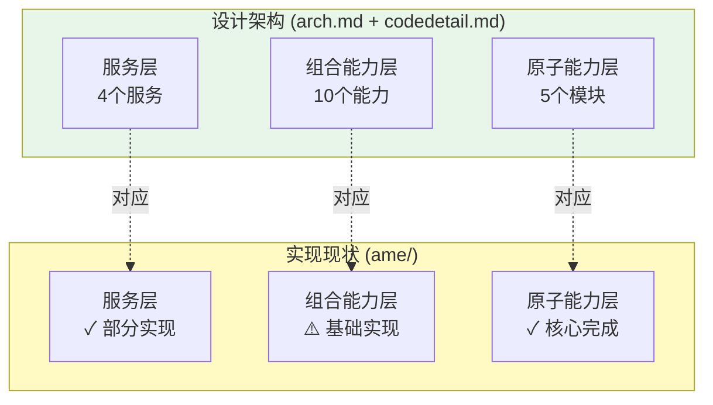
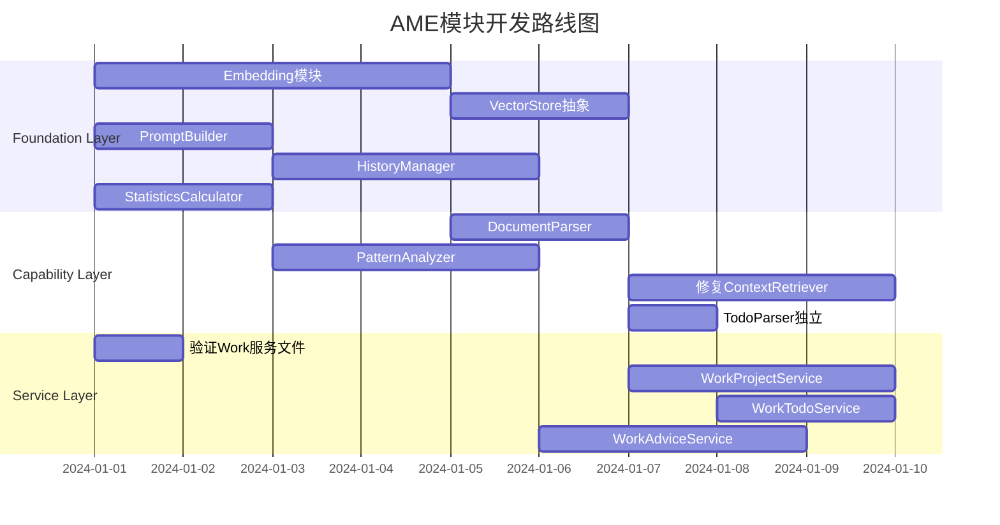

# AME 模块分析与开发计划

> **文档目标**: 基于architecture.md和codedetail.md的设计规范,全面分析现有AME模块实现情况,明确每个模块的现状、缺失和开发计划

> **架构原则**: 自下而上的能力提供 - 从原子能力层→组合能力层→服务层

---

## 📑 文档结构

1. [架构总览](#架构总览)
2. [Foundation Layer - 原子能力层](#foundation-layer---原子能力层)
   - [2.1 LLM模块](#21-llm模块)
   - [2.2 Storage模块](#22-storage模块)
   - [2.3 NLP模块](#23-nlp模块)
   - [2.4 File模块](#24-file模块)
   - [2.5 Algorithm模块](#25-algorithm模块)
3. [Capability Layer - 组合能力层](#capability-layer---组合能力层)
   - [3.1 Life场景能力](#31-life场景能力)
   - [3.2 Work场景能力](#32-work场景能力)
   - [3.3 CapabilityFactory](#33-capabilityfactory)
4. [Service Layer - 服务层](#service-layer---服务层)
   - [4.1 Life场景服务](#41-life场景服务)
   - [4.2 Work场景服务](#42-work场景服务)
5. [开发优先级与路线图](#开发优先级与路线图)

---

## 架构总览

### 设计架构 vs 实现现状



### 实现完整度统计

| 层级 | 设计要求 | 已实现 | 完成度 | 关键缺失 |
|------|----------|--------|--------|----------|
| **Foundation Layer** | 5个模块 | 5个模块 | 75% | VectorStore未实现、部分策略缺失 |
| **Capability Layer** | 10个能力 | 6个能力 | 60% | 4个能力缺失(DocumentParser等) |
| **Service Layer** | 4个服务 | 1个服务 | 25% | 3个Work服务缺失 |

---

## Foundation Layer - 原子能力层

> **设计理念**: 原子能力层采用**模块层+原子层**两层设计,提供最小粒度的原子操作

### 2.1 LLM模块

#### 模块定位

**能力边界**: 大模型调用、提示词管理、对话历史管理
**对外接口**: `call()`, `build_prompt()`, `manage_history()`
**技术选型**: OpenAI API (GPT-4/GPT-3.5-turbo)

#### 设计要求 (根据codedetail.md)

```python
# 模块层接口
class LLMCaller(ABC):
    - call(prompt, model, temperature, max_tokens) -> str
    - call_stream(prompt, model) -> Iterator[str]
    - batch_call(prompts) -> List[str]

class PromptBuilder:
    - build(template, context, variables) -> str
    - build_with_history(template, history) -> str
    - build_few_shot(template, examples) -> str

class HistoryManager:
    - manage(messages, max_length) -> List[Dict]
    - summarize_history(messages, llm_caller) -> str
```

#### 实现现状

**✅ 已实现**:
- `LLMCallerBase` (抽象基类): ✅ 完整实现
  - `generate()`: 异步完整生成 ✅
  - `generate_stream()`: 异步流式生成 ✅
  - `estimate_tokens()`: Token估算 ✅
  - `estimate_messages_tokens()`: 消息Token估算 ✅
  - `is_configured()`: 配置检查 ✅

- `OpenAICaller` (OpenAI实现): ✅ 完整实现
  - 使用tiktoken精确估算token ✅
  - 移除内部重试逻辑(由Strategy处理) ✅
  - 支持temperature/max_tokens等参数 ✅

- `StreamCaller` (流式调用封装): ✅ 完整实现
  - `call()`: 统一调用入口(支持STREAM/COMPLETE/BATCH模式) ✅
  - `stream_with_callback()`: 流式+回调 ✅
  - `batch_call()`: 批量并发调用 ✅

- **Strategy模块**: ✅ 部分实现
  - `cache.py`: 缓存策略 ✅
  - `retry.py`: 重试策略 ✅
  - `compress.py`: 压缩策略 ✅

**⚠️ 缺失功能**:

1. **PromptBuilder** (提示词构建器): ❌ 未实现
   - 需求: 模板化提示词构建
   - 功能: `build()`, `build_with_history()`, `build_few_shot()`
   - 影响: 当前提示词在各服务中硬编码,缺乏复用性

2. **HistoryManager** (历史管理器): ❌ 未实现
   - 需求: 对话历史管理与压缩
   - 功能: `manage()`, `summarize_history()`
   - 影响: 无法控制上下文长度,可能导致token超限
   - 注: 现有`foundation/llm/core/history.py`存在但未被使用

3. **Claude等其他LLM实现**: ❌ 未实现
   - 设计要求: `claude_caller.py`
   - 影响: 仅支持OpenAI,缺乏多模型切换能力

#### 测试现状

**已有测试**:
- `ame-tests/foundation/llm/test_openai_caller.py`: ✅ 存在
- `ame-tests/foundation/llm/test_pipelines.py`: ✅ 存在

**缺失测试**:
- PromptBuilder单元测试: ❌
- HistoryManager单元测试: ❌
- Strategy模块集成测试: ⚠️ 部分

#### 开发计划

**P0 - 核心缺失**:
1. 实现`PromptBuilder`类
   - 位置: `foundation/llm/core/prompt_builder.py`
   - 接口: `build()`, `build_with_history()`, `build_few_shot()`
   - 依赖: 无
   - 工时: 2天

2. 实现`HistoryManager`类
   - 位置: `foundation/llm/core/history_manager.py`
   - 接口: `manage()`, `summarize_history()`
   - 依赖: `LLMCaller`
   - 工时: 3天

**P1 - 增强功能**:
3. 完善Strategy模块测试
   - 位置: `ame-tests/foundation/llm/test_strategies.py`
   - 覆盖: cache/retry/compress
   - 工时: 2天

**P2 - 扩展性**:
4. 实现`ClaudeCaller`
   - 位置: `foundation/llm/atomic/claude_caller.py`
   - 工时: 3天

---

### 2.2 Storage模块

#### 模块定位

**能力边界**: 向量存储、图存储、混合检索
**对外接口**: `vector_search()`, `graph_query()`, `hybrid_retrieve()`
**技术选型**: Faiss(向量) + FalkorDB(图)

#### 设计要求

```python
class VectorStore(ABC):
    - add(id, vector, metadata) -> bool
    - search(query_vector, top_k, filter) -> List[Dict]
    - delete(vector_id) -> bool
    - update(vector_id, vector, metadata) -> bool

class GraphStore(ABC):
    - add_node(node_type, properties) -> str
    - add_edge(from_id, to_id, edge_type, properties) -> str
    - query(cypher, params) -> List[Dict]
    - update_edge(edge_id, properties) -> bool  # 用于设置invalid_time

class HybridRetriever:
    - retrieve(query, query_vector, top_k) -> List[HybridSearchResult]
    - fuse_scores(vector_results, graph_results) -> List
    # 融合策略: Faiss 0.6 + Falkor 0.4
```

#### 实现现状

**✅ 已实现**:

1. **GraphStore抽象与实现**: ✅ 完整
   - `GraphStoreBase` (抽象基类): ✅
     - 节点CRUD: `create_node()`, `get_node()`, `update_node()`, `delete_node()`, `find_nodes()` ✅
     - 边CRUD: `create_edge()`, `get_edge()`, `update_edge()`, `delete_edge()`, `find_edges()` ✅
     - 图查询: `get_neighbors()`, `get_edges_between()` ✅
     - 时间查询: `find_valid_edges_at()` ✅ (支持valid_from/valid_until)
     - 原生查询: `execute_cypher()` ✅
   
   - `FalkorDBStore` (FalkorDB实现): ✅ 完整
     - 连接管理: `connect()`, `disconnect()`, `health_check()` ✅
     - 所有基类接口实现 ✅
     - 自动创建索引优化性能 ✅
     - 支持时间属性边(valid_from/valid_until) ✅

2. **VectorStore (Faiss实现)**: ✅ 完整
   - `FaissVectorStore`: ✅ 实现完整
     - 索引类型: 支持Flat/IVF/HNSW ✅
     - 度量方式: 支持L2/IP ✅
     - 向量CRUD: `add_vector()`, `add_vectors()`, `get_vector()`, `update_vector()`, `delete_vector()` ✅
     - 向量检索: `search()`, `search_by_id()` ✅
     - 元数据过滤: ✅
     - 索引持久化: `save_index()`, `load_index()` ✅
     - 索引重建: `rebuild_if_needed()`, `_rebuild_index()` ✅ (自动优化已删除向量)

3. **HybridRetriever**: ✅ 完整实现
   - RRF融合算法: ✅ (Reciprocal Rank Fusion)
   - 可配置权重: ✅ (默认vector 0.6 + graph 0.4)
   - `retrieve()`: ✅ 完整实现
   - `set_weights()`: ✅ 支持动态调整权重
   - MMR多样性过滤: ✅ 实现

4. **Schema定义**: ✅ 完整
   - `NodeLabel`: PERSON, MEMORY, ENTITY, DOCUMENT, TASK, PROJECT, SESSION ✅
   - `RelationType`: MENTIONS, LIKES, DEPENDS_ON, HAS_TASK, LINKED_TO等 ✅
   - 时间属性支持: valid_from/valid_until ✅

**⚠️ 缺失功能**:

1. **VectorStore抽象基类**: ❌ 未实现
   - 设计要求: `VectorStoreBase`抽象类定义统一接口
   - 现状: 直接实现了`FaissVectorStore`,但缺少抽象层
   - 影响: 无法方便切换到Milvus/Qdrant等其他向量数据库
   - 需要: 提取抽象基类`VectorStoreBase`,定义标准接口

2. **Embedding模块**: ❌ 完全缺失
   - 设计要求: `EmbeddingBase`抽象类 + `OpenAIEmbedding`实现
   - 现状: 完全未实现
   - 影响: 
     - VectorStore无法独立工作,需要外部提供向量
     - HybridRetriever的`_graph_retrieve()`中相关性计算过于简单
   - 位置: 应在`foundation/embedding/`目录

3. **Pipeline层**: ⚠️ 部分缺失
   - 现有: `storage/pipeline/base.py`, `life_graph_pipeline.py`, `work_graph_pipeline.py`
   - 状态: 文件存在但内容未知(未读取)
   - 需检查: 是否实现了数据流水线处理

#### 测试现状

**已有测试**:
- `ame-tests/foundation/storage/test_faiss_store.py`: ✅ 存在
- `ame-tests/foundation/storage/test_faiss_delete_optimization.py`: ✅ 存在
- `ame-tests/foundation/storage/test_pipeline.py`: ✅ 存在
- `ame-tests/foundation/storage/test_storage_basic.py`: ✅ 存在

**缺失测试**:
- HybridRetriever集成测试: ⚠️ 需补充
- 时间属性边的完整测试: ⚠️ 需补充

#### 开发计划

**P0 - 核心缺失**:
1. 实现Embedding模块
   - 位置: `foundation/embedding/`
   - 文件: `atomic/base.py`, `atomic/openai_embedding.py`
   - 接口: `embed_text()`, `embed_batch()`, `get_dimension()`
   - 工时: 4天

2. 提取VectorStore抽象基类
   - 位置: `foundation/storage/atomic/vector_store.py`
   - 改造: FaissVectorStore继承VectorStoreBase
   - 工时: 2天

**P1 - 增强功能**:
3. 检查并完善Storage Pipeline
   - 位置: `foundation/storage/pipeline/`
   - 工时: 2天

4. 补充HybridRetriever集成测试
   - 位置: `ame-tests/foundation/storage/test_hybrid_retriever.py`
   - 工时: 2天

---

### 2.3 NLP模块

#### 模块定位

**能力边界**: NER、情感分析、意图识别、文本摘要
**对外接口**: `extract_entity()`, `analyze_emotion()`, `classify_intent()`, `summarize()`
**技术选型**: jieba + HuggingFace + LLM增强

#### 设计要求

```python
class EmotionAnalyzer:
    - analyze(text, use_llm=False) -> EmotionResult
    # EmotionResult: emotion, intensity, valence, keywords

class EntityExtractor:
    - extract(text, use_llm=False, use_backend=True) -> List[Entity]
    # 支持jieba/spacy/hanlp/custom后端
    # Entity: text, type, start, end, confidence

class IntentRecognizer:
    - recognize(message, context=None, use_llm=False) -> IntentResult
    # IntentResult: intent_type, sub_intent, confidence

class Summarizer:
    - summarize(text, max_length=200) -> str
    - summarize_with_entities(text) -> SummaryResult
```

#### 实现现状

**✅ 已实现**:

1. **EmotionAnalyzer**: ✅ 完整实现
   - 基于词典的情感分析: ✅
   - LLM增强分析: ✅
   - `analyze()`: 支持use_llm参数 ✅
   - `analyze_sync()`: 同步分析(仅词典) ✅
   - 情感词典: 包含6种情绪(JOY/SADNESS/ANGER/FEAR/SURPRISE/DISGUST) ✅
   - 返回: EmotionResult(emotion, intensity, valence, keywords) ✅

2. **EntityExtractor**: ✅ 完整实现(扩展性强)
   - jieba分词+词性标注: ✅
   - LLM增强提取: ✅
   - 多后端支持: ✅
     - `set_ner_backend()`: 切换后端(jieba/spacy/hanlp/custom) ✅
     - `set_custom_ner_function()`: 自定义NER函数 ✅
     - `register_entity_type_mapping()`: 自定义类型映射 ✅
   - `load_custom_dict()`: 支持自定义jieba词典 ✅
   - `extract()`: 异步提取,支持use_llm和use_backend参数 ✅
   - `extract_sync()`: 同步提取(仅jieba) ✅
   - 去重机制: `_deduplicate()` ✅

3. **IntentRecognizer**: ✅ 基础实现
   - 规则匹配: ✅
   - LLM增强: ✅
   - `recognize()`: 支持use_llm参数 ✅
   - 意图类型: CHAT/QUERY_SELF/COMFORT/ANALYZE等 ✅

4. **Summarizer**: ✅ 基础实现
   - LLM摘要生成: ✅
   - 集成EmotionAnalyzer和EntityExtractor: ✅
   - `summarize()`: 基础摘要 ✅
   - `summarize_with_enrichment()`: 带情感和实体的摘要 ✅

**⚠️ 缺失功能**:

1. **spaCy/HanLP后端实际实现**: ⚠️ 占位实现
   - 现状: `_init_spacy()`, `_init_hanlp()`仅有logger警告
   - 影响: 无法使用专业NER模型,仅依赖jieba
   - 建议: 实现spaCy中文模型集成(`zh_core_web_sm`)

2. **IntentRecognizer高级功能**: ⚠️ 功能简单
   - 现状: 基础规则匹配+LLM
   - 缺失: 分层意图识别(设计中有sub_intent)
   - 缺失: 意图置信度评估

3. **Summarizer高级策略**: ⚠️ 功能基础
   - 缺失: 不同长度级别的摘要(short/medium/long)
   - 缺失: 摘要质量评估

#### 测试现状

**已有测试**:
- `ame-tests/foundation/nlp/test_nlp_complete.py`: ✅ 存在

**缺失测试**:
- 各组件单独测试: ⚠️ 需补充
- 多后端切换测试: ❌ 未实现

#### 开发计划

**P1 - 增强功能**:
1. 实现spaCy中文NER后端
   - 位置: `foundation/nlp/atomic/entity_extractor.py`
   - 模型: `zh_core_web_sm`
   - 工时: 3天

2. 增强IntentRecognizer
   - 位置: `foundation/nlp/atomic/intent_recognizer.py`
   - 功能: 分层意图识别,置信度评估
   - 工时: 2天

**P2 - 优化功能**:
3. 扩展Summarizer策略
   - 位置: `foundation/nlp/atomic/summarizer.py`
   - 功能: 多级别摘要,质量评估
   - 工时: 2天

---

### 2.4 File模块

#### 模块定位

**能力边界**: 多格式文档解析(PDF/Word/MD/PPT/TXT)
**对外接口**: `parse(file)` (自动识别格式)
**技术选型**: PyPDF2 + python-docx + markdown

#### 设计要求

```python
class FileParserBase(ABC):
    - can_parse(file_path) -> bool
    - parse(file_path) -> ParsedDocument

# 具体实现
class PDFParser(FileParserBase): ...
class DocxParser(FileParserBase): ...
class MarkdownParser(FileParserBase): ...
class TextParser(FileParserBase): ...
class PPTParser(FileParserBase): ...

# 流水线
class DocumentPipeline:
    - parse_file(file_path) -> ParsedDocument
    - parse_batch(file_paths) -> List[ParsedDocument]
```

#### 实现现状

**✅ 已实现**:

1. **FileParserBase**: ✅ 抽象基类完整
   - `can_parse()`: 判断是否支持 ✅
   - `parse()`: 执行解析 ✅
   - `_validate_file_exists()`: 文件验证 ✅
   - `_get_file_extension()`: 扩展名提取 ✅

2. **具体解析器**: ✅ 文件存在
   - `pdf_parser.py`: ✅
   - `docx_parser.py`: ✅
   - `markdown_parser.py`: ✅
   - `text_parser.py`: ✅
   - `ppt_parser.py`: ✅
   - 注: 具体实现内容未读取,需验证完整性

3. **Pipeline**: ✅ 文件存在
   - `document_pipeline.py`: ✅
   - 注: 内容未读取,需验证实现

4. **Core模块**: ✅
   - `models.py`: ParsedDocument数据模型 ✅
   - `exceptions.py`: 异常定义 ✅

**⚠️ 需验证**:

1. 各解析器的具体实现质量
2. DocumentPipeline的功能完整性
3. 错误处理和边界情况

#### 测试现状

**已有测试**:
- `ame-tests/foundation/file/test_file_parsing.py`: ✅ 存在

**缺失测试**:
- 各格式的边界情况测试: ⚠️ 需补充

#### 开发计划

**P0 - 验证与完善**:
1. 读取并验证各解析器实现
   - 检查点: 是否完整实现can_parse()和parse()
   - 工时: 1天

2. 验证DocumentPipeline功能
   - 检查点: 是否支持自动格式识别和批量处理
   - 工时: 1天

**P1 - 增强功能**:
3. 补充异常处理和日志
   - 位置: 各解析器
   - 工时: 2天

---

### 2.5 Algorithm模块

#### 模块定位

**能力边界**: 文本相似度、时间解析、拓扑排序、统计计算
**对外接口**: `calculate_similarity()`, `parse_time()`, `topo_sort()`, `calculate_statistics()`
**技术选型**: NetworkX + NumPy

#### 设计要求

```python
class SimilarityCalculator:
    - calculate(text1, text2) -> float
    - cosine_similarity() / jaccard_similarity() / edit_distance()

class TimeAnalyzer:
    - parse(text) -> TimeInfo
    # 提取create_time/deadline/duration

class TopologicalSorter:
    - sort(tasks, dependencies) -> List[Task]
    # 拓扑排序,处理依赖关系

class StatisticsCalculator:
    - calculate_completion_rate(todos) -> float
    - calculate_delay_rate(todos) -> float
    - calculate_efficiency_score(todos) -> float
```

#### 实现现状

**✅ 已实现**:

1. **TextSimilarity**: ✅ 完整实现(功能丰富)
   - `cosine()`: 余弦相似度 ✅
   - `jaccard()`: Jaccard相似度 ✅
   - `edit_distance()`: Levenshtein距离 ✅
   - `edit_similarity()`: 归一化编辑相似度 ✅
   - `longest_common_subsequence()`: LCS ✅
   - `lcs_similarity()`: LCS相似度 ✅
   - `ngram_similarity()`: N-gram相似度 ✅
   - `compare_all()`: 批量比较所有算法 ✅
   - 支持字符级/词级别: ✅

2. **TimeAnalyzer**: ✅ 文件存在
   - `time_analyzer.py`: ✅
   - 注: 内容未读取,需验证实现

3. **TodoSorter**: ✅ 文件存在
   - `todo_sorter.py`: ✅
   - 注: 内容未读取,需验证拓扑排序实现

**⚠️ 缺失功能**:

1. **StatisticsCalculator**: ❌ 完全未实现
   - 设计要求: 计算完成率、延期率、效率分数
   - 位置: 应在`foundation/algorithm/statistics.py`
   - 用途: WorkAdviceService需要

#### 测试现状

**已有测试**:
- `ame-tests/foundation/algorithm/test_algorithm_complete.py`: ✅ 存在

#### 开发计划

**P0 - 核心缺失**:
1. 实现StatisticsCalculator
   - 位置: `foundation/algorithm/statistics.py`
   - 接口: `calculate_completion_rate()`, `calculate_delay_rate()`, `calculate_efficiency_score()`
   - 工时: 2天

**P1 - 验证功能**:
2. 验证TimeAnalyzer实现
   - 检查点: 是否支持多种时间格式解析
   - 工时: 1天

3. 验证TodoSorter拓扑排序
   - 检查点: 是否正确处理循环依赖
   - 工时: 1天

---

## Capability Layer - 组合能力层

> **设计理念**: 组合能力层将多个原子能力组合,完成抽象的业务步骤

### 3.1 Life场景能力

#### 设计要求

| 组合能力 | 组合的原子能力 | 核心功能 |
|----------|-----------------|----------|
| **IntentRecognizer** | LLMCaller + IntentClassifier | 识别用户意图 |
| **ContextRetriever** | VectorStore + GraphStore + HybridRetriever | 混合检索上下文(0.6+0.4) |
| **DialogueGenerator** | LLMCaller + PromptBuilder + HistoryManager | 生成个性化回复 |
| **MemoryExtractor** | LLMCaller + EmotionAnalyzer + EntityExtractor + TimeAnalyzer | 提取记忆点 |

#### 实现现状

**✅ 已实现**:

1. **ContextRetriever**: ✅ 基础实现
   - 位置: `capability/life/context_retriever.py`
   - 依赖: GraphStore ✅
   - 功能:
     - `retrieve_by_intent()`: 根据意图检索 ✅
     - `_retrieve_user_profile()`: 检索用户画像 ✅
     - `_retrieve_similar_emotions()`: 检索相似情绪对话 ✅
     - `_retrieve_behavior_patterns()`: 检索行为模式 ✅
     - `_retrieve_recent_memories()`: 检索最近记忆 ✅
     - `retrieve_by_keywords()`: 关键词检索 ✅
   - ⚠️ 缺陷: 未使用HybridRetriever(仅用GraphStore),未实现向量检索

2. **DialogueGenerator**: ✅ 文件存在
   - 位置: `capability/life/dialogue_generator.py`
   - 注: 内容未读取,需验证实现

3. **MemoryExtractor**: ✅ 文件存在
   - 位置: `capability/life/memory_extractor.py`
   - 注: 内容未读取,需验证实现

**❌ 缺失能力**:

1. **IntentRecognizer** (组合层): ❌ 未实现
   - 注: Foundation层有IntentRecognizer,但Capability层应有增强版本
   - 需求: 结合上下文的意图识别
   - 位置: 应在`capability/life/intent_recognizer.py`

#### 开发计划

**P0 - 核心缺失**:
1. 修复ContextRetriever的混合检索
   - 位置: `capability/life/context_retriever.py`
   - 改造: 集成HybridRetriever,实现向量+图谱融合(0.6+0.4)
   - 依赖: 需先实现Embedding模块
   - 工时: 3天

2. 验证DialogueGenerator实现
   - 检查点: 是否使用PromptBuilder和HistoryManager
   - 工时: 1天

3. 验证MemoryExtractor实现
   - 检查点: 是否集成所有NLP能力
   - 工时: 1天

**P1 - 增强功能**:
4. 实现Capability层IntentRecognizer增强版
   - 位置: `capability/life/intent_recognizer.py`
   - 功能: 结合上下文的意图识别
   - 工时: 2天

---

### 3.2 Work场景能力

#### 设计要求

| 组合能力 | 组合的原子能力 | 核心功能 |
|----------|-----------------|----------|
| **DocumentParser** | 多个FileParser | 多格式文档解析 |
| **ProjectAnalyzer** | EntityExtractor + LLMCaller | 项目分析报告 |
| **TodoParser** | LLMCaller + TimeAnalyzer | 任务解析 |
| **TodoManager** | GraphStore + SimilarityCalculator + TopologicalSorter | 待办管理 |
| **PatternAnalyzer** | GraphStore + StatisticsCalculator | 工作模式分析 |
| **AdviceGenerator** | LLMCaller + PromptBuilder | 建议生成 |

#### 实现现状

**✅ 已实现**:

1. **TodoManager**: ✅ 完整实现
   - 位置: `capability/work/todo_manager.py`
   - 依赖: LLMCaller + GraphStore + TodoSorter ✅
   - 功能:
     - `generate_and_sort()`: 生成并排序待办 ✅
     - `update_status()`: 更新状态 ✅
     - `get_active_todos()`: 获取活跃待办 ✅
     - `_fetch_existing_todos()`: 查询已有待办 ✅
     - `_parse_todos_from_text()`: LLM解析文本生成待办 ✅
     - `_persist_todos_to_graph()`: 持久化到WorkGraph ✅
   - ✅ 完整实现拓扑排序和依赖管理

2. **ProjectAnalyzer**: ✅ 文件存在
   - 位置: `capability/work/project_analyzer.py`
   - 注: 内容未读取,需验证实现

3. **AdviceGenerator**: ✅ 文件存在
   - 位置: `capability/work/advice_generator.py`
   - 注: 内容未读取,需验证实现

**❌ 缺失能力**:

1. **DocumentParser**: ❌ 未实现
   - 设计要求: 组合多个FileParser
   - 位置: 应在`capability/work/document_parser.py`
   - 影响: ProjectAnalyzer无法解析文档

2. **TodoParser**: ❌ 未实现
   - 设计要求: 单独的任务解析能力
   - 现状: 功能集成在TodoManager中(`_parse_todos_from_text()`)
   - 建议: 提取独立组件

3. **PatternAnalyzer**: ❌ 未实现
   - 设计要求: 分析工作模式
   - 位置: 应在`capability/work/pattern_analyzer.py`
   - 依赖: StatisticsCalculator(未实现)
   - 影响: WorkAdviceService缺少数据支持

#### 开发计划

**P0 - 核心缺失**:
1. 实现DocumentParser
   - 位置: `capability/work/document_parser.py`
   - 功能: 组合FileParser,批量解析文档
   - 工时: 2天

2. 实现PatternAnalyzer
   - 位置: `capability/work/pattern_analyzer.py`
   - 依赖: GraphStore + StatisticsCalculator
   - 功能: 计算完成率/延期率/效率分数
   - 工时: 3天

3. 提取TodoParser独立组件
   - 位置: `capability/work/todo_parser.py`
   - 改造: 从TodoManager中提取`_parse_todos_from_text()`
   - 工时: 1天

**P1 - 验证功能**:
4. 验证ProjectAnalyzer实现
   - 检查点: 是否完整集成EntityExtractor和LLM
   - 工时: 1天

5. 验证AdviceGenerator实现
   - 检查点: 是否使用PromptBuilder
   - 工时: 1天

---

### 3.3 CapabilityFactory

#### 设计要求

```python
class CapabilityFactory:
    # Foundation能力创建
    - create_llm_caller()
    - create_graph_store()
    - create_intent_recognizer()
    - create_entity_extractor()
    - create_emotion_analyzer()
    - create_summarizer()
    
    # Life能力创建
    - create_context_retriever()
    - create_dialogue_generator()
    - create_memory_extractor()
    - create_life_capability_package()  # 预设包
    
    # Work能力创建
    - create_project_analyzer()
    - create_todo_manager()
    - create_advice_generator()
    - create_work_capability_package()  # 预设包
    
    # 缓存管理
    - clear_cache()
    - get_cache_info()
```

#### 实现现状

**✅ 已实现**: 75%完成度

1. **Foundation层创建方法**: ✅ 完整
   - `create_llm_caller()` ✅
   - `create_graph_store()` ✅
   - `create_intent_recognizer()` ✅
   - `create_entity_extractor()` ✅
   - `create_emotion_analyzer()` ✅
   - `create_summarizer()` ✅
   - `create_todo_sorter()` ✅

2. **Life能力创建方法**: ✅ 完整
   - `create_context_retriever()` ✅
   - `create_dialogue_generator()` ✅
   - `create_memory_extractor()` ✅
   - `create_life_capability_package()` ✅

3. **Work能力创建方法**: ✅ 完整
   - `create_project_analyzer()` ✅
   - `create_todo_manager()` ✅
   - `create_advice_generator()` ✅
   - `create_work_capability_package()` ✅

4. **测试能力创建**: ✅ 特色功能
   - `create_llm_test_capability()` ✅
   - `create_storage_test_capability()` ✅

5. **缓存管理**: ✅ 完整
   - `clear_cache()` ✅
   - `get_cache_info()` ✅

**⚠️ 需改进**:

1. **缺少VectorStore创建方法**: ❌
   - 原因: VectorStore未抽象
   - 影响: 无法统一管理向量存储实例

2. **缺少Embedding创建方法**: ❌
   - 原因: Embedding模块未实现
   - 影响: 无法统一管理Embedding实例

3. **预设包缺少完整依赖**: ⚠️
   - `create_nlp_capability_package()`: ✅ 完整
   - `create_life_capability_package()`: ⚠️ 未包含VectorStore
   - `create_work_capability_package()`: ⚠️ 未包含DocumentParser

#### 开发计划

**P0 - 补充缺失**:
1. 添加VectorStore创建方法
   - 方法: `create_vector_store()`
   - 前置: VectorStore抽象层实现
   - 工时: 1天

2. 添加Embedding创建方法
   - 方法: `create_embedding()`
   - 前置: Embedding模块实现
   - 工时: 1天

**P1 - 完善预设包**:
3. 完善Life能力包
   - 改进: 添加VectorStore和HybridRetriever
   - 工时: 1天

4. 完善Work能力包
   - 改进: 添加DocumentParser
   - 工时: 1天

---

## Service Layer - 服务层

> **设计理念**: 服务层编排组合能力,实现完整业务流程

### 4.1 Life场景服务

#### 设计要求

**ChatService** (生活对话服务):
- 能力编排: IntentRecognizer + ContextRetriever + DialogueGenerator + MemoryExtractor
- 核心流程:
  1. 意图识别
  2. 上下文检索(混合检索0.6+0.4)
  3. 对话生成
  4. 记忆提取(会话结束时)

#### 实现现状

**✅ 已实现**: LifeChatService (基本完整)

- 位置: `service/life/life_chat_service.py`
- 依赖: CapabilityFactory ✅
- 核心功能:
  - `start_session()`: 创建Session ✅
  - `chat()`: 对话(支持流式/完整) ✅
  - `end_session()`: 结束Session并提取记忆 ✅
  - `get_session_info()`: 获取Session信息 ✅
  - `list_active_sessions()`: 列出活跃Session ✅

- SessionManager: ✅ 完整实现
  - 会话创建/更新/关闭 ✅
  - 消息历史管理 ✅

- **流程实现**:
  1. 意图识别: ✅ 调用`intent_recognizer.recognize()`
  2. 上下文检索: ✅ 调用`context_retriever.retrieve_by_intent()`
  3. 对话生成: ✅ 调用`dialogue_generator.generate()`
  4. 记忆提取: ✅ 调用`memory_extractor.extract_and_save()`

**⚠️ 需改进**:

1. **上下文检索未使用向量**: ⚠️
   - 现状: ContextRetriever仅用GraphStore
   - 改进: 集成HybridRetriever实现混合检索

2. **缺少会话超时管理**: ⚠️
   - 建议: SessionManager添加TTL清理机制

#### 开发计划

**P1 - 增强功能**:
1. 集成混合检索
   - 位置: `capability/life/context_retriever.py`
   - 前置: Embedding模块实现
   - 工时: 2天

2. 添加Session超时管理
   - 位置: `service/life/life_chat_service.py` - SessionManager
   - 工时: 1天

---

### 4.2 Work场景服务

#### 设计要求

1. **WorkProjectService** (项目分析服务)
   - 能力编排: DocumentParser + ProjectAnalyzer
   - 流程: 文档解析 → 实体提取 → 项目分析 → 报告生成

2. **WorkTodoService** (待办管理服务)
   - 能力编排: TodoParser + TodoManager
   - 流程: 任务解析 → 去重合并 → 拓扑排序 → 持久化

3. **WorkAdviceService** (工作建议服务)
   - 能力编排: PatternAnalyzer + AdviceGenerator
   - 流程: 数据收集 → 模式分析 → 建议生成 → Markdown格式化

#### 实现现状

**❌ 完全缺失**: 三个Work服务均未实现

- `service/work/project.py`: ⚠️ 文件存在,内容未读取
- `service/work/todo.py`: ⚠️ 文件存在,内容未读取
- `service/work/suggest.py`: ⚠️ 文件存在,内容未读取

**注**: 文件存在但内容未知,需读取验证

#### 开发计划

**P0 - 核心缺失**:

1. 验证现有Work服务文件
   - 读取: `project.py`, `todo.py`, `suggest.py`
   - 评估: 实现完整度
   - 工时: 1天

2. 实现/完善WorkProjectService
   - 位置: `service/work/project.py`
   - 依赖: DocumentParser + ProjectAnalyzer
   - 工时: 3天

3. 实现/完善WorkTodoService
   - 位置: `service/work/todo.py`
   - 依赖: TodoParser + TodoManager
   - 工时: 2天

4. 实现/完善WorkAdviceService
   - 位置: `service/work/suggest.py`
   - 依赖: PatternAnalyzer + AdviceGenerator
   - 工时: 3天

---

## 开发优先级与路线图

### 优先级定义

- **P0**: 核心功能缺失,阻塞其他模块
- **P1**: 重要功能,影响用户体验
- **P2**: 增强功能,提升可扩展性

### 总体路线图



### 第一阶段: Foundation补全 (约2周)

**目标**: 补全基础能力层缺失模块

| 任务 | 优先级 | 工时 | 依赖 |
|------|--------|------|------|
| 实现Embedding模块 | P0 | 4天 | 无 |
| 提取VectorStore抽象 | P0 | 2天 | 无 |
| 实现PromptBuilder | P0 | 2天 | 无 |
| 实现HistoryManager | P0 | 3天 | PromptBuilder |
| 实现StatisticsCalculator | P0 | 2天 | 无 |
| 验证File模块实现 | P0 | 2天 | 无 |

### 第二阶段: Capability补全 (约2周)

**目标**: 补全组合能力层缺失能力

| 任务 | 优先级 | 工时 | 依赖 |
|------|--------|------|------|
| 实现DocumentParser | P0 | 2天 | File模块验证 |
| 实现PatternAnalyzer | P0 | 3天 | StatisticsCalculator |
| 修复ContextRetriever混合检索 | P0 | 3天 | Embedding模块 |
| 提取TodoParser独立组件 | P1 | 1天 | 无 |
| 验证DialogueGenerator | P1 | 1天 | PromptBuilder |
| 验证MemoryExtractor | P1 | 1天 | 无 |

### 第三阶段: Service补全 (约2周)

**目标**: 补全服务层,实现完整业务流程

| 任务 | 优先级 | 工时 | 依赖 |
|------|--------|------|------|
| 验证现有Work服务文件 | P0 | 1天 | 无 |
| 实现WorkProjectService | P0 | 3天 | DocumentParser |
| 实现WorkTodoService | P0 | 2天 | TodoParser |
| 实现WorkAdviceService | P0 | 3天 | PatternAnalyzer |
| 完善LifeChatService | P1 | 2天 | ContextRetriever修复 |

### 第四阶段: 测试与优化 (约1周)

**目标**: 完善测试覆盖,优化性能

| 任务 | 优先级 | 工时 |
|------|--------|------|
| Foundation层单元测试补充 | P1 | 2天 |
| Capability层集成测试 | P1 | 2天 |
| Service层端到端测试 | P1 | 2天 |
| 性能优化与文档完善 | P2 | 1天 |

---

## 附录: 模块层级与基类抽象检查清单

### Foundation Layer基类抽象检查

| 模块 | 抽象基类 | 状态 | 具体实现 | 扩展性 |
|------|----------|------|----------|--------|
| **LLM** | `LLMCallerBase` | ✅ 完整 | OpenAICaller ✅ | 可扩展(Claude等) |
| **Storage-Graph** | `GraphStoreBase` | ✅ 完整 | FalkorDBStore ✅ | 可扩展(Neo4j等) |
| **Storage-Vector** | `VectorStoreBase` | ❌ 缺失 | FaissVectorStore ✅ | 需抽象基类 |
| **Embedding** | `EmbeddingBase` | ❌ 缺失 | ❌ 无实现 | 完全缺失 |
| **NLP** | 各组件独立 | ✅ 完整 | jieba+LLM ✅ | 高度扩展 |
| **File** | `FileParserBase` | ✅ 完整 | 5个Parser ✅ | 易扩展 |
| **Algorithm** | 工具函数集 | ✅ 完整 | TextSimilarity等 ✅ | 无需抽象 |

### Capability Layer组合模式检查

| 能力 | 组合的原子能力 | 状态 | 缺失依赖 |
|------|----------------|------|----------|
| **IntentRecognizer(C)** | LLM + IntentClassifier | ❌ 未实现 | - |
| **ContextRetriever** | VectorStore + GraphStore + HybridRetriever | ⚠️ 部分 | VectorStore |
| **DialogueGenerator** | LLM + PromptBuilder + HistoryManager | ⚠️ 未验证 | PromptBuilder |
| **MemoryExtractor** | LLM + Emotion + Entity + Time | ⚠️ 未验证 | - |
| **DocumentParser** | 多个FileParser | ❌ 未实现 | - |
| **ProjectAnalyzer** | Entity + LLM | ⚠️ 未验证 | - |
| **TodoParser** | LLM + TimeAnalyzer | ❌ 未独立 | - |
| **TodoManager** | Graph + Similarity + Sorter | ✅ 完整 | - |
| **PatternAnalyzer** | Graph + Statistics | ❌ 未实现 | Statistics |
| **AdviceGenerator** | LLM + PromptBuilder | ⚠️ 未验证 | PromptBuilder |

### Service Layer能力编排检查

| 服务 | 编排的组合能力 | 状态 | 缺失能力 |
|------|----------------|------|----------|
| **ChatService** | Intent + Context + Dialogue + Memory | ✅ 基本完整 | 混合检索未启用 |
| **WorkProjectService** | DocumentParser + ProjectAnalyzer | ❌ 未验证 | DocumentParser |
| **WorkTodoService** | TodoParser + TodoManager | ❌ 未验证 | TodoParser独立版 |
| **WorkAdviceService** | PatternAnalyzer + AdviceGenerator | ❌ 未验证 | PatternAnalyzer |

---

**文档版本**: v1.0  
**创建日期**: 2025-01  
**下次更新**: 第一阶段完成后
