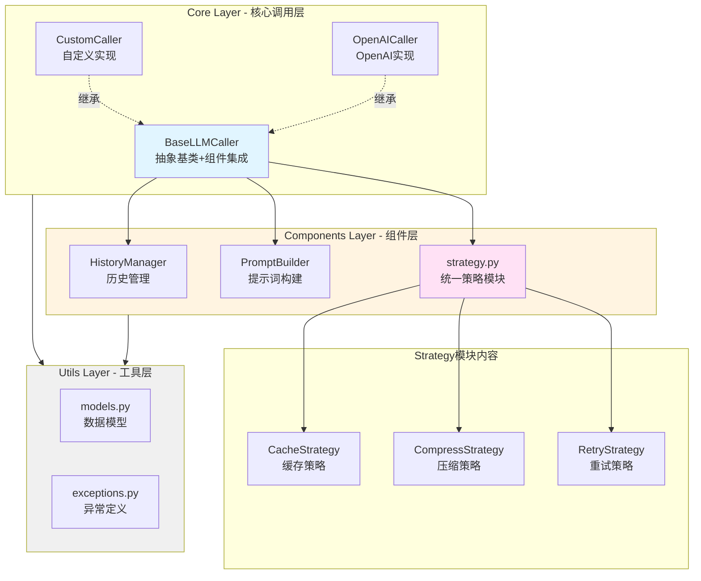
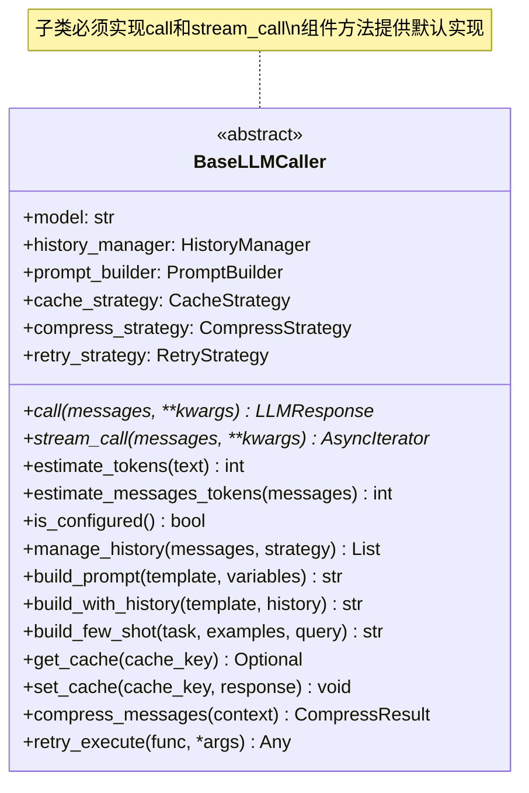
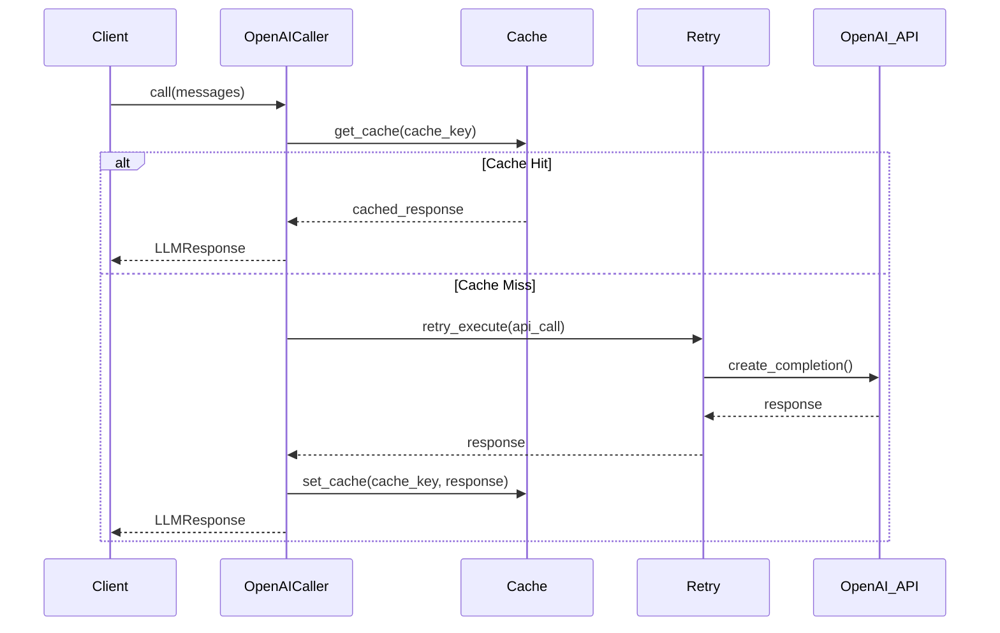
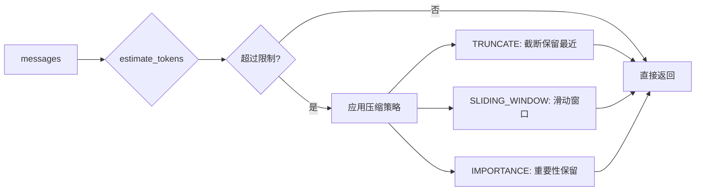
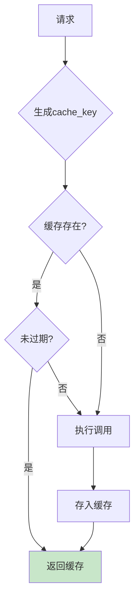
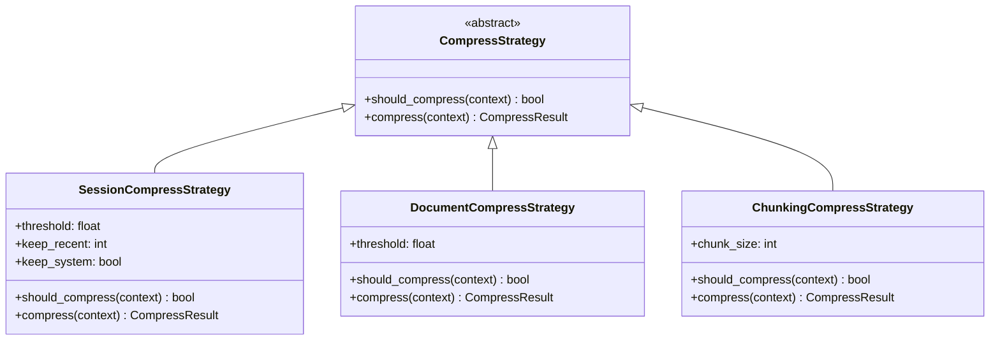
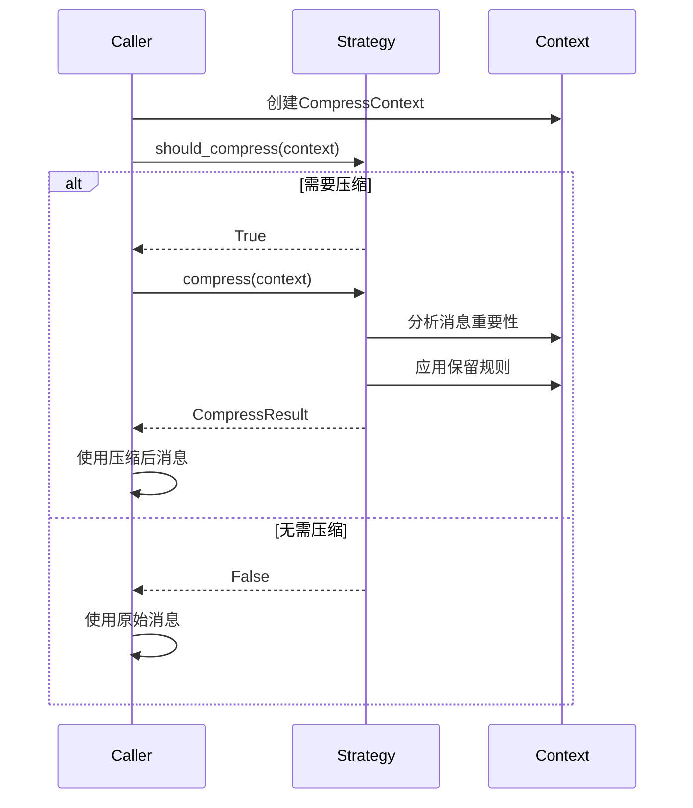
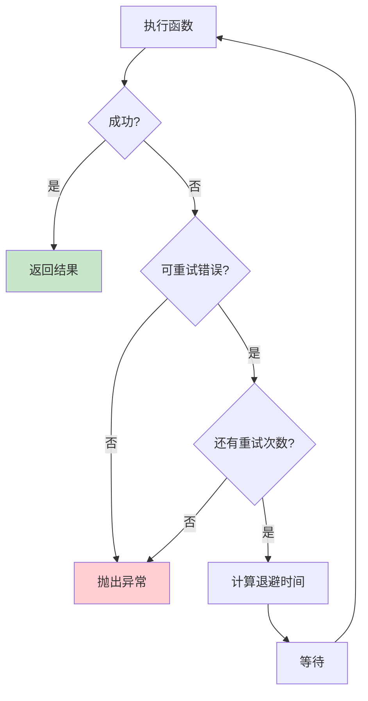
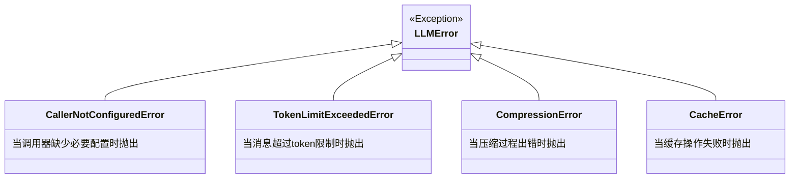
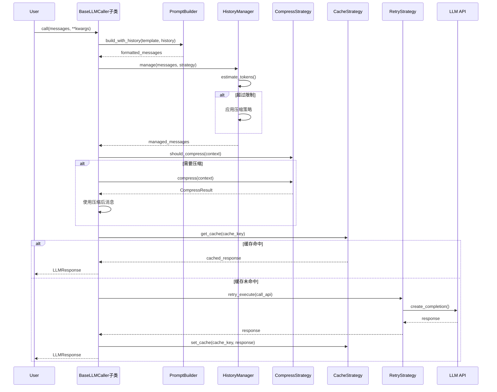

# LLM架构重构设计

## 概述

本文档描述LLM模块的架构重构方案，将原有的三层架构（components/core/utils）调整为更清晰的职责分层，确保组件层能够被基类继承使用，同时保证自定义调用器（如Qwen Caller）能够复用所有组件能力。

### 核心目标

1. **组件能力复用**：Base类继承Components层的所有组件能力作为自己的方法
2. **扩展性保障**：自定义调用器只需实现核心调用方法（call/stream_call），自动获得组件能力
3. **策略由调用方配置**：不预设固定的Pipe类，由外部使用方根据场景主动组合策略参数
4. **职责清晰**：Components层提供可复用组件，Core层提供调用抽象与实现，Utils层提供数据模型与异常

### 技术约束

- Python 3.11+
- 支持异步调用（async/await）
- 无需向后兼容，外部调用将统一更新
- 优先使用组合而非多继承
- **移除SessionPipe和DocumentPipe**：不再预设管道类，由调用方自行组合策略

---

## 架构设计

### 整体分层



### 核心设计理念

1. **BaseLLMCaller采用Mixin模式**
   - 通过组合方式集成所有组件能力
   - 子类自动继承所有组件方法
   - 只需实现`call`和`stream_call`抽象方法

2. **组件独立可测试**
   - 每个组件可单独实例化和测试
   - 组件间无依赖，通过参数传递协作

3. **统一数据流**
   - 所有数据模型定义在Utils层
   - 组件之间通过标准数据模型交互

4. **策略由调用方组合**
   - 不提供预设的Pipe类（如SessionPipe/DocumentPipe）
   - 调用方根据具体场景配置策略参数
   - 例：对话场景使用`UnifiedCompressStrategy(mode='conservative')`
   - 例：文档场景使用`UnifiedCompressStrategy(mode='aggressive')`

---

## 模块详细设计

### 1. Core Layer - 核心调用层

#### 1.1 BaseLLMCaller（抽象基类）

**职责**：
- 定义LLM调用的抽象接口
- 集成所有组件能力作为默认方法
- 提供Token估算的默认实现

**接口设计**：



**组件集成方式**：

| 组件 | 集成方法 | 方法名 |
|------|---------|--------|
| HistoryManager | 实例属性 | `manage_history()` |
| PromptBuilder | 实例属性 | `build_prompt()`, `build_with_history()`, `build_few_shot()` |
| Strategy模块 | 实例属性 | `get_cache()`, `set_cache()`, `compress_messages()`, `retry_execute()` |

**说明**：所有策略类（CacheStrategy、CompressStrategy、RetryStrategy）统一定义在`components/strategy.py`文件中

**Token估算**：

```python
def estimate_tokens(self, text: str) -> int:
    """默认Token估算实现
    
    子类可选择覆盖此方法以提供更精确的估算。
    默认实现：
    - 中文：1字符 ≈ 1.5 token
    - 英文：1字符 ≈ 0.25 token
    """
    pass

def estimate_messages_tokens(self, messages: List[Dict]) -> int:
    """估算消息列表token数
    
    考虑格式化开销（每条消息+4，对话标记+2）
    """
    pass
```

#### 1.2 OpenAICaller（具体实现）

**职责**：
- 实现OpenAI API调用
- 使用tiktoken进行精确Token估算
- 继承Base的所有组件能力

**实现要点**：



**必须实现的方法**：

| 方法 | 描述 | 返回类型 |
|------|------|---------|
| `call()` | 完整等待式调用 | `LLMResponse` |
| `stream_call()` | 流式调用 | `AsyncIterator[str]` |

**可选覆盖的方法**：

| 方法 | 描述 | 建议 |
|------|------|------|
| `estimate_tokens()` | Token估算 | 覆盖，使用tiktoken |
| `is_configured()` | 配置检查 | 覆盖，检查API Key |

#### 1.3 自定义Caller扩展示例

**场景**：用户需要集成Qwen模型

```python
class QwenCaller(BaseLLMCaller):
    """Qwen调用器示例
    
    只需实现call和stream_call，自动获得：
    - 历史管理能力
    - 提示词构建能力
    - 缓存能力
    - 压缩能力
    - 重试能力
    """
    
    async def call(self, messages, **kwargs) -> LLMResponse:
        # 可使用继承的组件能力
        compressed = self.compress_messages(...)
        cache_key = self.cache_strategy.get_cache_key(...)
        
        # 实现Qwen调用逻辑
        ...
    
    async def stream_call(self, messages, **kwargs) -> AsyncIterator[str]:
        # 实现Qwen流式调用
        ...
```

---

### 2. Components Layer - 组件层

**文件结构**：

```
components/
├── __init__.py
├── history_manager.py      # 历史管理
├── prompt_builder.py       # 提示词构建
└── strategy.py            # 统一策略模块（Cache/Compress/Retry）
```

#### 2.1 HistoryManager（历史管理）

**职责**：管理对话历史，支持多种压缩策略

**核心方法**：



**策略枚举**：

| 策略 | 描述 | 适用场景 |
|------|------|---------|
| TRUNCATE | 截断保留最近N条 | 通用场景 |
| SLIDING_WINDOW | 保留开头和最近 | 需要上下文关联 |
| IMPORTANCE | 基于重要性评分 | 复杂对话 |

**接口表**：

| 方法 | 参数 | 返回 | 描述 |
|------|------|------|------|
| `manage()` | messages, strategy, keep_system | List[Dict] | 执行历史管理 |
| `estimate_tokens()` | messages | int | 估算token数 |
| `set_max_tokens()` | max_tokens | void | 动态调整限制 |

#### 2.2 PromptBuilder（提示词构建）

**职责**：提供模板化提示词构建能力

**能力矩阵**：

| 能力 | 方法 | 输入 | 输出 |
|------|------|------|------|
| 基础构建 | `build()` | template, variables | str |
| 历史嵌入 | `build_with_history()` | template, history | str |
| Few-shot | `build_few_shot()` | task, examples, query | str |
| 系统提示词 | `build_with_system()` | user_prompt, system_prompt | List[Dict] |
| 完整消息 | `build_messages_with_history()` | user_message, history, system | List[Dict] |

**模板示例**：

```python
# 变量替换
template = "请分析: ${content}"
variables = {"content": "今天天气很好"}
result = builder.build(template, variables)
# 输出: "请分析: 今天天气很好"

# 历史嵌入
template = "对话历史:\n${history}\n\n请继续对话。"
history = [
    {"role": "user", "content": "你好"},
    {"role": "assistant", "content": "你好!"}
]
result = builder.build_with_history(template, history)
# 输出包含格式化的历史对话

# Few-shot
examples = [
    {"input": "今天天气很好", "output": "正面"},
    {"input": "我很难过", "output": "负面"}
]
result = builder.build_few_shot("情感分类", examples, "我很开心")
```

#### 2.3 strategy.py（统一策略模块）

**文件路径**：`ame/foundation/llm/components/strategy.py`

**设计理念**：
- 将所有策略类集中在一个文件中，便于维护和理解
- 通过参数配置实现不同模式，避免类爆炸
- 保持策略间的独立性和可组合性

##### 2.3.1 CacheStrategy（缓存策略）

**设计要点**：



**缓存键生成规则**：

| 因素 | 权重 | 说明 |
|------|------|------|
| messages内容 | ✓ | 完整消息序列化 |
| model参数 | ✓ | 模型名称 |
| temperature | ✓ | 温度参数 |
| max_tokens | ✓ | 最大token数 |
| top_p | ✓ | nucleus采样 |
| 时间戳 | ✗ | 不包含，影响缓存命中 |

**接口**：

| 方法 | 参数 | 返回 | 描述 |
|------|------|------|------|
| `get_cache_key()` | messages, model, temperature, kwargs | str | 生成MD5哈希键 |
| `get()` | cache_key | Optional[LLMResponse] | 获取缓存 |
| `set()` | cache_key, response | void | 设置缓存 |
| `clear()` | - | void | 清空缓存 |
| `get_stats()` | - | Dict | 获取统计信息 |

**配置参数**：

| 参数 | 默认值 | 说明 |
|------|--------|------|
| max_size | 1000 | 最大缓存条目数 |
| ttl | 3600 | 过期时间（秒） |
| enabled | True | 是否启用 |

##### 2.3.2 CompressStrategy（压缩策略）

**策略类层次**：



**策略对比**：

| 策略 | 阈值 | 保留规则 | 适用场景 |
|------|------|---------|---------|
| Session | 0.95 | 系统消息+重要消息+最近N轮 | 对话场景 |
| Document | 0.8 | 系统消息+最新输入+最新分析 | 文档分析 |
| Chunking | N/A | 将超长消息分块 | 单消息超长 |

**压缩流程**：



##### 2.3.3 RetryStrategy（重试策略）

**指数退避算法**：

```
wait_time = min(backoff_factor * (2 ^ attempt), max_backoff)
```

**重试决策树**：



**预设配置**：

| 场景 | 重试次数 | 退避因子 | 最大退避 | 适用错误 |
|------|---------|---------|---------|---------||
| network | 3 | 1.0s | 30s | 网络错误 |
| rate_limit | 5 | 2.0s | 60s | 速率限制 |
| default | 3 | 0.5s | 10s | 通用错误 |

**使用方式**：

```python
# 方式1: 使用预设配置
retry = RetryStrategy.from_preset('network')

# 方式2: 自定义配置
retry = RetryStrategy(
    max_retries=3,
    backoff_factor=1.0,
    max_backoff=30.0
)

# 方式3: 装饰器模式
@RetryStrategy(max_retries=3)
async def my_function():
    ...

# 方式4: 显式调用
result = await retry.retry_with_backoff(func, *args)
```

---

### 3. Utils Layer - 工具层

#### 3.1 models.py（数据模型）

**模型定义表**：

| 数据类 | 用途 | 关键字段 |
|--------|------|---------|
| CallMode | 调用模式枚举 | STREAM, COMPLETE, BATCH |
| LLMResponse | LLM响应 | content, model, usage, finish_reason |
| CompressContext | 压缩上下文 | messages, max_tokens, token_estimator |
| CompressResult | 压缩结果 | kept_messages, removed_messages, compression_ratio |
| PipelineContext | 管道上下文 | messages, max_tokens, temperature, metadata |
| PipelineResult | 管道结果 | response, stream_iterator, cached, compressed |

**LLMResponse结构**：

```python
@dataclass
class LLMResponse:
    content: str                      # 响应内容
    model: str                        # 使用的模型
    usage: Optional[Dict[str, int]]   # token使用统计
    finish_reason: Optional[str]      # 完成原因
    metadata: Optional[Dict]          # 元数据
    
    @property
    def total_tokens(self) -> int
    
    @property
    def prompt_tokens(self) -> int
    
    @property
    def completion_tokens(self) -> int
```

**CompressResult结构**：

```python
@dataclass
class CompressResult:
    kept_messages: List[Dict]         # 保留的消息
    removed_messages: List[Dict]      # 移除的消息
    tokens_before: int                # 压缩前token数
    tokens_after: int                 # 压缩后token数
    compression_ratio: float          # 压缩比
    
    @property
    def saved_tokens(self) -> int     # 节省的token数
```

#### 3.2 exceptions.py（异常定义）

**异常层次**：



**异常使用场景**：

| 异常 | 触发条件 | 处理建议 |
|------|---------|---------|
| CallerNotConfiguredError | API Key未设置 | 提示用户配置 |
| TokenLimitExceededError | 消息超过模型限制 | 启用压缩策略 |
| CompressionError | 压缩失败 | 降级到简单截断 |
| CacheError | 缓存操作异常 | 禁用缓存继续 |

---

## 数据流设计

### 完整调用流程



### 组件协作模式

**模式1：顺序执行**

```
用户输入 
  → PromptBuilder（构建提示词）
  → HistoryManager（管理历史）
  → CompressStrategy（压缩检查）
  → CacheStrategy（缓存检查）
  → RetryStrategy（重试执行）
  → 返回结果
```

**模式2：条件分支**

```
estimate_tokens()
  ├─ < threshold → 直接调用
  └─ >= threshold
       ├─ SessionCompress → 保守压缩
       └─ DocumentCompress → 激进压缩
```

---

## 测试设计

### 单元测试覆盖

#### Components层测试

| 组件 | 测试点 | 测试方法 |
|------|-------|---------|
| HistoryManager | Token估算准确性 | `test_token_estimation()` |
| | 截断策略 | `test_truncate_strategy()` |
| | 滑动窗口 | `test_sliding_window()` |
| | 重要性保留 | `test_importance_based()` |
| PromptBuilder | 变量替换 | `test_basic_build()` |
| | 历史嵌入 | `test_build_with_history()` |
| | Few-shot构建 | `test_build_few_shot()` |
| CacheStrategy | 缓存命中 | `test_cache_hit()` |
| | 缓存过期 | `test_cache_expiration()` |
| | LRU淘汰 | `test_lru_eviction()` |
| CompressStrategy | Session策略 | `test_session_compress()` |
| | Document策略 | `test_document_compress()` |
| | Chunking策略 | `test_chunking_compress()` |
| RetryStrategy | 指数退避 | `test_exponential_backoff()` |
| | 最大重试 | `test_max_retries()` |
| | 异常过滤 | `test_retry_on_filter()` |

#### Core层测试

| 组件 | 测试点 | 测试方法 |
|------|-------|---------|
| BaseLLMCaller | 组件集成 | `test_component_integration()` |
| | 抽象方法强制 | `test_abstract_enforcement()` |
| OpenAICaller | 完整调用 | `test_basic_generate()` |
| | 流式调用 | `test_stream_generate()` |
| | Token估算（tiktoken） | `test_token_estimation()` |
| | 多轮对话 | `test_multi_turn_conversation()` |

### 集成测试场景

**场景1：带缓存的完整调用**

```python
async def test_call_with_cache():
    caller = OpenAICaller(api_key="...")
    
    # 第一次调用
    response1 = await caller.call(messages)
    assert not response1.cached
    
    # 第二次调用（相同输入）
    response2 = await caller.call(messages)
    assert response2.cached
    assert response2.content == response1.content
```

**场景2：压缩触发**

```python
async def test_compression_trigger():
    caller = OpenAICaller(api_key="...")
    
    # 使用保守模式压缩
    caller.compress_strategy = UnifiedCompressStrategy(
        mode='conservative',
        threshold=0.8,
        keep_recent=5
    )
    
    # 创建超长历史
    long_messages = create_long_history(20_rounds)
    
    # 调用应触发压缩
    result = await caller.call(long_messages, max_tokens=1000)
    assert result.compressed
    assert result.compression_info["tokens_before"] > 1000
    assert result.compression_info["tokens_after"] <= 1000
```

**场景3：重试机制**

```python
async def test_retry_on_network_error():
    caller = OpenAICaller(api_key="...")
    caller.retry_strategy = NetworkRetryStrategy(max_retries=3)
    
    # 模拟网络不稳定
    with patch("openai.create", side_effect=[
        ConnectionError(),
        ConnectionError(),
        valid_response
    ]):
        response = await caller.call(messages)
        assert response is not None
```

---

## 迁移指南

### 旧版API映射

| 旧API | 新API | 说明 |
|-------|-------|------|
| `OpenAICaller.generate()` | `OpenAICaller.call()` | 统一为call方法 |
| `OpenAICaller.generate_stream()` | `OpenAICaller.stream_call()` | 统一为stream_call |
| `SessionPipe.process()` | **删除** | 由调用方配置策略 |
| `DocumentPipe.process()` | **删除** | 由调用方配置策略 |

### 代码迁移示例

**旧版代码（使用SessionPipe）**：

```python
# 旧版：使用预设的Pipe类
caller = OpenAICaller(api_key="...")
pipe = SessionPipe(caller, cache_enabled=True)
context = PipelineContext(messages=messages)
result = await pipe.process(context)
```

**新版代码（直接配置策略）**：

```python
# 新版：直接在Caller中配置策略
caller = OpenAICaller(
    api_key="...",
    cache_enabled=True,
    compress_strategy=UnifiedCompressStrategy(mode='conservative')
)
response = await caller.call(messages, max_tokens=4000)
```

**旧版代码（使用DocumentPipe）**：

```python
# 旧版：使用文档模式的Pipe
caller = OpenAICaller(api_key="...")
pipe = DocumentPipe(caller, compress_threshold=0.8)
context = PipelineContext(messages=messages)
result = await pipe.process(context)
```

**新版代码（配置激进压缩）**：

```python
# 新版：配置激进压缩策略
caller = OpenAICaller(
    api_key="...",
    compress_strategy=UnifiedCompressStrategy(
        mode='aggressive',
        threshold=0.8,
        keep_recent=1
    )
)
response = await caller.call(messages, max_tokens=4000)
```

**核心变化**：
1. 移除Pipe层封装，直接使用Caller
2. 策略配置从预设类变为参数化配置
3. 调用方自行根据场景选择合适的策略参数

### 外部调用更新清单

需要更新的模块：

- [ ] `ame/capability/life/dialogue_generator.py` - 移除SessionPipe，直接配置策略
- [ ] `ame/capability/work/advice_generator.py` - 移除Pipe依赖
- [ ] `ame/service/life/life_chat_service.py` - 更新为新的Caller API
- [ ] `ame/service/work/suggest.py` - 更新为新的Caller API
- [ ] 所有引用`SessionPipe`或`DocumentPipe`的代码
- [ ] 所有使用`PipelineContext`和`PipelineResult`的代码

**迁移原则**：
1. Pipe类的策略配置移至Caller构造函数
2. `process()`调用替换为`call()`或`stream_call()`
3. 根据业务场景选择`mode='conservative'`或`mode='aggressive'`

---

## 性能优化

### 缓存效率

**指标监控**：

| 指标 | 计算方式 | 目标值 |
|------|---------|--------|
| 缓存命中率 | hits / (hits + misses) | > 30% |
| 平均响应时间 | sum(response_time) / count | < 1s |
| 缓存内存占用 | sizeof(cache) | < 100MB |

### 压缩效率

**压缩比目标**：

| 场景 | 压缩前Token | 压缩后Token | 压缩比 |
|------|------------|------------|--------|
| 10轮对话 | ~5000 | ~2000 | 60% |
| 长文档分析 | ~10000 | ~1000 | 90% |

### Token估算优化

| 估算方法 | 准确度 | 性能 | 适用场景 |
|---------|-------|------|---------|
| 简单估算 | ±30% | 极快 | 快速预估 |
| tiktoken | ±5% | 快 | OpenAI模型 |
| 模型API | 100% | 慢 | 精确计费 |

---

## 扩展性设计

### 新增自定义Caller

**步骤**：

1. 继承`BaseLLMCaller`
2. 实现`call()`和`stream_call()`
3. 可选覆盖`estimate_tokens()`
4. 自动获得所有组件能力

**示例**：

```python
class CustomCaller(BaseLLMCaller):
    def __init__(self, custom_config, **kwargs):
        super().__init__(**kwargs)
        self.config = custom_config
    
    async def call(self, messages, **kwargs):
        # 使用继承的组件
        cache_key = self.cache_strategy.get_cache_key(messages, self.model, **kwargs)
        cached = self.get_cache(cache_key)
        if cached:
            return cached
        
        # 自定义调用逻辑
        result = await self._custom_api_call(messages, **kwargs)
        
        # 设置缓存
        self.set_cache(cache_key, result)
        return result
    
    async def stream_call(self, messages, **kwargs):
        # 自定义流式调用
        async for chunk in self._custom_stream_call(messages, **kwargs):
            yield chunk
```

### 新增压缩策略

**方式1：使用参数配置**（推荐）

```python
# 无需新建类，通过参数配置实现自定义策略
compress = UnifiedCompressStrategy(
    mode='custom',
    threshold=0.9,
    keep_recent=3,
    keep_system=True,
    keep_important=True,
    custom_filter=lambda msg: msg.get('score', 0) > 0.5
)
```

**方式2：继承扩展**（高级场景）

```python
class SmartCompressStrategy(CompressStrategy):
    def should_compress(self, context):
        # 自定义压缩条件
        return context.current_tokens > context.max_tokens * 0.9
    
    def compress(self, context):
        # 自定义压缩逻辑（如使用LLM摘要）
        summary = await llm.summarize(context.messages)
        ...
        return CompressResult(...)
```

**说明**：优先通过参数配置实现不同策略，只有在需要完全自定义压缩逻辑时才继承扩展

### 新增组件

**步骤**：

1. 评估是否应添加到现有模块（优先选择）
   - 如果是策略类，添加到`strategy.py`
   - 如果与历史相关，扩展`history_manager.py`
   - 如果与提示词相关，扩展`prompt_builder.py`

2. 如确需新建组件文件：
   - 在`components/`下创建新模块
   - 在`BaseLLMCaller`中添加组件属性
   - 在`BaseLLMCaller`中添加组件方法包装
   - 更新`__init__.py`导出

---

## 技术债务与限制

### 当前限制

1. **不支持批量调用**：`CallMode.BATCH`暂未实现
2. **LLM摘要压缩**：`CompressionStrategy.SUMMARIZE`需要LLM调用器，存在循环依赖风险
3. **缓存持久化**：当前缓存仅内存存储，重启后丢失

### 未来改进方向

| 方向 | 优先级 | 复杂度 |
|------|-------|--------|
| 支持批量调用 | 中 | 中 |
| 实现LLM摘要压缩 | 低 | 高 |
| 支持缓存持久化（Redis） | 中 | 中 |
| 支持异步缓存预热 | 低 | 低 |
| 支持多模态输入 | 低 | 高 |

---

## 验收标准

### 功能验收

- [ ] OpenAICaller能正常调用并返回响应
- [ ] 流式调用能正常yield文本片段
- [ ] 缓存在相同输入下能正常命中
- [ ] 历史管理能正确压缩超长对话
- [ ] 提示词构建能正确替换变量和嵌入历史
- [ ] 重试机制在网络错误时能自动重试

### 性能验收

- [ ] 缓存命中时响应时间 < 100ms
- [ ] Token估算误差 < 10%（tiktoken）
- [ ] 压缩策略能将token数控制在限制内
- [ ] 重试延迟符合指数退避预期

### 测试验收

- [ ] 所有组件单元测试通过
- [ ] OpenAICaller集成测试通过
- [ ] 边界情况测试覆盖（空消息、超长消息、网络错误）
- [ ] 测试覆盖率 > 80%
