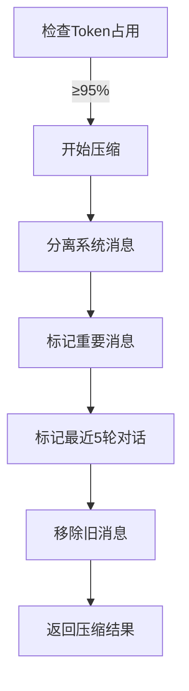
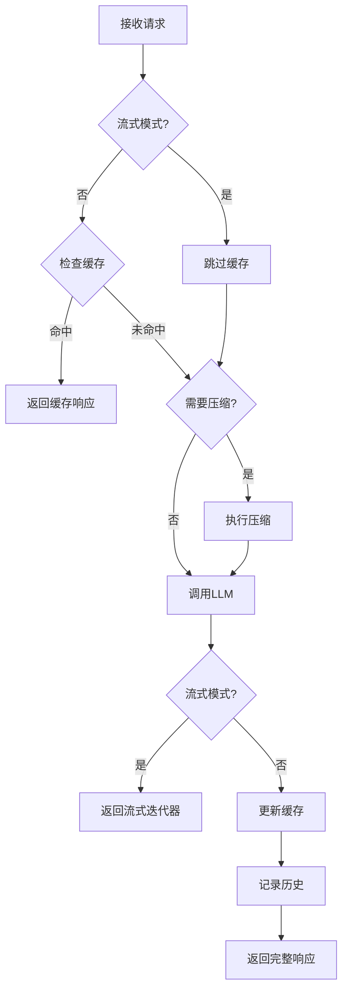
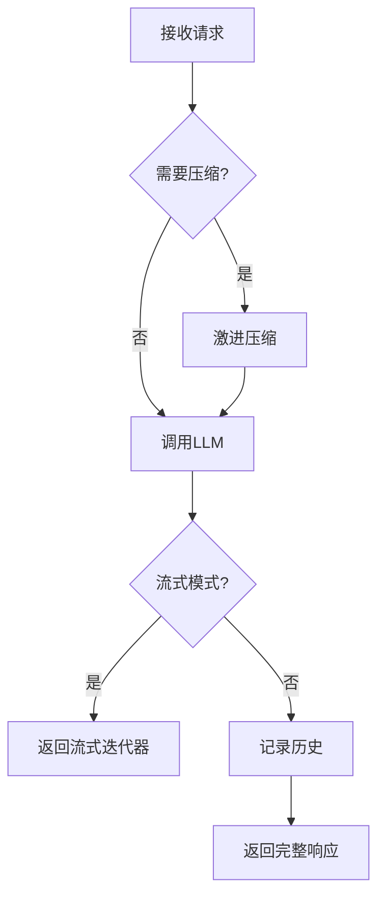

# LLM 模块开发实现设计

## 1. 模块概述

### 1.1 设计对照

本文档基于 `ame-doc/codedetail.md` 中的 LLM 模块设计，提供具体的开发实现方案。

**设计文档章节对应**：
- **2.1 LLM模块** → 本文档 2-4 章节
- **基础能力层目录结构** → 本文档 5 章节
- **使用示例与最佳实践** → 本文档 6 章节

### 1.2 目标目录结构（按 codedetail.md）

**目标结构**（需要实现的）：
```
foundation/llm/
├── __init__.py
├── utils/                 # 通用工具
│   ├── __init__.py
│   ├── models.py         # 数据模型
│   └── exceptions.py     # 异常定义
├── core/                  # 核心实现（原子层）
│   ├── __init__.py
│   ├── base.py           # 抽象基类：LLMCaller
│   ├── openai_caller.py  # OpenAI API调用器
│   └── claude_caller.py  # Claude API调用器(可选)
└── components/            # 组合组件（模块层）
    ├── __init__.py
    ├── prompt_builder.py # 提示词构建器
    └── history_manager.py# 历史管理器
```

**当前实际结构**：
```
foundation/llm/
├── core/                       ✅ 已实现（但结构不同）
│   ├── models.py              ✅ 数据模型
│   ├── history.py             ✅ ConversationHistory
│   ├── exceptions.py          ✅ 异常定义
│   ├── history_manager.py     ⚠️  旧版管理器
│   └── prompt_builder.py      ⚠️  独立组件
├── atomic/                     ⚠️  与目标结构不符
│   ├── caller.py              ✅ 抽象基类
│   ├── openai_caller.py       ✅ OpenAI实现
│   └── strategy/              ✅ 策略组件（目标结构中没有）
└── pipeline/                   ⚠️  与目标结构不符
    ├── session_pipe.py        ✅ 会话管道（目标结构中没有）
    └── document_pipe.py       ✅ 文档管道（目标结构中没有）
```

### 1.3 重构任务

#### 核心任务：将现有代码重构为目标结构

**目标**：按照 codedetail.md 定义的结构重新组织代码

**重构方案**：

**方案A：完全按照 codedetail.md 重构（推荐）**

1. **创建 utils/ 目录**
   - 移动 `core/models.py` → `utils/models.py`
   - 移动 `core/exceptions.py` → `utils/exceptions.py`
   - 删除 `core/history.py`（功能整合到 components/history_manager.py）

2. **重组 core/ 目录**（原子层）
   - 移动 `atomic/caller.py` → `core/base.py`（重命名）
   - 移动 `atomic/openai_caller.py` → `core/openai_caller.py`
   - 可选：添加 `core/claude_caller.py`

3. **创建 components/ 目录**（模块层）
   - 移动 `core/prompt_builder.py` → `components/prompt_builder.py`
   - 移动 `core/history_manager.py` → `components/history_manager.py`（或重写）

4. **处理 atomic/strategy/ 和 pipeline/**
   - **选项1**：删除 `atomic/strategy/` 和 `pipeline/`，将功能整合到 `components/` 中
   - **选项2**：保留为扩展，但不在主 `__init__.py` 导出

**方案B：保留现有结构，扩展目标结构（兼容方案）**

保留 `atomic/`、`pipeline/`，同时创建 `utils/`、`components/` 作为别名或适配层。

**推荐方案A**：项目正在重构，无需向后兼容，应该完全按照新设计实现。

### 1.3 开发任务清单

#### 任务1：代码整合与规范化

**问题**：
1. `core/history_manager.py` - 旧版历史管理器，功能与 `ConversationHistory` 重叠
2. `core/prompt_builder.py` - 独立存在，未融入管道架构

**解决方案**：
- [ ] 评估 `history_manager.py` 是否需要保留（如需保留，重命名为 `history_utils.py`）
- [ ] 将 `prompt_builder.py` 整合到 Capability Layer 或作为工具类
- [ ] 更新 `__init__.py` 导出，移除不推荐使用的旧接口

#### 任务2：测试覆盖完善

**当前测试文件**：
```
ame-tests/foundation/llm/
├── test_openai_caller.py      ✅ OpenAI调用器测试
├── test_pipelines.py          ✅ 管道测试（SessionPipe/DocumentPipe）
├── test_history_manager.py    ⚠️  旧版管理器测试
└── test_prompt_builder.py     ⚠️  独立组件测试
```

**实际项目根目录结构**：
```
another-me/
├── ame/                       # 核心引擎目录
│   ├── foundation/            # 基础能力层
│   ├── capability/            # 组合能力层
│   ├── service/               # 服务层
│   ├── requirements.txt       # Python依赖
│   └── setup.py               # 安装配置
├── ame-tests/                 # 测试目录
├── ame-doc/                   # 文档目录
│   ├── architecture.md        # 架构设计
│   └── codedetail.md          # 代码实现细节
├── docs/                      # 其他文档
├── README.md                  # 项目说明
└── AME_OPTIMIZATION_ROADMAP.md # 优化路线图
```

**注意**：项目当前**仅包含核心引擎部分**，前后端应用（ame-backend、ame-frontend）和部署配置（deployment）不在当前代码库中。

**待补充测试**：
- [ ] `test_cache_strategy.py` - 缓存策略单元测试
- [ ] `test_retry_strategy.py` - 重试策略单元测试
- [ ] `test_compress_strategy.py` - 压缩策略单元测试
- [ ] `test_conversation_history.py` - ConversationHistory测试
- [ ] `test_integration.py` - 完整场景集成测试

#### 任务3：依赖管理

**必需依赖**：
```txt
# LLM 调用
openai>=1.0.0              # OpenAI API客户端
tiktoken>=0.5.0            # 精确Token估算

# 策略组件
cachetools>=5.0.0          # TTLCache缓存

# 日志
loguru>=0.7.0              # 统一日志

# 异步支持
aiohttp>=3.9.0             # 异步HTTP（网络重试）
```

**验证方式**：
```bash
conda activate another
pip list | grep -E "openai|tiktoken|cachetools|loguru|aiohttp"
```

#### 任务4：文档与示例

- [ ] 创建 `examples/llm/` 目录，提供使用示例
- [ ] 编写 `README.md` 说明模块使用方式
- [ ] 补充行内文档字符串（Docstring）

---

## 2. 核心层实现 (Core Layer)

### 2.1 数据模型 (models.py)

#### 实现状态：✅ 完整实现

**关键数据类**：

| 数据类 | 用途 | 关键字段 |
|--------|------|----------|
| `CallMode` | 调用模式枚举 | STREAM, COMPLETE, BATCH |
| `LLMResponse` | LLM响应 | content, model, usage, finish_reason |
| `CompressContext` | 压缩上下文 | messages, max_tokens, token_estimator |
| `CompressResult` | 压缩结果 | kept_messages, removed_messages, compression_ratio |
| `PipelineContext` | 管道上下文 | messages, max_tokens, temperature, stream |
| `PipelineResult` | 管道结果 | response, stream_iterator, compressed, cached |

**辅助函数**：
- `create_user_message(content, **metadata)` → Dict
- `create_assistant_message(content, **metadata)` → Dict
- `create_system_message(content, **metadata)` → Dict

**设计亮点**：
1. **类型安全**：使用 `@dataclass` 和类型注解
2. **属性方法**：`LLMResponse.total_tokens`、`CompressResult.saved_tokens`
3. **工厂方法**：`PipelineContext.from_history(history)`

### 2.2 会话历史 (history.py)

#### 实现状态：✅ 完整实现

**ConversationHistory 核心方法**：

```python
@dataclass
class ConversationHistory:
    messages: List[Dict[str, str]]
    compression_events: List[Dict[str, Any]]
    created_at: datetime
    metadata: Dict[str, Any]
    
    # 核心方法
    def add_message(self, role: str, content: str, **meta)
    def record_compression(self, compression_info: Dict)
    def clear(self)
    def export(self) -> Dict[str, Any]
    def load(self, data: Dict[str, Any])
```

**使用场景**：
1. **管道内部维护**：SessionPipe/DocumentPipe 内部使用
2. **数据持久化**：`export()` 导出完整历史
3. **会话恢复**：`load()` 从存储中恢复
4. **压缩追踪**：`compression_events` 记录压缩历史

### 2.3 异常定义 (exceptions.py)

#### 实现状态：✅ 完整实现

**异常层次**：
```
LLMError (基类)
├── CallerNotConfiguredError    # API Key未配置
├── TokenLimitExceededError     # Token超限
├── CompressionError            # 压缩失败
└── CacheError                  # 缓存错误
```

**使用示例**：
```python
from ame.foundation.llm import CallerNotConfiguredError

if not self.api_key:
    raise CallerNotConfiguredError("OpenAI API密钥未配置")
```

### 2.4 待处理组件

#### history_manager.py - 旧版历史管理器

**现状**：
- 提供 `HistoryManager` 类，功能与 `ConversationHistory` + 压缩策略重叠
- 包含 `manage()`, `summarize_history()`, `estimate_tokens()` 等方法

**处理建议**：

**方案A：废弃（推荐）**
- 理由：功能已被 `ConversationHistory` + `CompressStrategy` 替代
- 操作：
  1. 在 `__init__.py` 中移除导出
  2. 添加 `@deprecated` 注释
  3. 更新测试，使用新接口

**方案B：保留为工具类**
- 重命名为 `history_utils.py`
- 仅保留 `summarize_history()` 方法（使用LLM压缩历史）
- 其他方法迁移到 `ConversationHistory`

**决策依据**：
- 检查是否有外部依赖（Capability Layer / Service Layer）
- 评估 `summarize_history()` 的 LLM摘要功能是否独特

#### prompt_builder.py - 提示词构建器

**现状**：
- 提供 `PromptBuilder` 类和 `PromptTemplates` 常量
- 功能独立，未集成到管道架构

**处理建议**：

**方案A：移至 Capability Layer（推荐）**
- 理由：提示词构建属于**组合能力**，不是原子能力
- 目标位置：`ame/capability/common/prompt_builder.py`
- 依赖：使用 `foundation.llm` 的 `create_*_message` 辅助函数

**方案B：保留为工具类**
- 位置：`foundation/llm/utils/prompt_builder.py`
- 导出：作为可选工具，不在主 `__init__.py` 导出

**实现步骤**：
1. 确定目标位置
2. 更新导入路径
3. 更新 `__init__.py`
4. 更新测试文件

---

## 3. 原子能力层实现 (Atomic Layer)

### 3.1 调用器 (Caller)

#### 3.1.1 LLMCallerBase (caller.py)

**实现状态：✅ 完整实现**

**抽象方法**：

| 方法 | 返回类型 | 说明 |
|------|----------|------|
| `generate()` | `LLMResponse` | 完整生成（等待全部输出） |
| `generate_stream()` | `AsyncIterator[str]` | 流式生成 |
| `estimate_tokens()` | `int` | 估算文本Token数 |
| `is_configured()` | `bool` | 检查配置状态 |

**默认实现**：
- `estimate_messages_tokens(messages)` - 估算消息列表Token数

**设计要点**：
```python
# 每条消息额外计算格式化开销
for msg in messages:
    total += self.estimate_tokens(msg.get("role", ""))
    total += self.estimate_tokens(msg.get("content", ""))
    total += 4  # 消息格式化开销
total += 2  # 对话开始/结束标记
```

#### 3.1.2 OpenAICaller (openai_caller.py)

**实现状态：✅ 完整实现（含tiktoken精确估算）**

**核心特性**：

1. **tiktoken 精确估算**
```python
# 初始化编码器
if TIKTOKEN_AVAILABLE:
    try:
        self._encoding = tiktoken.encoding_for_model(model)
    except KeyError:
        self._encoding = tiktoken.get_encoding("cl100k_base")

# 精确估算
def estimate_tokens(self, text: str) -> int:
    if self._encoding:
        return len(self._encoding.encode(text))
    else:
        # 降级方案：简单估算
        return int(chinese_chars * 1.5 + english_chars * 0.25)
```

2. **异步客户端**
```python
self._client = AsyncOpenAI(
    api_key=api_key,
    base_url=base_url,
    timeout=timeout,
    organization=organization,
    max_retries=0  # 重试由RetryStrategy处理
)
```

3. **流式生成**
```python
async def generate_stream(...) -> AsyncIterator[str]:
    response = await self._client.chat.completions.create(
        model=self.model,
        messages=messages,
        stream=True,
        **kwargs
    )
    
    async for chunk in response:
        if chunk.choices and chunk.choices[0].delta.content:
            yield chunk.choices[0].delta.content
```

**参数说明**：

| 参数 | 类型 | 默认值 | 说明 |
|------|------|--------|------|
| `api_key` | str | 必填 | OpenAI API密钥 |
| `model` | str | "gpt-3.5-turbo" | 模型名称 |
| `base_url` | str | None | API基础URL（代理） |
| `timeout` | float | 60.0 | 超时时间（秒） |
| `organization` | str | None | 组织ID |

#### 3.1.3 StreamCaller (caller.py)

**实现状态：✅ 完整实现**

**核心方法**：

1. **统一调用入口**
```python
async def call(
    self,
    messages: List[Dict[str, str]],
    mode: CallMode = CallMode.COMPLETE,
    **kwargs
):
    """根据mode自动选择调用方式"""
    if mode == CallMode.STREAM:
        return self.caller.generate_stream(messages, **kwargs)
    elif mode == CallMode.COMPLETE:
        return await self.caller.generate(messages, **kwargs)
```

2. **流式回调**
```python
async def stream_with_callback(
    self,
    messages: List[Dict[str, str]],
    on_chunk: Callable[[str], None],
    **kwargs
) -> str:
    """流式调用 + 回调函数"""
    full_response = ""
    async for chunk in self.caller.generate_stream(messages, **kwargs):
        full_response += chunk
        if on_chunk:
            result = on_chunk(chunk)
            if hasattr(result, '__await__'):
                await result
    return full_response
```

3. **批量调用**
```python
async def batch_call(
    self,
    batch_messages: List[List[Dict[str, str]]],
    **kwargs
) -> List[LLMResponse]:
    """批量并发调用"""
    import asyncio
    tasks = [
        self.caller.generate(messages, **kwargs)
        for messages in batch_messages
    ]
    return await asyncio.gather(*tasks)
```

### 3.2 策略组件 (Strategy)

#### 3.2.1 CacheStrategy (cache.py)

**实现状态：✅ 完整实现（TTLCache）**

**核心设计**：

```python
from cachetools import TTLCache

class CacheStrategy:
    def __init__(
        self,
        max_size: int = 1000,
        ttl: int = 3600,
        enabled: bool = True
    ):
        if enabled:
            self.cache = TTLCache(maxsize=max_size, ttl=ttl)
```

**缓存键生成**：
```python
def get_cache_key(
    self,
    messages: List[Dict[str, str]],
    model: str,
    temperature: float = 0.7,
    **kwargs
) -> str:
    """生成MD5哈希键"""
    cache_data = {
        "messages": messages,
        "model": model,
        "temperature": temperature,
    }
    # 添加关键参数
    for key in ["max_tokens", "top_p", "frequency_penalty", "presence_penalty"]:
        if key in kwargs:
            cache_data[key] = kwargs[key]
    
    cache_str = json.dumps(cache_data, sort_keys=True, ensure_ascii=False)
    return hashlib.md5(cache_str.encode('utf-8')).hexdigest()
```

**统计信息**：
```python
def get_stats(self) -> Dict[str, Any]:
    return {
        "enabled": True,
        "size": len(self.cache),
        "max_size": self.max_size,
        "ttl": self.ttl,
        "current_size": len(self.cache)
    }
```

**设计亮点**：
- ✅ **防止内存泄漏**：TTLCache 自动过期
- ✅ **LRU淘汰**：达到 max_size 时自动淘汰最少使用
- ✅ **可禁用**：`enabled=False` 时不使用缓存

#### 3.2.2 RetryStrategy (retry.py)

**实现状态：✅ 完整实现（指数退避）**

**核心设计**：

```python
class RetryStrategy:
    def __init__(
        self,
        max_retries: int = 3,
        backoff_factor: float = 0.5,
        max_backoff: float = 10.0,
        retry_on: Optional[Tuple[Type[Exception], ...]] = None
    ):
```

**指数退避算法**：
```python
def _calculate_backoff(self, attempt: int) -> float:
    """wait_time = min(backoff_factor * (2 ^ attempt), max_backoff)"""
    wait_time = self.backoff_factor * (2 ** attempt)
    return min(wait_time, self.max_backoff)

# 示例：
# attempt=0: 0.5秒
# attempt=1: 1秒
# attempt=2: 2秒
# attempt=3: 4秒
```

**重试执行**：
```python
async def retry_with_backoff(
    self,
    func: Callable,
    *args,
    **kwargs
):
    last_error = None
    
    for attempt in range(self.max_retries):
        try:
            if asyncio.iscoroutinefunction(func):
                return await func(*args, **kwargs)
            else:
                return func(*args, **kwargs)
        except Exception as e:
            last_error = e
            
            if not self._should_retry(e):
                raise
            
            if attempt < self.max_retries - 1:
                wait_time = self._calculate_backoff(attempt)
                logger.warning(f"尝试 {attempt + 1}/{self.max_retries} 失败，{wait_time:.2f}秒后重试...")
                await asyncio.sleep(wait_time)
    
    raise last_error
```

**装饰器用法**：
```python
@RetryStrategy(max_retries=3)
async def my_llm_call():
    ...
```

**预定义策略**：

1. **NetworkRetryStrategy** - 网络错误重试
```python
class NetworkRetryStrategy(RetryStrategy):
    def __init__(self, max_retries: int = 3):
        super().__init__(
            max_retries=max_retries,
            backoff_factor=1.0,
            max_backoff=30.0,
            retry_on=(
                aiohttp.ClientError,
                asyncio.TimeoutError,
                ConnectionError,
            )
        )
```

2. **RateLimitRetryStrategy** - 速率限制重试
```python
class RateLimitRetryStrategy(RetryStrategy):
    def __init__(self, max_retries: int = 5):
        super().__init__(
            max_retries=max_retries,
            backoff_factor=2.0,
            max_backoff=60.0,
        )
```

#### 3.2.3 CompressStrategy (compress.py)

**实现状态：✅ 完整实现（3种策略）**

**抽象基类**：
```python
class CompressStrategy(ABC):
    @abstractmethod
    def should_compress(self, context: CompressContext) -> bool:
        """判断是否需要压缩"""
        pass
    
    @abstractmethod
    def compress(self, context: CompressContext) -> CompressResult:
        """执行压缩"""
        pass
```

**策略1：SessionCompressStrategy - 会话模式**

**设计理念**：保守压缩，适用于对话场景

**压缩规则**：
1. 保留系统消息
2. 保留重要消息（metadata.important=True）
3. 保留最近N轮对话
4. 移除旧消息

```python
class SessionCompressStrategy(CompressStrategy):
    def __init__(
        self,
        threshold: float = 0.95,   # 95%时触发
        keep_recent: int = 5,      # 保留最近5轮
        keep_system: bool = True   # 保留系统消息
    ):
```

**压缩流程**：


**策略2：DocumentCompressStrategy - 文档模式**

**设计理念**：激进压缩，适用于文档分析

**压缩规则**：
1. 保留系统消息
2. 保留最新用户输入
3. 保留最新AI响应
4. 移除所有旧内容

```python
class DocumentCompressStrategy(CompressStrategy):
    def __init__(self, threshold: float = 0.8):  # 80%时触发（更激进）
```

**压缩对比**：

| 场景 | 策略 | 阈值 | 保留内容 |
|------|------|------|----------|
| 会话 | SessionCompress | 95% | 系统+重要+最近5轮 |
| 文档 | DocumentCompress | 80% | 系统+最新1轮 |

**策略3：ChunkingCompressStrategy - 分块压缩**

**设计理念**：处理单条消息超长的情况

```python
class ChunkingCompressStrategy(CompressStrategy):
    def __init__(self, chunk_size: int = 2000):  # 每块2000字符
```

**触发条件**：
```python
def should_compress(self, context: CompressContext) -> bool:
    """检查是否有单条消息超过最大token限制的70%"""
    threshold = context.max_tokens * 0.7
    
    for msg in context.messages:
        msg_tokens = context.token_estimator(msg.get("content", ""))
        if msg_tokens > threshold:
            return True
    return False
```

**分块逻辑**：
```python
# 简单分块（按字符）
content = msg.get("content", "")
chunks = []

for i in range(0, len(content), self.chunk_size):
    chunk = content[i:i + self.chunk_size]
    chunks.append(chunk)

# 创建分块消息
for idx, chunk in enumerate(chunks):
    chunk_msg = {
        "role": msg.get("role", "user"),
        "content": chunk,
        "metadata": {
            "chunked": True,
            "chunk_index": idx,
            "total_chunks": len(chunks)
        }
    }
    kept_messages.append(chunk_msg)
```

---

## 4. 管道能力层实现 (Pipeline Layer)

### 4.1 管道基类 (base.py)

**实现状态：✅ 完整实现**

**设计理念**：定义所有管道必须实现的接口

```python
class PipelineBase(ABC):
    def __init__(self, caller: LLMCallerBase):
        if not isinstance(caller, LLMCallerBase):
            raise TypeError(f"caller必须是LLMCallerBase的子类实例")
        
        self.caller = caller
        self._setup_strategies()
    
    @abstractmethod
    def _setup_strategies(self):
        """设置策略组件 - 子类必须实现"""
        pass
    
    @abstractmethod
    async def process(self, context: PipelineContext) -> PipelineResult:
        """处理请求 - 子类必须实现"""
        pass
```

**辅助方法**：
```python
def _get_context_summary(self, context: PipelineContext) -> str:
    """获取上下文摘要（用于日志）"""
    msg_count = len(context.messages)
    stream_mode = "stream" if context.stream else "complete"
    return f"{msg_count} messages, {stream_mode} mode"
```

### 4.2 SessionPipe - 会话管道

**实现状态：✅ 完整实现**

**设计定位**：适用于多轮对话场景

**组合的策略**：

| 策略 | 配置 | 用途 |
|------|------|------|
| `StreamCaller` | - | 流式/完整调用 |
| `CacheStrategy` | max_size=1000, ttl=3600 | 避免重复调用 |
| `SessionCompressStrategy` | threshold=0.95, keep_recent=5 | 保守压缩历史 |
| `RetryStrategy` | max_retries=3 | 处理临时错误 |

**初始化参数**：
```python
class SessionPipe(PipelineBase):
    def __init__(
        self,
        caller: LLMCallerBase,
        cache_enabled: bool = True,
        cache_ttl: int = 3600,
        compress_threshold: float = 0.95,
        keep_recent: int = 5,
        max_retries: int = 3
    ):
```

**处理流程**：



**核心方法实现**：

```python
async def process(self, context: PipelineContext) -> PipelineResult:
    """处理请求"""
    api_messages = context.to_api_messages()
    
    # 1. 检查缓存（仅完整模式）
    cached = False
    if not context.stream and self.cache_enabled:
        cache_key = self.cache.get_cache_key(
            messages=api_messages,
            model=self.caller.model,
            temperature=context.temperature
        )
        
        cached_response = self.cache.get(cache_key)
        if cached_response:
            return PipelineResult(response=cached_response, cached=True)
    
    # 2. 检查并执行压缩
    compressed = False
    compression_info = None
    
    current_tokens = self.caller.estimate_messages_tokens(api_messages)
    compress_ctx = CompressContext(
        messages=context.messages,
        max_tokens=context.max_tokens,
        token_estimator=self.caller.estimate_tokens,
        current_tokens=current_tokens
    )
    
    if self.compressor.should_compress(compress_ctx):
        result = self.compressor.compress(compress_ctx)
        context.messages = result.kept_messages
        api_messages = context.to_api_messages()
        compressed = True
        compression_info = {...}
        self.history.record_compression(compression_info)
    
    # 3. 调用LLM（带重试）
    if context.stream:
        stream_iterator = await self.retry.retry_with_backoff(
            self.stream_caller.call,
            messages=api_messages,
            mode=CallMode.STREAM,
            temperature=context.temperature,
            **context.metadata
        )
        return PipelineResult(stream_iterator=stream_iterator, ...)
    else:
        response = await self.retry.retry_with_backoff(
            self.stream_caller.call,
            messages=api_messages,
            mode=CallMode.COMPLETE,
            temperature=context.temperature,
            **context.metadata
        )
        
        # 4. 更新缓存
        if self.cache_enabled and cache_key:
            self.cache.set(cache_key, response)
        
        # 5. 记录历史
        self.history.add_message(role="assistant", content=response.content, ...)
        
        return PipelineResult(response=response, ...)
```

**额外功能**：

1. **清空历史**
```python
def clear_history(self):
    """清空会话历史（开启新对话）"""
    self.history.clear()
    self.clear_cache()
```

2. **导出会话**
```python
def export_session(self) -> Dict[str, Any]:
    """导出会话数据（用于存储和分析）"""
    return {
        "type": "session",
        "history": self.history.export(),
        "cache_stats": self.get_cache_stats(),
        "exported_at": datetime.now().isoformat()
    }
```

3. **恢复会话**
```python
@classmethod
def from_export(cls, caller: LLMCallerBase, export_data: Dict[str, Any]):
    """从导出数据恢复会话"""
    pipe = cls(caller=caller)
    history_data = export_data.get("history", {})
    pipe.history.load(history_data)
    return pipe
```

### 4.3 DocumentPipe - 文档管道

**实现状态：✅ 完整实现**

**设计定位**：适用于文档分析场景

**组合的策略**：

| 策略 | 配置 | 用途 |
|------|------|------|
| `StreamCaller` | - | 流式/完整调用 |
| `DocumentCompressStrategy` | threshold=0.8 | 激进压缩（仅保留最新） |
| `RetryStrategy` | max_retries=3 | 处理临时错误 |
| ❌ `CacheStrategy` | - | **不使用缓存**（每次分析都是新内容） |

**初始化参数**：
```python
class DocumentPipe(PipelineBase):
    def __init__(
        self,
        caller: LLMCallerBase,
        compress_threshold: float = 0.8,   # 更激进
        max_retries: int = 3
    ):
```

**核心差异**：

| 特性 | SessionPipe | DocumentPipe |
|------|-------------|--------------|
| **缓存** | ✅ 启用 | ❌ 禁用 |
| **压缩阈值** | 95% | 80% |
| **压缩策略** | 保守（保留重要+最近5轮） | 激进（仅保留最新1轮） |
| **适用场景** | 多轮对话 | 文档分析 |

**处理流程**：



**核心方法实现**：

```python
async def process(self, context: PipelineContext) -> PipelineResult:
    """处理请求 - 注意：不使用缓存"""
    api_messages = context.to_api_messages()
    
    # 1. 检查并执行压缩（激进）
    compressed = False
    compression_info = None
    
    current_tokens = self.caller.estimate_messages_tokens(api_messages)
    compress_ctx = CompressContext(
        messages=context.messages,
        max_tokens=context.max_tokens,
        token_estimator=self.caller.estimate_tokens,
        current_tokens=current_tokens
    )
    
    if self.compressor.should_compress(compress_ctx):
        result = self.compressor.compress(compress_ctx)
        context.messages = result.kept_messages
        api_messages = context.to_api_messages()
        compressed = True
        compression_info = {...}
        self.history.record_compression(compression_info)
    
    # 2. 调用LLM（带重试）
    if context.stream:
        stream_iterator = await self.retry.retry_with_backoff(
            self.stream_caller.call,
            messages=api_messages,
            mode=CallMode.STREAM,
            temperature=context.temperature,
            **context.metadata
        )
        return PipelineResult(
            stream_iterator=stream_iterator,
            compressed=compressed,
            metadata={"mode": "stream", "pipeline": "document"}
        )
    else:
        response = await self.retry.retry_with_backoff(
            self.stream_caller.call,
            messages=api_messages,
            mode=CallMode.COMPLETE,
            temperature=context.temperature,
            **context.metadata
        )
        
        # 3. 记录历史
        self.history.add_message(
            role="assistant",
            content=response.content,
            timestamp=datetime.now().isoformat()
        )
        
        return PipelineResult(
            response=response,
            compressed=compressed,
            compression_info=compression_info,
            metadata={"mode": "complete", "pipeline": "document"}
        )
```

**额外功能**：

1. **清空分析历史**
```python
def clear_history(self):
    """清空分析历史（开启新分析）"""
    self.history.clear()
```

2. **导出分析数据**
```python
def export_session(self) -> Dict[str, Any]:
    """导出分析数据"""
    return {
        "type": "document",
        "history": self.history.export(),
        "exported_at": datetime.now().isoformat()
    }
```

3. **恢复分析**
```python
@classmethod
def from_export(cls, caller: LLMCallerBase, export_data: Dict[str, Any]):
    """从导出数据恢复分析"""
    pipe = cls(caller=caller)
    history_data = export_data.get("history", {})
    pipe.history.load(history_data)
    return pipe
```

---

## 5. 测试实现

### 5.1 测试架构

**测试目录结构**：
```
ame-tests/foundation/llm/
├── test_openai_caller.py          ✅ 已实现
├── test_pipelines.py              ✅ 已实现
├── test_history_manager.py        ⚠️  旧版测试
├── test_prompt_builder.py         ⚠️  旧版测试
├── test_cache_strategy.py         ❌ 待补充
├── test_retry_strategy.py         ❌ 待补充
├── test_compress_strategy.py      ❌ 待补充
└── test_conversation_history.py   ❌ 待补充
```

### 5.2 测试规范

**脚本化测试模式**（符合项目规范）：
```python
"""
模块测试

直接遍历测试用例并执行，打印详细输出供人工验证
"""

import asyncio
import sys
import os

sys.path.insert(0, os.path.join(os.path.dirname(__file__), '../../..'))

from ame import OpenAICaller, SessionPipe


def print_separator(title=""):
    """打印分隔线"""
    if title:
        print(f"\n{'='*80}")
        print(f"  {title}")
        print(f"{'='*80}")
    else:
        print("-" * 80)


async def test_basic():
    """基本功能测试"""
    print_separator("测试基本功能")
    
    # 测试逻辑...
    
    print("\n✅ 基本功能测试完成")


async def main():
    """主测试函数"""
    api_key = os.getenv("OPENAI_API_KEY")
    if not api_key:
        print("❌ 请设置 OPENAI_API_KEY 环境变量")
        return
    
    await test_basic()
    # ... 更多测试


if __name__ == "__main__":
    asyncio.run(main())
```

### 5.3 测试用例设计

#### 5.3.1 test_cache_strategy.py

```python
"""
缓存策略测试

测试要点：
1. 缓存命中/未命中
2. TTL过期机制
3. LRU淘汰机制
4. 缓存统计
"""

import asyncio
import time
from ame.foundation.llm import CacheStrategy, LLMResponse


async def test_cache_hit():
    """测试缓存命中"""
    print_separator("测试缓存命中")
    
    cache = CacheStrategy(max_size=100, ttl=10)
    
    # 生成缓存键
    messages = [{"role": "user", "content": "Hello"}]
    cache_key = cache.get_cache_key(messages, "gpt-3.5-turbo", 0.7)
    
    # 设置缓存
    response = LLMResponse(content="Hi there!", model="gpt-3.5-turbo")
    cache.set(cache_key, response)
    
    # 获取缓存
    cached_response = cache.get(cache_key)
    
    print(f"原始响应: {response.content}")
    print(f"缓存响应: {cached_response.content}")
    print(f"缓存命中: {cached_response is not None}")
    
    assert cached_response is not None
    assert cached_response.content == response.content
    
    print("\n✅ 缓存命中测试完成")


async def test_cache_ttl():
    """测试TTL过期"""
    print_separator("测试TTL过期")
    
    cache = CacheStrategy(max_size=100, ttl=2)  # 2秒过期
    
    messages = [{"role": "user", "content": "Hello"}]
    cache_key = cache.get_cache_key(messages, "gpt-3.5-turbo", 0.7)
    
    response = LLMResponse(content="Hi!", model="gpt-3.5-turbo")
    cache.set(cache_key, response)
    
    # 立即获取
    cached1 = cache.get(cache_key)
    print(f"立即获取: {cached1 is not None}")
    
    # 等待过期
    print("等待3秒...")
    await asyncio.sleep(3)
    
    cached2 = cache.get(cache_key)
    print(f"过期后获取: {cached2 is not None}")
    
    assert cached1 is not None
    assert cached2 is None
    
    print("\n✅ TTL过期测试完成")


async def test_cache_lru():
    """测试LRU淘汰"""
    print_separator("测试LRU淘汰")
    
    cache = CacheStrategy(max_size=3, ttl=60)
    
    # 添加4个缓存项
    for i in range(4):
        messages = [{"role": "user", "content": f"Message {i}"}]
        cache_key = cache.get_cache_key(messages, "gpt-3.5-turbo", 0.7)
        response = LLMResponse(content=f"Response {i}", model="gpt-3.5-turbo")
        cache.set(cache_key, response)
        print(f"添加缓存项 {i}，当前大小: {len(cache)}")
    
    # 检查大小
    print(f"最终缓存大小: {len(cache)} (max_size=3)")
    
    assert len(cache) == 3
    
    print("\n✅ LRU淘汰测试完成")
```

#### 5.3.2 test_retry_strategy.py

```python
"""
重试策略测试

测试要点：
1. 成功重试
2. 达到最大重试次数
3. 指数退避时间
4. 不可重试异常
"""

import asyncio
from ame.foundation.llm import RetryStrategy


class MockError(Exception):
    """模拟错误"""
    pass


async def test_retry_success():
    """测试成功重试"""
    print_separator("测试成功重试")
    
    retry = RetryStrategy(max_retries=3, backoff_factor=0.1)
    
    attempt_count = 0
    
    async def flaky_function():
        nonlocal attempt_count
        attempt_count += 1
        print(f"尝试 {attempt_count}")
        
        if attempt_count < 3:
            raise MockError("临时错误")
        return "Success"
    
    result = await retry.retry_with_backoff(flaky_function)
    
    print(f"最终结果: {result}")
    print(f"总尝试次数: {attempt_count}")
    
    assert result == "Success"
    assert attempt_count == 3
    
    print("\n✅ 成功重试测试完成")


async def test_retry_max_attempts():
    """测试达到最大重试次数"""
    print_separator("测试达到最大重试次数")
    
    retry = RetryStrategy(max_retries=3, backoff_factor=0.1)
    
    async def always_fail():
        raise MockError("持续失败")
    
    try:
        await retry.retry_with_backoff(always_fail)
        assert False, "应该抛出异常"
    except MockError as e:
        print(f"捕获异常: {e}")
        print("✅ 正确抛出异常")
    
    print("\n✅ 最大重试次数测试完成")


async def test_backoff_time():
    """测试指数退避时间"""
    print_separator("测试指数退避时间")
    
    retry = RetryStrategy(max_retries=4, backoff_factor=0.5, max_backoff=5.0)
    
    for attempt in range(4):
        backoff = retry._calculate_backoff(attempt)
        print(f"尝试 {attempt}: 退避时间 = {backoff:.2f}秒")
    
    # 验证指数增长
    assert retry._calculate_backoff(0) == 0.5
    assert retry._calculate_backoff(1) == 1.0
    assert retry._calculate_backoff(2) == 2.0
    assert retry._calculate_backoff(3) == 4.0
    assert retry._calculate_backoff(4) == 5.0  # max_backoff限制
    
    print("\n✅ 指数退避时间测试完成")
```

#### 5.3.3 test_compress_strategy.py

```python
"""
压缩策略测试

测试要点：
1. SessionCompressStrategy - 保守压缩
2. DocumentCompressStrategy - 激进压缩
3. ChunkingCompressStrategy - 分块压缩
"""

import asyncio
from ame.foundation.llm import (
    CompressContext,
    SessionCompressStrategy,
    DocumentCompressStrategy,
    ChunkingCompressStrategy
)


def simple_token_estimator(text: str) -> int:
    """简单Token估算"""
    return len(text) // 4


async def test_session_compress():
    """测试会话模式压缩"""
    print_separator("测试会话模式压缩")
    
    # 创建长对话历史
    messages = [
        {"role": "system", "content": "你是助手"},
        {"role": "user", "content": "问题1" * 100},
        {"role": "assistant", "content": "回答1" * 100},
        {"role": "user", "content": "问题2" * 100, "metadata": {"important": True}},
        {"role": "assistant", "content": "回答2" * 100},
        {"role": "user", "content": "问题3" * 100},
        {"role": "assistant", "content": "回答3" * 100},
    ]
    
    current_tokens = sum(simple_token_estimator(m["content"]) for m in messages)
    
    compress_ctx = CompressContext(
        messages=messages,
        max_tokens=500,
        token_estimator=simple_token_estimator,
        current_tokens=current_tokens
    )
    
    # 会话模式压缩
    compressor = SessionCompressStrategy(threshold=0.5, keep_recent=1)
    
    if compressor.should_compress(compress_ctx):
        result = compressor.compress(compress_ctx)
        
        print(f"压缩前消息数: {len(messages)}")
        print(f"压缩后消息数: {len(result.kept_messages)}")
        print(f"移除消息数: {len(result.removed_messages)}")
        print(f"Token: {result.tokens_before} → {result.tokens_after}")
        print(f"压缩比: {result.compression_ratio:.2%}")
        
        # 验证保留规则
        kept_roles = [m["role"] for m in result.kept_messages]
        print(f"保留的消息角色: {kept_roles}")
        
        assert "system" in kept_roles  # 保留系统消息
        assert len(result.kept_messages) < len(messages)
    
    print("\n✅ 会话模式压缩测试完成")


async def test_document_compress():
    """测试文档模式压缩"""
    print_separator("测试文档模式压缩")
    
    # 创建多轮分析历史
    messages = [
        {"role": "system", "content": "你是分析助手"},
        {"role": "user", "content": "分析片段1" * 100},
        {"role": "assistant", "content": "分析结果1" * 100},
        {"role": "user", "content": "分析片段2" * 100},
        {"role": "assistant", "content": "分析结果2" * 100},
        {"role": "user", "content": "分析片段3" * 100},
        {"role": "assistant", "content": "分析结果3" * 100},
    ]
    
    current_tokens = sum(simple_token_estimator(m["content"]) for m in messages)
    
    compress_ctx = CompressContext(
        messages=messages,
        max_tokens=500,
        token_estimator=simple_token_estimator,
        current_tokens=current_tokens
    )
    
    # 文档模式压缩（激进）
    compressor = DocumentCompressStrategy(threshold=0.5)
    
    if compressor.should_compress(compress_ctx):
        result = compressor.compress(compress_ctx)
        
        print(f"压缩前消息数: {len(messages)}")
        print(f"压缩后消息数: {len(result.kept_messages)}")
        print(f"移除消息数: {len(result.removed_messages)}")
        print(f"Token: {result.tokens_before} → {result.tokens_after}")
        print(f"压缩比: {result.compression_ratio:.2%}")
        
        # 验证激进压缩：仅保留系统+最新1轮
        kept_roles = [m["role"] for m in result.kept_messages]
        print(f"保留的消息角色: {kept_roles}")
        
        assert "system" in kept_roles
        assert len(result.kept_messages) <= 3  # system + user + assistant
    
    print("\n✅ 文档模式压缩测试完成")
```

#### 5.3.4 test_conversation_history.py

```python
"""
ConversationHistory 测试

测试要点：
1. 添加消息
2. 记录压缩事件
3. 导出/加载
4. 清空
"""

import asyncio
from ame.foundation.llm import ConversationHistory


async def test_add_message():
    """测试添加消息"""
    print_separator("测试添加消息")
    
    history = ConversationHistory()
    
    # 添加消息
    history.add_message("user", "Hello")
    history.add_message("assistant", "Hi there!", timestamp="2024-01-01")
    history.add_message("user", "How are you?", important=True)
    
    print(f"消息数量: {len(history)}")
    print(f"消息列表:")
    for msg in history.messages:
        print(f"  {msg['role']}: {msg['content']}")
        if "metadata" in msg:
            print(f"    metadata: {msg['metadata']}")
    
    assert len(history) == 3
    assert history.messages[2].get("metadata", {}).get("important") == True
    
    print("\n✅ 添加消息测试完成")


async def test_export_load():
    """测试导出/加载"""
    print_separator("测试导出/加载")
    
    # 创建历史
    history1 = ConversationHistory()
    history1.add_message("user", "Hello")
    history1.record_compression({"tokens_before": 1000, "tokens_after": 500})
    
    # 导出
    data = history1.export()
    print(f"导出数据: {data.keys()}")
    print(f"消息数: {data['total_messages']}")
    print(f"压缩事件数: {len(data['compression_events'])}")
    
    # 加载
    history2 = ConversationHistory()
    history2.load(data)
    
    print(f"加载后消息数: {len(history2)}")
    print(f"加载后压缩事件数: {len(history2.compression_events)}")
    
    assert len(history2) == len(history1)
    assert len(history2.compression_events) == len(history1.compression_events)
    
    print("\n✅ 导出/加载测试完成")
```

### 5.4 运行测试

**测试命令**：
```bash
conda activate another

# 设置环境变量
export OPENAI_API_KEY="your-api-key"

# 运行单个测试
python ame-tests/foundation/llm/test_cache_strategy.py

# 运行所有测试
for test in ame-tests/foundation/llm/test_*.py; do
    echo "运行测试: $test"
    python "$test"
    echo "---"
done
```

---

## 6. 使用示例与集成指南

### 6.1 基本使用示例

#### 示例1：简单对话

```python
import asyncio
from ame import OpenAICaller, SessionPipe, PipelineContext, create_user_message

async def simple_chat():
    """简单对话示例"""
    
    # 1. 初始化调用器
    caller = OpenAICaller(
        api_key="your-api-key",
        model="gpt-3.5-turbo"
    )
    
    # 2. 创建会话管道
    pipe = SessionPipe(
        caller,
        cache_enabled=True,
        keep_recent=5
    )
    
    # 3. 构建消息
    messages = [
        create_user_message("介绍一下机器学习")
    ]
    
    # 4. 创建上下文
    context = PipelineContext(
        messages=messages,
        max_tokens=4000,
        temperature=0.7
    )
    
    # 5. 处理请求
    result = await pipe.process(context)
    
    # 6. 输出结果
    print(f"响应: {result.response.content}")
    print(f"缓存状态: {'命中' if result.cached else '未命中'}")
    print(f"Token使用: {result.response.total_tokens}")

asyncio.run(simple_chat())
```

#### 示例2：流式对话

```python
import asyncio
from ame import OpenAICaller, SessionPipe, PipelineContext

async def streaming_chat():
    """流式对话示例"""
    
    caller = OpenAICaller(api_key="your-api-key")
    pipe = SessionPipe(caller)
    
    messages = [{"role": "user", "content": "写一首关于AI的诗"}]
    
    context = PipelineContext(
        messages=messages,
        stream=True  # 启用流式模式
    )
    
    result = await pipe.process(context)
    
    # 流式输出
    print("AI回复: ", end="", flush=True)
    full_response = ""
    
    async for chunk in result.stream_iterator:
        print(chunk, end="", flush=True)
        full_response += chunk
    
    print("\n")
    
    # 手动记录assistant响应
    pipe.history.add_message("assistant", full_response)

asyncio.run(streaming_chat())
```

#### 示例3：文档分析

```python
import asyncio
from ame import OpenAICaller, DocumentPipe, PipelineContext, create_system_message, create_user_message

async def analyze_document():
    """文档分析示例"""
    
    caller = OpenAICaller(api_key="your-api-key")
    pipe = DocumentPipe(caller, compress_threshold=0.8)
    
    # 分析多个文档片段
    messages = [
        create_system_message("你是一个文档分析助手"),
        create_user_message("分析这段文档：人工智能正在改变世界...")
    ]
    
    context = PipelineContext(messages=messages)
    result = await pipe.process(context)
    
    print(f"分析结果: {result.response.content}")
    
    # 继续分析下一个片段
    pipe.history.add_message("user", "分析下一段：深度学习是核心技术...")
    
    # 导出分析数据
    export_data = pipe.export_session()
    print(f"分析历史: {export_data['history']['total_messages']} 条消息")

asyncio.run(analyze_document())
```

### 6.2 高级使用示例

#### 示例4：自定义压缩策略

```python
from ame.foundation.llm import CompressStrategy, CompressContext, CompressResult

class CustomCompressStrategy(CompressStrategy):
    """自定义压缩策略：只保留包含关键词的消息"""
    
    def __init__(self, keywords: list, threshold: float = 0.9):
        self.keywords = keywords
        self.threshold = threshold
    
    def should_compress(self, context: CompressContext) -> bool:
        return context.current_tokens >= context.max_tokens * self.threshold
    
    def compress(self, context: CompressContext) -> CompressResult:
        kept_messages = []
        removed_messages = []
        
        for msg in context.messages:
            content = msg.get("content", "")
            # 保留包含关键词的消息
            if any(keyword in content for keyword in self.keywords):
                kept_messages.append(msg)
            else:
                removed_messages.append(msg)
        
        tokens_before = context.current_tokens
        tokens_after = sum(
            context.token_estimator(m.get("content", "")) + 4
            for m in kept_messages
        )
        
        return CompressResult(
            kept_messages=kept_messages,
            removed_messages=removed_messages,
            tokens_before=tokens_before,
            tokens_after=tokens_after,
            compression_ratio=(tokens_before - tokens_after) / tokens_before
        )

# 使用自定义策略
async def use_custom_compressor():
    caller = OpenAICaller(api_key="your-api-key")
    pipe = SessionPipe(caller)
    
    # 替换压缩策略
    pipe.compressor = CustomCompressStrategy(keywords=["重要", "关键"])
    
    # 使用管道...
```

#### 示例5：批量调用

```python
import asyncio
from ame import OpenAICaller, StreamCaller

async def batch_process():
    """批量处理示例"""
    
    caller = OpenAICaller(api_key="your-api-key")
    stream_caller = StreamCaller(caller)
    
    # 批量消息列表
    batch_messages = [
        [{"role": "user", "content": "介绍Python"}],
        [{"role": "user", "content": "介绍JavaScript"}],
        [{"role": "user", "content": "介绍Rust"}],
    ]
    
    # 并发调用
    responses = await stream_caller.batch_call(batch_messages)
    
    for i, response in enumerate(responses):
        print(f"响应 {i+1}: {response.content[:50]}...")

asyncio.run(batch_process())
```

### 6.3 最佳实践

#### 实践1：错误处理

```python
from ame.foundation.llm import CallerNotConfiguredError, TokenLimitExceededError
import asyncio

async def safe_call():
    try:
        caller = OpenAICaller(api_key="invalid-key")
        pipe = SessionPipe(caller)
        
        context = PipelineContext(messages=[...])
        result = await pipe.process(context)
        
    except CallerNotConfiguredError as e:
        print(f"配置错误: {e}")
    except TokenLimitExceededError as e:
        print(f"Token超限: {e}")
    except Exception as e:
        print(f"未知错误: {type(e).__name__}: {e}")
```

#### 实践2：Token管理

```python
from ame import OpenAICaller

# 估算Token
caller = OpenAICaller(api_key="your-api-key")

text = "这是一段中文文本"
tokens = caller.estimate_tokens(text)
print(f"估算Token: {tokens}")

messages = [
    {"role": "user", "content": "Hello"},
    {"role": "assistant", "content": "Hi!"}
]
total_tokens = caller.estimate_messages_tokens(messages)
print(f"消息列表Token: {total_tokens}")
```

#### 实践3：会话持久化

```python
import json
from ame import SessionPipe

# 导出会话
async def export_and_save():
    pipe = SessionPipe(caller)
    # ... 进行对话 ...
    
    # 导出
    export_data = pipe.export_session()
    
    # 保存到文件
    with open("session.json", "w") as f:
        json.dump(export_data, f, indent=2)

# 恢复会话
async def load_and_resume():
    with open("session.json", "r") as f:
        export_data = json.load(f)
    
    # 恢复
    pipe = SessionPipe.from_export(caller, export_data)
    
    # 继续对话...
```

#### 实践4：性能优化

```python
# 1. 启用缓存
pipe = SessionPipe(
    caller,
    cache_enabled=True,
    cache_ttl=3600  # 1小时过期
)

# 2. 调整压缩阈值
pipe = SessionPipe(
    caller,
    compress_threshold=0.9  # 90%时压缩
)

# 3. 减少重试次数（加快失败响应）
pipe = SessionPipe(
    caller,
    max_retries=2
)

# 4. 流式输出（降低首字延迟）
context = PipelineContext(
    messages=messages,
    stream=True
)
```

### 6.4 与Capability Layer集成

#### 集成示例：DialogueGenerator

```python
# ame/capability/life/dialogue_generator.py

from ame.foundation.llm import SessionPipe, PipelineContext, create_system_message, create_user_message

class DialogueGenerator:
    """对话生成器 - Capability Layer"""
    
    def __init__(self, session_pipe: SessionPipe):
        """
        Args:
            session_pipe: 由CapabilityFactory提供
        """
        self.pipe = session_pipe
    
    async def generate(
        self,
        message: str,
        context: list,
        style: str = "friendly"
    ) -> str:
        """生成个性化回复"""
        
        # 构建系统提示词
        system_prompt = self._build_system_prompt(style)
        
        # 构建消息列表
        messages = [create_system_message(system_prompt)]
        
        # 添加上下文
        for ctx in context:
            messages.append(create_user_message(ctx["content"]))
        
        # 添加当前消息
        messages.append(create_user_message(message))
        
        # 调用管道
        pipeline_ctx = PipelineContext(messages=messages)
        result = await self.pipe.process(pipeline_ctx)
        
        return result.response.content
    
    def _build_system_prompt(self, style: str) -> str:
        """构建系统提示词"""
        prompts = {
            "friendly": "你是一个友好的助手",
            "professional": "你是一个专业的顾问",
            "casual": "你是一个随和的朋友"
        }
        return prompts.get(style, prompts["friendly"])
```

#### CapabilityFactory 集成

```python
# ame/capability/factory.py

from ame.foundation.llm import OpenAICaller, SessionPipe
from ame.capability.life import DialogueGenerator

class CapabilityFactory:
    """能力工厂"""
    
    _instances = {}
    
    @classmethod
    def get_llm_caller(cls, api_key: str, model: str = "gpt-3.5-turbo"):
        """获取LLM调用器"""
        key = f"llm_caller_{model}"
        if key not in cls._instances:
            cls._instances[key] = OpenAICaller(api_key=api_key, model=model)
        return cls._instances[key]
    
    @classmethod
    def get_session_pipe(cls, api_key: str):
        """获取会话管道"""
        if "session_pipe" not in cls._instances:
            caller = cls.get_llm_caller(api_key)
            cls._instances["session_pipe"] = SessionPipe(caller)
        return cls._instances["session_pipe"]
    
    @classmethod
    def get_dialogue_generator(cls, api_key: str):
        """获取对话生成器"""
        if "dialogue_generator" not in cls._instances:
            pipe = cls.get_session_pipe(api_key)
            cls._instances["dialogue_generator"] = DialogueGenerator(pipe)
        return cls._instances["dialogue_generator"]
```

---

## 7. 依赖与部署

### 7.1 依赖清单

**requirements.txt**：
```txt
# LLM 核心依赖
openai>=1.0.0              # OpenAI API客户端
tiktoken>=0.5.0            # 精确Token估算

# 策略组件依赖
cachetools>=5.0.0          # TTLCache缓存

# 日志
loguru>=0.7.0              # 统一日志

# 异步支持
aiohttp>=3.9.0             # 异步HTTP（网络重试用）
```

### 7.2 安装与验证

**安装步骤**：
```bash
# 激活conda环境
conda activate another

# 安装依赖
pip install openai>=1.0.0 tiktoken>=0.5.0 cachetools>=5.0.0 loguru>=0.7.0 aiohttp>=3.9.0

# 验证安装
python -c "import openai, tiktoken, cachetools, loguru, aiohttp; print('All dependencies installed')"
```

**版本检查**：
```bash
pip list | grep -E "openai|tiktoken|cachetools|loguru|aiohttp"
```

### 7.3 环境配置

**环境变量**：
```bash
# OpenAI API配置
export OPENAI_API_KEY="your-api-key"
export OPENAI_BASE_URL="https://api.openai.com/v1"  # 可选，用于代理

# 日志级别
export LOG_LEVEL="INFO"  # DEBUG/INFO/WARNING/ERROR
```

**.env 文件**（可选）：
```env
OPENAI_API_KEY=your-api-key
OPENAI_BASE_URL=https://api.openai.com/v1
LOG_LEVEL=INFO
```

### 7.4 部署检查清单

- [ ] 验证 Python 版本 >= 3.11
- [ ] 验证所有依赖已安装
- [ ] 验证 OpenAI API Key 可用
- [ ] 运行单元测试确认功能正常
- [ ] 检查日志输出配置
- [ ] 验证缓存目录权限
- [ ] 性能基准测试

---

## 8. 后续优化方向

### 8.1 待补充功能

1. **Claude API 支持**
   - 实现 `ClaudeCaller` 继承 `LLMCallerBase`
   - 适配 Anthropic API 接口

2. **本地模型支持**
   - 实现 `LocalLLMCaller` 支持 LLaMA、ChatGLM
   - 适配 HuggingFace Transformers API

3. **更多压缩策略**
   - `SummaryCompressStrategy` - 使用LLM摘要压缩历史
   - `ImportanceCompressStrategy` - 基于消息重要性评分压缩

4. **Prompt管理增强**
   - 提示词版本管理
   - 提示词A/B测试
   - 提示词效果评估

### 8.2 性能优化

1. **缓存优化**
   - 实现分布式缓存（Redis）
   - 缓存预热机制
   - 缓存命中率监控

2. **并发优化**
   - 请求队列管理
   - 并发限流
   - 超时控制

3. **Token优化**
   - 动态调整 max_tokens
   - 智能分块策略
   - Token使用统计

### 8.3 监控与可观测性

1. **日志增强**
   - 结构化日志输出
   - 日志链路追踪
   - 日志聚合分析

2. **指标监控**
   - 请求成功率
   - 平均响应时间
   - Token使用量
   - 缓存命中率
   - 压缩触发频率

3. **告警机制**
   - API调用失败告警
   - Token超限告警
   - 异常重试告警
