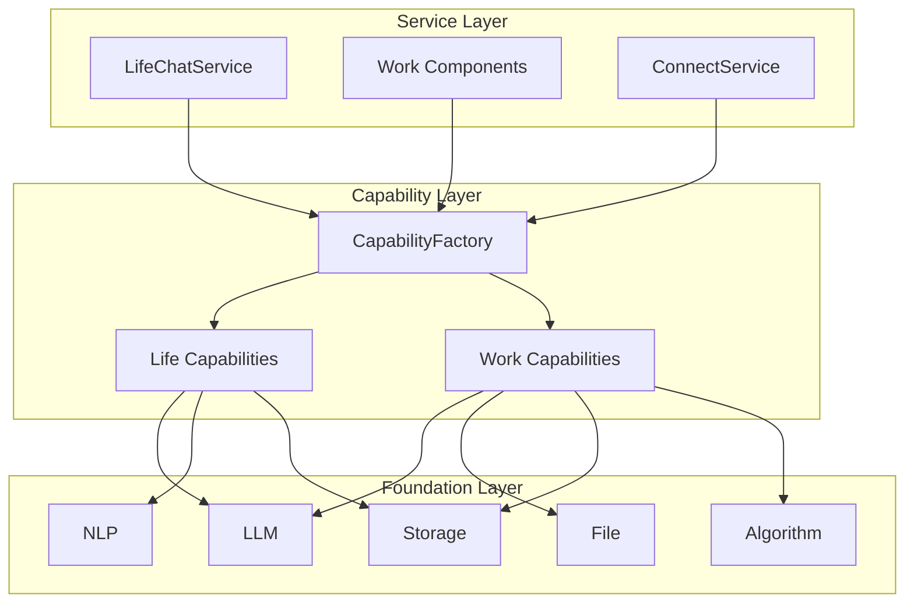
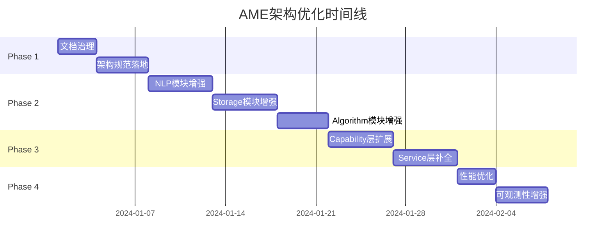

# AME 项目架构优化设计

## 1. 项目概述

**AME (Another Me Engine)** 是一个 AI 数字分身引擎，采用三层架构（Foundation → Capability → Service），通过模块化设计实现高度可扩展。项目当前实现了核心能力层，但存在文档冗余、部分架构不合理、测试覆盖不足等问题。

### 1.1 现有架构分析



### 1.2 核心优化目标

| 目标 | 现状问题 | 预期效果 |
|-----|---------|---------|
| **文档精简** | 文档分散重复(architecture.md + foundation/*.md)，内容过时 | 单一权威文档源，易于维护 |
| **架构统一** | Service层部分组件未遵循Factory注入规范 | 统一依赖注入，降低耦合 |
| **模块优化** | NLP/Storage/Algorithm模块功能单一、可扩展性弱 | 增强通用性和可配置性 |
| **测试完善** | 测试覆盖率低，缺少集成测试 | 核心模块测试覆盖>80% |

---

## 2. 架构现状评估

### 2.1 优势分析

✅ **三层架构清晰**
- Foundation层职责单一，原子能力解耦良好
- CapabilityFactory实现了依赖注入中心
- Service层封装业务逻辑，可复用性强

✅ **模块化设计成熟**
- Foundation层按功能划分为LLM/File/NLP/Storage/Algorithm
- 每个模块内部采用atomic-core-pipeline三层结构
- 遵循开闭原则，易于扩展

✅ **代码质量较高**
- 类型注解完整
- 异常处理规范
- 日志记录详细

✅ **Service层架构统一**
- `ConnectService`: 已遵循Factory注入规范 ✅
- `LifeChatService`: 已遵循Factory注入规范 ✅
- `WorkProjectService/WorkTodoService/WorkAdviceService`: 已遵循Factory注入规范 ✅

### 2.2 问题识别

#### 问题1: 文档严重过时与代码脱节 🔴

**文档问题分析**:

1. **`ame-doc/foundation/llm.md`**:
   - ❌ 文档中使用的类名：`AtomicOpenAICaller`、`ConversationMessage`
   - ✅ 实际代码类名：`OpenAICaller`、消息使用标准字典格式
   - ❌ 文档提到"双层架构"，实际是三层架构（atomic-core-pipeline）
   - ❌ 示例代码无法运行，导入路径和API调用都不正确

2. **`ame-doc/foundation/file.md`**:
   - ❌ 描述准确，但过于详细（235行），与"代码即文档"理念冲突
   - ✅ 代码结构与文档描述基本一致
   - ⚠️ 示例路径引用 `ame/docs/examples/08_file_parsing.py`（不存在）

3. **`ame-doc/foundation/storage.md`**:
   - ⚠️ 描述基本准确，但部分API可能已变化
   - ✅ Pipeline层的时间属性设计与文档一致
   - ❌ 缺少与实际代码的同步验证

4. **`ame-doc/architecture.md`**:
   - ❌ 标注"Phase 2: Storage（进行中）"，实际已完成
   - ❌ 标注"Phase 3/4/5: 规划中"，实际Capability/Service已部分实现
   - ✅ 三层架构描述准确
   - ⚠️ 技术栈描述部分过时（如"前端: Reflex"未在代码中体现）

**根本问题**:
- 文档维护滞后，与代码演进脱节
- 缺少文档自动化验证机制
- 过度详细的文档反而成为维护负担

**影响**:
- 开发者无法信任文档，只能阅读源码
- 新人onboarding成本高（文档误导）
- 社区贡献者难以理解真实架构

#### 问题2: NLP模块扩展性不足 🔴

**问题分析**（基于代码）:

1. **IntentRecognizer** ([intent_recognizer.py](file:///Users/kaiiangs/Desktop/another-me/ame/foundation/nlp/atomic/intent_recognizer.py)):
   - ❌ 意图类型硬编码在`_init_rules()`中，仅支持4种（QUERY_SELF/COMFORT/ANALYZE/CHAT）
   - ❌ 规则模式固定，无法动态添加新意图
   - ⚠️ LLM识别使用硬编码prompt，缺少prompt模板配置
   - ✅ 已实现规则+LLM混合策略（优势保留）

2. **EntityExtractor** ([entity_extractor.py](file:///Users/kaiiangs/Desktop/another-me/ame/foundation/nlp/atomic/entity_extractor.py)):
   - ❌ jieba词性映射固定在`_map_flag_to_type()`，仅支持5种类型
   - ❌ 缺少自定义词典加载接口
   - ❌ NER模型不可切换（仅jieba）
   - ⚠️ LLM提取依赖硬编码类型列表

3. **Summarizer**（未读取代码，待验证）:
   - 假设：功能单一，不支持多策略

**技术债务**:
```python
# IntentRecognizer硬编码问题示例
def _init_rules(self) -> Dict[IntentType, List[str]]:
    return {
        IntentType.QUERY_SELF: [r"我.*?(喜欢|兴趣)"],  # 固定规则
        IntentType.COMFORT: [r"(难过|伤心)"],
        # 无法动态添加新意图
    }
```

**优化方向**:
1. **配置化意图识别**:
   ```python
   class IntentRecognizer:
       def __init__(
           self,
           llm_caller=None,
           custom_intents: Optional[Dict[str, List[str]]] = None,  # 新增
           intent_config_path: Optional[str] = None  # 新增：从配置文件加载
       ):
       
       def register_intent(self, intent_name: str, patterns: List[str]):
           """动态注册新意图"""
   ```

2. **可扩展实体提取**:
   ```python
   class EntityExtractor:
       def load_custom_dict(self, dict_path: str) -> None:
           """加载自定义jieba词典"""
           if self.jieba:
               self.jieba.load_userdict(dict_path)
       
       def set_ner_backend(self, backend: str) -> None:
           """切换NER后端：jieba/spacy/hanlp"""
   ```

3. **多策略摘要器**:
   ```python
   class SummaryStrategy(Enum):
       EXTRACTIVE = "extractive"  # 抽取式
       GENERATIVE = "generative"  # 生成式
       HYBRID = "hybrid"          # 混合式
   
   class Summarizer:
       def set_strategy(self, strategy: SummaryStrategy):
           """切换摘要策略"""
   ```

#### 问题3: Storage模块功能不完整 🔴

**问题分析**（基于代码）:

1. **FalkorDBStore** ([falkordb_store.py](file:///Users/kaiiangs/Desktop/another-me/ame/foundation/storage/atomic/falkordb_store.py)):
   - ✅ 实现了GraphStoreBase抽象接口
   - ✅ 支持节点/边的CRUD操作
   - ⚠️ 异步方法实现，但内部调用的`graph.query()`是同步的（可能阻塞）
   - ❌ 缺少批量操作优化（如批量创建节点）

2. **向量存储缺失**:
   - ❌ 无VectorStoreBase抽象接口
   - ❌ 无Faiss实现（架构文档提到但未实现）
   - ❌ 无向量检索能力

3. **混合检索缺失**:
   - ❌ 无HybridRetriever实现
   - ❌ 架构文档提到的"60%向量+40%图谱"策略未落地

**核心缺陷**:
```python
# FalkorDBStore的伪异步问题
async def create_node(self, node: GraphNode) -> str:
    # 虽然方法是async，但内部是同步调用
    result = self.graph.query(cypher)  # 同步操作！
    return node_id
```

**优化方案**:

1. **实现向量存储层**:
   ```python
   # ame/foundation/storage/atomic/vector_store.py
   class VectorStoreBase(ABC):
       @abstractmethod
       async def add_vectors(
           self, 
           vectors: List[Vector], 
           metadata: List[Dict]
       ) -> List[str]:
           """批量添加向量"""
       
       @abstractmethod
       async def search(
           self, 
           query_vector: Vector, 
           k: int = 10,
           filter: Optional[Dict] = None
       ) -> List[SearchResult]:
           """向量检索"""
   
   # ame/foundation/storage/atomic/faiss_store.py
   class FaissVectorStore(VectorStoreBase):
       """Faiss本地向量存储实现"""
       def __init__(self, index_path: str, dim: int = 1536):
           import faiss
           self.index = faiss.IndexFlatL2(dim)
   ```

2. **实现混合检索**:
   ```python
   # ame/foundation/storage/atomic/hybrid_retriever.py
   class HybridRetriever:
       def __init__(
           self,
           vector_store: VectorStoreBase,
           graph_store: GraphStoreBase,
           vector_weight: float = 0.6,
           graph_weight: float = 0.4
       ):
       
       async def retrieve(
           self, 
           query: str, 
           k: int = 10
       ) -> List[RetrievalResult]:
           # 1. 向量检索
           vector_results = await self.vector_store.search(...)
           
           # 2. 图谱检索
           graph_results = await self.graph_store.search_by_context(...)
           
           # 3. RRF融合
           merged = self._reciprocal_rank_fusion(
               vector_results, 
               graph_results
           )
           return merged
   ```

3. **解耦Pipeline与存储**:
   ```python
   # ame/foundation/storage/pipeline/base.py
   class GraphPipelineBase:
       def __init__(
           self,
           graph_store: GraphStoreBase,  # 抽象依赖，非FalkorDB
           vector_store: Optional[VectorStoreBase] = None
       ):
   ```

#### 问题4: Algorithm模块能力不足 🟡

**问题分析**（基于代码）:

1. **TodoSorter** ([todo_sorter.py](file:///Users/kaiiangs/Desktop/another-me/ame/foundation/algorithm/todo_sorter.py)):
   - ✅ 实现了拓扑排序（Kahn算法）处理依赖关系
   - ✅ 考虑了优先级和截止日期
   - ❌ 评分权重硬编码在`_priority_score()`中：
     ```python
     priority_map = {
         Priority.HIGH: 100,    # 固定值
         Priority.MEDIUM: 50,
         Priority.LOW: 10
     }
     # 紧急度计算逻辑也是硬编码
     ```
   - ❌ 缺少自定义评分函数接口
   - ⚠️ 循环依赖检测简单（仅通过拓扑排序发现）

2. **缺失的通用算法**:
   - ❌ 文本相似度计算（余弦/Jaccard/编辑距离）
   - ❌ 时间模式分析（用户活跃时段统计）
   - ❌ 关键词提取算法（TF-IDF/TextRank）

**优化方案**:

1. **可配置TodoSorter**:
   ```python
   class TodoSorter:
       def __init__(
           self,
           urgency_weight: float = 0.4,      # 新增：可配置权重
           importance_weight: float = 0.4,
           dependency_weight: float = 0.2,
           custom_scorer: Optional[Callable] = None  # 新增：自定义评分
       ):
       
       def _priority_score(self, todo: TodoItem) -> float:
           if self.custom_scorer:
               return self.custom_scorer(todo)
           
           # 默认评分逻辑
           urgency = self._calc_urgency(todo) * self.urgency_weight
           importance = self._calc_importance(todo) * self.importance_weight
           return urgency + importance
   ```

2. **新增文本相似度模块**:
   ```python
   # ame/foundation/algorithm/text_similarity.py
   class TextSimilarity:
       @staticmethod
       def cosine(text1: str, text2: str) -> float:
           """余弦相似度"""
       
       @staticmethod
       def jaccard(text1: str, text2: str) -> float:
           """Jaccard相似度"""
       
       @staticmethod
       def edit_distance(text1: str, text2: str) -> int:
           """编辑距离（Levenshtein）"""
   ```

3. **新增时间分析模块**:
   ```python
   # ame/foundation/algorithm/time_analyzer.py
   class TimePatternAnalyzer:
       def analyze_active_hours(
           self, 
           timestamps: List[datetime]
       ) -> Dict[int, int]:
           """分析活跃时段（小时级统计）"""
       
       def detect_periodicity(
           self, 
           events: List[Event]
       ) -> Optional[timedelta]:
           """检测周期性（如每周一开会）"""
   ```

#### 问题5: 测试覆盖不足

**问题描述**:
```
ame-tests/
├── foundation/
│   ├── file/test_file_parsing.py
│   ├── llm/test_openai_caller.py
│   ├── llm/test_pipelines.py
│   └── storage/test_*
├── test_ame_basic.py
└── test_ame_integration.py
```

**缺失**:
- NLP模块无测试
- Algorithm模块无测试
- Capability层无测试
- Service层无测试

---

## 3. 分阶段优化方案

### Phase 1: 文档治理与清理 (1周)

#### 任务1.1: 删除过时文档

**删除清单**（基于代码验证）:

✅ **确认删除**:
1. `ame-doc/foundation/llm.md` (108行)
   - 原因：类名错误（AtomicOpenAICaller不存在）、示例代码无法运行
   - 替代：Foundation层代码 + type hints + docstring

2. `ame-doc/foundation/file.md` (236行)
   - 原因：过度详细，维护成本高，与"代码即文档"理念冲突
   - 替代：代码中的docstring + README快速示例

3. `ame-doc/foundation/storage.md` (225行)
   - 原因：与llm.md/file.md同样问题，且缺少同步验证
   - 替代：Schema定义代码 + 集成测试

**保留并简化**:
- `ame-doc/architecture.md`: 精简为核心架构说明（≤150行）
  - 删除详细实施路线
  - 删除过时的Phase状态
  - 保留架构图和设计原则

- `README.md`: 保留，作为项目入口
  - 已包含快速开始和示例
  - 无需额外foundation文档

**产出文档结构**:
```
project/
├── README.md                    # 项目入口 + 快速开始
├── ame-doc/
│   └── architecture.md          # 精简架构文档（≤150行）
└── ame/
    ├── foundation/              # 代码即文档
    ├── capability/
    └── service/
```

#### 任务1.2: 更新核心文档

**更新 `ame-doc/architecture.md`**:

删除内容：
- ❌ 详细的Phase实施路线（已过时）
- ❌ 技术栈详细列表（README已有）
- ❌ Foundation层详细说明（代码自说明）

保留内容：
- ✅ 三层架构Mermaid图
- ✅ 设计原则和架构规范
- ✅ 技术决策表

新增内容：
- ✅ **架构规范**章节：
  ```markdown
  ## 架构规范
  
  ### Service层依赖注入规范
  - 所有Service必须通过CapabilityFactory获取能力
  - 禁止在Service内部创建Factory实例
  - 禁止直接传递Foundation层组件到Service
  
  ### 模块三层结构规范
  - Foundation层：atomic-core-pipeline三层结构
  - 职责清晰：atomic提供原子能力、core定义数据模型、pipeline编排组合
  ```

**更新 `README.md`**:
- 修正"功能清单"中的Phase状态（标注实际完成情况）
- 更新"Roadmap"，反映真实进度

---

### Phase 2: 基础层能力增强 (2周)

#### 任务2.1: NLP模块增强

**优化点**:

1. **意图识别器 - 支持自定义意图**
   ```python
   class IntentRecognizer:
       def __init__(
           self,
           llm_caller: Optional[LLMCallerBase] = None,
           custom_intents: Optional[List[str]] = None,
           intent_rules: Optional[Dict[str, List[str]]] = None
       ):
           # custom_intents: 自定义意图列表
           # intent_rules: 关键词规则映射
   ```

2. **实体提取器 - 支持自定义词典**
   ```python
   class EntityExtractor:
       def load_custom_dict(self, dict_path: str) -> None:
           """加载自定义jieba词典"""
       
       def set_ner_model(self, model: str) -> None:
           """切换NER模型（jieba/spacy/自定义）"""
   ```

3. **摘要器 - 多策略支持**
   ```python
   class SummaryStrategy(Enum):
       EXTRACTIVE = "extractive"  # 抽取式
       GENERATIVE = "generative"  # 生成式
       HYBRID = "hybrid"          # 混合式
   
   class Summarizer:
       def set_strategy(self, strategy: SummaryStrategy) -> None:
           """设置摘要策略"""
   ```

**测试要求**:
- 新增 `ame-tests/foundation/nlp/test_intent_recognizer.py`
- 新增 `ame-tests/foundation/nlp/test_entity_extractor.py`
- 新增 `ame-tests/foundation/nlp/test_summarizer.py`
- 覆盖率目标: >80%

#### 任务2.2: Storage模块增强

**优化点**:

1. **实现向量存储接口**
   ```python
   # ame/foundation/storage/atomic/vector_store.py
   class VectorStoreBase(ABC):
       @abstractmethod
       async def add_vectors(self, vectors: List[Vector]) -> None: ...
       
       @abstractmethod
       async def search(self, query_vector: Vector, k: int) -> List[SearchResult]: ...
   
   class FaissVectorStore(VectorStoreBase):
       """Faiss向量存储实现"""
   ```

2. **解耦Pipeline与存储**
   ```python
   # ame/foundation/storage/pipeline/base.py
   class GraphPipelineBase:
       def __init__(
           self,
           graph_store: GraphStoreBase,  # 抽象依赖
           vector_store: Optional[VectorStoreBase] = None
       ):
   ```

3. **新增混合检索能力**
   ```python
   # ame/foundation/storage/atomic/hybrid_retriever.py
   class HybridRetriever:
       def __init__(
           self,
           vector_store: VectorStoreBase,
           graph_store: GraphStoreBase,
           vector_weight: float = 0.6,
           graph_weight: float = 0.4
       ):
   ```

**文件结构**:
```
storage/
├── atomic/
│   ├── base.py
│   ├── falkordb_store.py
│   ├── vector_store.py          # 新增
│   ├── faiss_store.py           # 新增
│   └── hybrid_retriever.py      # 新增
├── core/
│   ├── models.py                # 新增Vector模型
└── pipeline/
    ├── base.py                  # 解耦重构
    ├── life_graph_pipeline.py
    └── work_graph_pipeline.py
```

**测试要求**:
- 新增 `ame-tests/foundation/storage/test_vector_store.py`
- 新增 `ame-tests/foundation/storage/test_hybrid_retriever.py`
- 覆盖率目标: >75%

#### 任务2.3: Algorithm模块增强

**优化点**:

1. **TodoSorter可配置化**
   ```python
   class TodoSorter:
       def __init__(
           self,
           urgency_weight: float = 0.4,
           importance_weight: float = 0.4,
           dependency_weight: float = 0.2
       ):
           """支持自定义评分权重"""
   ```

2. **新增通用算法**
   ```python
   # ame/foundation/algorithm/text_similarity.py
   class TextSimilarity:
       """文本相似度计算（余弦/Jaccard/编辑距离）"""
   
   # ame/foundation/algorithm/time_analyzer.py
   class TimePatternAnalyzer:
       """时间模式分析（活跃时段、周期性等）"""
   ```

**测试要求**:
- 新增 `ame-tests/foundation/algorithm/test_todo_sorter.py`
- 新增 `ame-tests/foundation/algorithm/test_text_similarity.py`
- 覆盖率目标: >85%

---

### Phase 3: 能力层扩展与服务完善 (2周)

#### 任务3.1: Capability层新能力

**新增能力**:

1. **混合检索能力（Capability层封装）**
   ```python
   # ame/capability/retrieval/hybrid_retriever.py
   class HybridRetrievalCapability:
       """
       封装混合检索逻辑：
       1. 向量检索
       2. 图谱检索
       3. 结果融合与重排序
       """
       def __init__(
           self,
           vector_store: VectorStoreBase,
           graph_store: GraphStoreBase,
           llm_caller: Optional[LLMCallerBase] = None  # 用于重排序
       ):
   ```

2. **知识管理能力**
   ```python
   # ame/capability/knowledge/document_manager.py
   class DocumentManager:
       """
       文档管理：上传、解析、向量化、索引
       """
       def __init__(
           self,
           doc_parser: DocumentParsePipeline,
           vector_store: VectorStoreBase,
           entity_extractor: EntityExtractor
       ):
   ```

**CapabilityFactory扩展**:
```python
class CapabilityFactory:
    def create_hybrid_retriever(
        self,
        vector_store: VectorStoreBase,
        graph_store: GraphStoreBase,
        cache_key: Optional[str] = None
    ) -> HybridRetrievalCapability:
        ...
    
    def create_document_manager(
        self,
        vector_store: VectorStoreBase,
        cache_key: Optional[str] = None
    ) -> DocumentManager:
        ...
```

#### 任务3.2: Service层补全

**新增服务**:

1. **KnowledgeService（知识管理服务）**
   ```python
   # ame/service/knowledge/knowledge_service.py
   class KnowledgeService:
       """
       功能：
       - 文档上传与解析
       - 知识检索（RAG）
       - 知识问答
       """
       def __init__(self, capability_factory: CapabilityFactory, **config):
           self.doc_manager = factory.create_document_manager(...)
           self.hybrid_retriever = factory.create_hybrid_retriever(...)
   ```

2. **RetrievalService（检索服务）**
   ```python
   # ame/service/retrieval/retrieval_service.py
   class RetrievalService:
       """
       统一检索服务：
       - 向量检索
       - 图谱检索
       - 混合检索
       """
   ```

**测试要求**:
- 新增 `ame-tests/service/test_knowledge_service.py`
- 新增 `ame-tests/service/test_retrieval_service.py`
- 覆盖率目标: >70%

---

### Phase 4: 性能优化与可观测性 (1周)

#### 任务4.1: 性能优化

**优化点**:

1. **缓存机制优化**
   - Factory缓存支持TTL和LRU策略
   - LLM响应缓存（基于prompt hash）
   - 向量检索结果缓存

2. **异步优化**
   - 所有IO操作异步化
   - 批量操作优化（批量向量插入/检索）

3. **资源管理**
   ```python
   class CapabilityFactory:
       async def cleanup(self):
           """清理所有缓存资源"""
           for resource in self._cache.values():
               if hasattr(resource, 'close'):
                   await resource.close()
   ```

#### 任务4.2: 可观测性增强

**优化点**:

1. **统一日志规范**
   ```python
   # ame/foundation/utils/logger.py
   def setup_logger(
       level: str = "INFO",
       log_file: Optional[str] = None,
       json_format: bool = False
   ):
   ```

2. **性能监控**
   ```python
   # ame/foundation/utils/metrics.py
   class PerformanceMetrics:
       """记录LLM调用时长、检索耗时、缓存命中率等"""
   ```

3. **错误追踪**
   - 增强异常类携带上下文信息
   - 支持链路追踪（trace_id）

---

## 4. 技术决策与风险

### 4.1 技术选型

| 决策点 | 方案 | 理由 |
|-------|-----|-----|
| **向量存储** | Faiss | 轻量级、高性能、本地化 |
| **检索策略** | 向量60% + 图谱40% | 兼顾语义理解与关系推理 |
| **缓存策略** | LRU + TTL | 平衡内存占用与性能 |
| **测试框架** | pytest | 生态成熟、插件丰富 |

### 4.2 风险与应对

| 风险 | 影响 | 应对措施 |
|-----|-----|---------|
| **API兼容性破坏** | 现有代码失效 | 增量优化，保留旧接口过渡期 |
| **向量存储性能问题** | 大规模检索慢 | 分片索引、增量构建、ANN优化 |
| **测试成本高** | 延长开发周期 | 优先覆盖核心路径，非关键路径允许延后 |

---

## 5. 实施计划与验收标准

### 5.1 实施时间线



### 5.2 验收标准

#### Phase 1 验收

- [ ] 删除3个过时的foundation文档（llm.md/file.md/storage.md）
- [ ] `architecture.md`精简至≤150行，内容与代码一致
- [ ] `README.md`状态更新，反映真实完成度
- [ ] 验证所有Service遵循Factory注入规范（已验证✅）

#### Phase 2 验收

- [ ] NLP模块支持自定义意图、词典、摘要策略
- [ ] Storage实现向量存储和混合检索
- [ ] Algorithm支持配置化TodoSorter和新算法
- [ ] Foundation层测试覆盖率 >80%

#### Phase 3 验收

- [ ] 新增HybridRetrievalCapability和DocumentManager
- [ ] 新增KnowledgeService和RetrievalService
- [ ] Service层测试覆盖率 >70%

#### Phase 4 验收

- [ ] Factory支持缓存策略配置
- [ ] 统一日志和性能监控
- [ ] 核心路径E2E测试通过

---

## 7. 技术优化总结

### 7.1 优化优先级矩阵

| 优化项 | 紧迫性 | 复杂度 | 影响面 | 优先级 |
|-------|--------|--------|--------|--------|
| **删除过时文档** | 高 | 低 | 中 | P0 |
| **向量存储实现** | 高 | 中 | 高 | P0 |
| **混合检索实现** | 高 | 中 | 高 | P0 |
| **NLP可配置化** | 中 | 低 | 中 | P1 |
| **TodoSorter增强** | 低 | 低 | 低 | P2 |
| **通用算法补充** | 低 | 中 | 低 | P2 |

### 7.2 关键技术亮点

#### 7.2.1 向量存储选型：Faiss

**选择理由**:
- ✅ 完全本地化，无外部依赖
- ✅ 高性能ANN算法（HNSW/IVF）
- ✅ 支持多种索引类型（Flat/IVF/HNSW）
- ✅ 内存占用可控，支持持久化

**性能对比**:
| 方案 | 检索速度 | 精度 | 内存占用 | 部署复杂度 |
|------|---------|------|---------|------------|
| Faiss | 极快 | 高 | 中 | 低 |
| Milvus | 快 | 高 | 高 | 高 |
| Qdrant | 快 | 高 | 中 | 中 |

#### 7.2.2 混合检索策略：RRF算法

**Reciprocal Rank Fusion (RRF)**:
```python
score(doc) = Σ (weight_i / (k + rank_i))

# 实践配置
vector_weight = 0.6  # 语义理解权重
graph_weight = 0.4   # 关系推理权重
k = 60               # RRF平滑参数
```

**优势**:
- 无需训练，参数简单
- 对不同来源的分数归一化
- 鲁棒性强，适合多源融合

#### 7.2.3 NLP模块设计模式

**策略模式应用**:
```python
# 意图识别：规则策略 + LLM策略
if rule_matches:
    return RuleStrategy().recognize()
else:
    return LLMStrategy().recognize()

# 摘要生成：抽取式 vs 生成式
if strategy == EXTRACTIVE:
    return ExtractiveStrategy().summarize()
else:
    return GenerativeStrategy().summarize()
```

### 7.3 技术风险与应对

| 风险 | 影响 | 概率 | 应对措施 |
|------|------|------|----------|
| Faiss索引过大 | 内存溢出 | 中 | 分片索引、增量构建 |
| 混合检索延迟 | 用户体验差 | 低 | 并发执行、结果缓存 |
| NLP配置复杂 | 学习成本高 | 中 | 提供默认配置、文档示例 |
| 文档删除后信息丢失 | 开发混乱 | 低 | 代码docstring补充、迁移示例到README |

### 7.4 性能优化目标

**检索性能**:
- 向量检索: <100ms (1536维, 10w条)
- 图谱检索: <200ms (3跳关系查询)
- 混合检索: <300ms (端到端)

**存储性能**:
- Faiss索引构建: <10s (1w条)
- 增量更新: <10ms/条
- 持久化: <1s (10w条索引)

**NLP性能**:
- 意图识别: <50ms (规则), <500ms (LLM)
- 实体提取: <100ms (jieba), <800ms (LLM)
- 摘要生成: <2s (200字)

### 7.5 代码质量提升

**测试覆盖目标**:
```
Foundation层:
- llm: 已有测试 ✅
- file: 已有测试 ✅
- storage: 目标 >75%
- nlp: 目标 >80%
- algorithm: 目标 >85%

Capability层: 目标 >70%
Service层: 目标 >70%
总体覆盖率: 目标 >75%
```

**类型注解完整性**:
- 所有公共API: 100%类型注解
- 内部方法: >90%类型注解
- 使用mypy静态检查

### 7.6 实施建议

**Phase 1优先级最高**（文档治理）:
- ✅ 立即删除3个过时文档（569行冗余）
- ✅ 精简architecture.md至≤150行
- ✅ 避免未来文档维护负担

**Phase 2核心价值**（Storage增强）:
- ⭐ 向量存储是RAG系统的基础
- ⭐ 混合检索直接提升检索质量
- ⭐ 为Capability层提供完整支撑

**Phase 3可延后**（NLP/Algorithm优化）:
- 📅 当前NLP功能已可用
- 📅 可根据实际需求逐步增强
- 📅 优先保证核心检索路径

### 7.7 后续演进方向

**中期（3-6个月）**:
- 向量索引优化（分片、增量更新）
- 图谱查询优化（Cypher性能调优）
- 检索结果缓存机制
- LLM调用成本优化

**长期（6-12个月）**:
- 多模态向量支持（图片/音频）
- 分布式向量存储
- 在线学习与索引更新
- 用户反馈闭环优化
