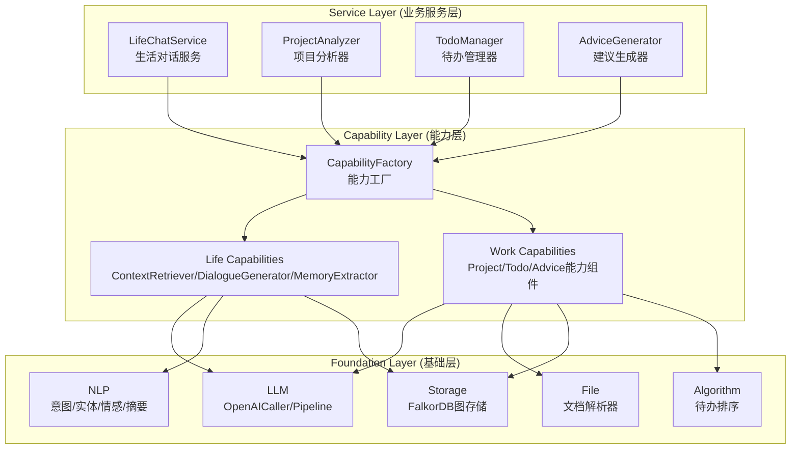
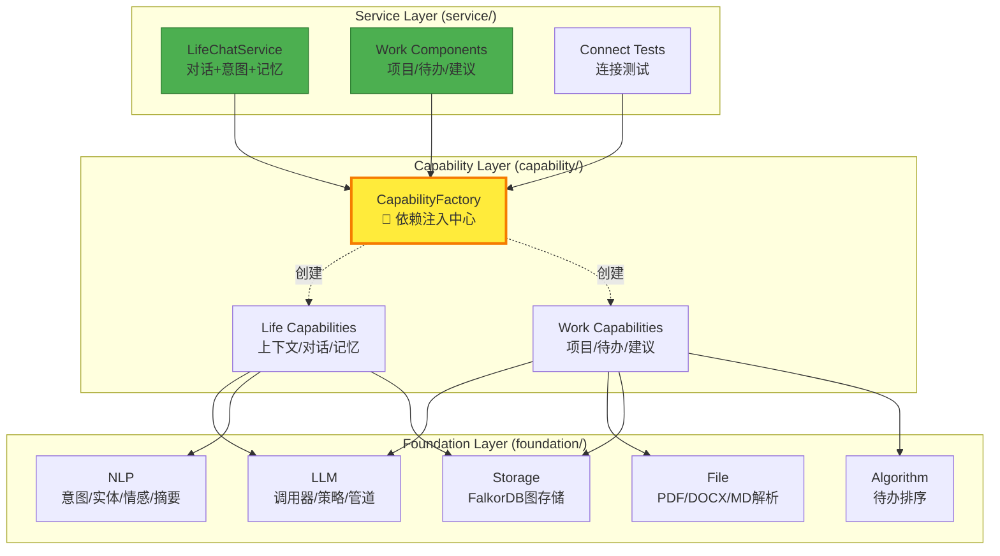
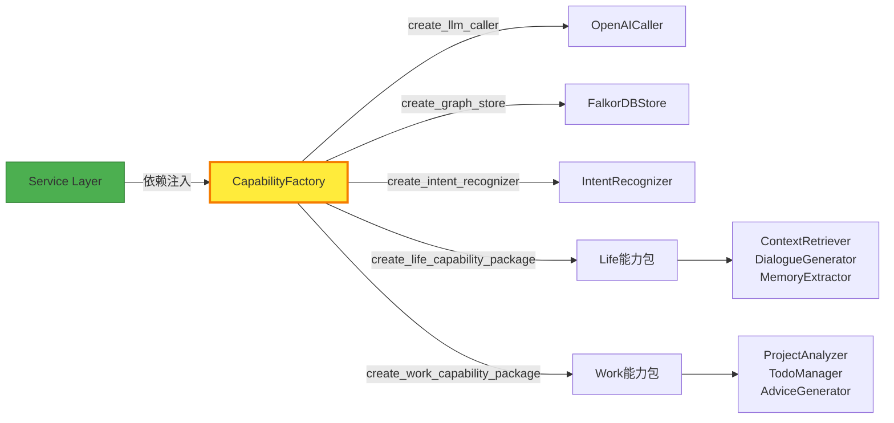

# README 优化设计文档

## 📊 现状分析

### 问题概述

当前README存在以下核心问题：

| 问题类别 | 具体表现 | 影响 |
|---------|---------|------|
| **架构不匹配** | README描述四层架构（Foundation→Capabilities→Services→Application），但实际代码为三层（foundation→capability→service） | 用户困惑、理解错误 |
| **模块命名差异** | README使用`Capabilities Layer`，实际为`capability`；README使用`Services Layer`，实际为`service` | 代码查找困难 |
| **文件路径错误** | README引用不存在的文件路径（如services/conversation/README.md、docs/examples/等） | 链接失效、文档断裂 |
| **功能描述偏差** | 描述大量未实现功能（MimicService、ReportService等），实际仅有基础能力实现 | 期望落差、误导用户 |
| **示例代码无效** | 提供无法运行的代码示例（引用不存在的类和方法） | 用户上手困难 |

### 实际架构与README对比

#### README描述的架构（错误）
```
Application Layer (FastAPI Backend / CLI / SDK)
       ↓
Services Layer (MimicService | SearchService | ReportService ...)
       ↓
Capabilities Layer (HybridRetriever | DataAnalyzer | StyleGenerator)
       ↓
Foundation Layer (LLM | Embedding | VectorStore | GraphStore)
```

#### 实际代码架构（正确）
```
service/ (连接测试、生活对话、工作能力)
   ├── connect/ (LLM测试、存储测试)
   ├── life/ (LifeChatService - 对话服务)
   └── work/ (项目分析、待办管理、建议生成)
       ↓
capability/ (生活能力、工作能力 + 工厂)
   ├── life/ (上下文检索、对话生成、记忆提取)
   ├── work/ (项目分析器、待办管理器、建议生成器)
   └── factory.py (CapabilityFactory - 统一创建入口)
       ↓
foundation/ (基础原子能力)
   ├── llm/ (LLM调用、策略模式、管道)
   ├── file/ (文档解析：PDF/DOCX/MD/TXT/PPT)
   ├── nlp/ (意图识别、实体提取、情感分析、摘要)
   ├── storage/ (FalkorDB图存储、Pipeline)
   └── algorithm/ (待办排序算法)
```

### 关键差异清单

| 维度 | README描述 | 实际实现 | 差距等级 |
|-----|-----------|---------|---------|
| **目录命名** | `capabilities/` | `capability/` | ⚠️ 中 |
| **目录命名** | `services/` | `service/` | ⚠️ 中 |
| **服务实现** | MimicService、SearchService、ReportService等 | 仅LifeChatService + 工作能力组件 | 🔴 高 |
| **能力组合** | HybridRetriever、DataAnalyzer、StyleGenerator | 分为life和work两类能力 | 🔴 高 |
| **工厂模式** | 描述不清晰 | CapabilityFactory核心枢纽 | 🟡 低 |
| **文档路径** | docs/examples/、services/xxx/README.md | 实际为ame-doc/目录 | 🔴 高 |
| **示例代码** | 无法运行（引用不存在的模块） | 需重写 | 🔴 高 |

---

## 🎯 优化目标

### 核心原则

1. **真实性优先**：README必须准确反映当前代码状态
2. **渐进式呈现**：明确区分"已实现"和"规划中"
3. **快速上手**：提供可运行的示例代码
4. **模块化设计**：文档结构与代码结构对齐

### 优化维度

| 维度 | 改进目标 | 衡量标准 |
|-----|---------|---------|
| **准确性** | 100%路径正确、示例可运行 | 所有链接有效、代码通过验证 |
| **清晰度** | 架构图与代码一致 | 用户能快速定位模块 |
| **实用性** | 提供3个可运行案例 | 新用户30分钟内跑通 |
| **可维护性** | 模块化文档结构 | 单模块变更<5处修改 |

---

## 📐 架构对齐方案

### 正确的层级关系



### 核心模块真实功能

#### Foundation Layer（基础层）✅ 已实现

| 模块 | 功能 | 关键类 |
|-----|------|-------|
| **llm** | LLM调用、策略模式、管道模式 | OpenAICaller、SessionPipe、DocumentPipe |
| **file** | 多格式文档解析 | PDF/DOCX/Markdown/PPT/Text解析器 |
| **nlp** | NLP能力 | IntentRecognizer、EntityExtractor、EmotionAnalyzer、Summarizer |
| **storage** | 图存储 | FalkorDBStore、GraphStoreBase、Pipeline |
| **algorithm** | 算法能力 | TodoSorter（优先级排序算法） |

#### Capability Layer（能力层）✅ 部分实现

| 模块 | 功能 | 关键类 |
|-----|------|-------|
| **factory** | 统一创建入口 | CapabilityFactory（核心枢纽） |
| **life** | 生活场景能力 | ContextRetriever、DialogueGenerator、MemoryExtractor |
| **work** | 工作场景能力 | ProjectAnalyzer、TodoManager、AdviceGenerator |

#### Service Layer（服务层）⏳ 部分实现

| 服务 | 状态 | 说明 |
|-----|------|------|
| **LifeChatService** | ✅ 已实现 | 对话服务（意图识别+上下文检索+生成+记忆提取） |
| **工作能力组件** | ✅ 已实现 | 项目分析、待办管理、建议生成（独立组件形态） |
| **MimicService** | ❌ 未实现 | README描述但不存在 |
| **SearchService** | ❌ 未实现 | README描述但不存在 |
| **ReportService** | ❌ 未实现 | README描述但不存在 |

---

## 📦 目录结构对齐

### 当前真实目录

```
ame/
├── foundation/              # ✅ 基础层
│   ├── llm/                # LLM调用器、策略、管道
│   ├── file/               # 文档解析器
│   ├── nlp/                # NLP能力（意图、实体、情感、摘要）
│   ├── storage/            # 图存储（FalkorDB）
│   └── algorithm/          # 算法能力（TodoSorter）
│
├── capability/              # ✅ 能力层（注意：单数形式）
│   ├── life/               # 生活能力
│   ├── work/               # 工作能力
│   └── factory.py          # 能力工厂（核心）
│
├── service/                 # ✅ 服务层（注意：单数形式）
│   ├── connect/            # 连接测试服务
│   ├── life/               # 生活服务（LifeChatService）
│   └── work/               # 工作服务组件
│
└── requirements.txt         # 依赖清单
```

### README应移除的虚构内容

❌ **不存在的目录**：
- `capabilities/retrieval/`
- `capabilities/analysis/`
- `capabilities/generation/`
- `capabilities/memory/`
- `services/conversation/`
- `services/knowledge/`
- `services/work/`
- `models/`
- `data_processor/`
- `docs/wiki/`
- `docs/examples/`

---

## 🔧 CapabilityFactory核心作用

### 设计模式

CapabilityFactory是整个架构的**依赖注入中心**：

```python
# ✅ 正确使用方式（Service层依赖Factory）
class LifeChatService:
    def __init__(self, capability_factory: CapabilityFactory, ...):
        self.factory = capability_factory
        self.llm_caller = factory.create_llm_caller(...)
        self.capabilities = factory.create_life_capability_package(...)

# ❌ 错误方式（直接注入大量Foundation组件）
class MyService:
    def __init__(self, llm, embedding, vector_store, graph_store, ner, ...):
        # 违反依赖倒置原则
```

### Factory提供的能力

| 能力类型 | 方法 | 返回 |
|---------|------|------|
| **Foundation-LLM** | `create_llm_caller()` | OpenAICaller实例 |
| **Foundation-Storage** | `create_graph_store()` | FalkorDBStore实例 |
| **Foundation-NLP** | `create_intent_recognizer()` | IntentRecognizer实例 |
| **Foundation-NLP** | `create_entity_extractor()` | EntityExtractor实例 |
| **Foundation-NLP** | `create_emotion_analyzer()` | EmotionAnalyzer实例 |
| **Foundation-NLP** | `create_summarizer()` | Summarizer实例 |
| **Foundation-Algorithm** | `create_todo_sorter()` | TodoSorter实例 |
| **Capability-Life** | `create_life_capability_package()` | 生活能力包（字典） |
| **Capability-Work** | `create_work_capability_package()` | 工作能力包（字典） |
| **Test** | `create_llm_test_capability()` | LLM测试器 |
| **Test** | `create_storage_test_capability()` | 存储测试器 |

### 缓存机制

```python
# 支持实例复用，避免重复创建
llm1 = factory.create_llm_caller(api_key="xxx", cache_key="main_llm")
llm2 = factory.create_llm_caller(api_key="xxx", cache_key="main_llm")
# llm1 和 llm2 是同一个实例
```

---

## 📝 分阶段优化排期

### Phase 1: 紧急修复（立即执行）🔴

**目标**：消除明显错误，避免误导用户

#### 修复清单

| 项目 | 修改内容 | 优先级 |
|-----|---------|-------|
| **架构图** | 修正为三层架构（foundation→capability→service） | P0 |
| **目录名** | 将`Capabilities Layer`改为`Capability Layer`，`Services Layer`改为`Service Layer` | P0 |
| **项目结构** | 删除不存在的目录引用（models/、data_processor/等） | P0 |
| **链接修正** | 移除所有失效链接（docs/examples/、services/xxx/README.md） | P0 |
| **示例代码** | 移除无法运行的示例 | P0 |

#### 输出物

- `README_Phase1.md`：紧急修复版README

---

### Phase 2: 内容重构（短期：1-2周）🟡

**目标**：准确反映实际功能，提供可运行示例

#### 重构清单

| 任务 | 具体内容 | 输出 |
|-----|---------|------|
| **架构说明** | 重写架构章节，强调CapabilityFactory核心作用 | 架构图+文字说明 |
| **功能清单** | 分为"已实现"和"规划中"两部分 | 功能对照表 |
| **快速开始** | 提供3个可运行案例（连接测试、生活对话、工作分析） | 代码示例 |
| **API文档** | 针对已实现模块提供详细API说明 | API参考表 |
| **目录结构** | 提供真实的目录树 | 目录说明 |

#### 可运行示例

##### 示例1：连接测试
```python
from ame.capability.factory import CapabilityFactory

factory = CapabilityFactory()

# LLM连接测试
llm_tester = factory.create_llm_test_capability(
    api_key="sk-...",
    model="gpt-3.5-turbo"
)
result = await llm_tester.test_basic_call()
print(result)
```

##### 示例2：生活对话
```python
from ame.service.life import LifeChatService
from ame.capability.factory import CapabilityFactory

factory = CapabilityFactory()

chat_service = LifeChatService(
    capability_factory=factory,
    llm_api_key="sk-...",
    graph_host="localhost"
)

# 开始对话
session_id = await chat_service.start_session(user_id="user_123")
response = await chat_service.chat(session_id, "你好，最近天气怎么样？")
print(response)
```

##### 示例3：待办管理
```python
from ame.capability.factory import CapabilityFactory

factory = CapabilityFactory()

todo_manager = factory.create_todo_manager(
    api_key="sk-...",
    graph_host="localhost"
)

# 添加待办
task = await todo_manager.parse_and_add_task(
    "明天下午3点前完成项目报告"
)
print(task)
```

#### 输出物

- `README_Phase2.md`：内容重构版README
- `QUICK_START.md`：快速开始指南

---

### Phase 3: 文档体系化（中期：2-4周）🟢

**目标**：建立完整的文档体系，支持模块化维护

#### 文档结构

```
README.md                    # 主README（概览+快速开始）
├── docs/
│   ├── ARCHITECTURE.md      # 架构详解
│   ├── QUICK_START.md       # 快速开始（详细版）
│   ├── API_REFERENCE.md     # API参考手册
│   ├── FACTORY_GUIDE.md     # CapabilityFactory使用指南
│   ├── DEVELOPMENT.md       # 开发指南
│   └── ROADMAP.md           # 发展路线图
│
├── ame/foundation/README.md     # Foundation层说明
├── ame/capability/README.md     # Capability层说明
└── ame/service/README.md        # Service层说明
```

#### 各文档职责

| 文档 | 内容 | 受众 |
|-----|------|------|
| **README.md** | 项目概览、快速安装、基础示例 | 新用户 |
| **ARCHITECTURE.md** | 架构设计、分层职责、设计模式 | 开发者 |
| **QUICK_START.md** | 详细安装步骤、完整示例、常见问题 | 新用户 |
| **API_REFERENCE.md** | 所有公开API的详细说明 | 开发者 |
| **FACTORY_GUIDE.md** | CapabilityFactory使用规范、最佳实践 | 开发者 |
| **DEVELOPMENT.md** | 开发规范、测试指南、贡献流程 | 贡献者 |
| **ROADMAP.md** | 功能规划、版本计划、进度追踪 | 所有人 |

#### 输出物

- 完整的文档体系（7个主文档 + 3个层级README）

---

### Phase 4: 增强与完善（长期：持续）🔵

**目标**：文档与代码保持同步，持续优化用户体验

#### 长期任务

| 任务 | 内容 | 频率 |
|-----|------|------|
| **同步更新** | 代码变更时同步更新文档 | 每次发布 |
| **示例库** | 持续扩充可运行示例 | 每月新增2-3个 |
| **视频教程** | 录制视频演示 | 季度级 |
| **用户反馈** | 根据Issue优化文档 | 持续 |
| **国际化** | 提供英文版文档 | 长期规划 |

#### 输出物

- 动态更新的文档体系
- 示例代码库
- 视频教程集

---

## 📋 优化后的README大纲

### 主README结构（README.md）

```markdown
# AME (Another Me Engine)

## 项目简介
- 核心定位
- 核心特性（真实功能）

## 🏗️ 架构设计（修正版）
- 三层架构图（foundation→capability→service）
- 各层职责（真实功能）
- CapabilityFactory核心作用

## 📦 项目结构（真实版）
- 真实的目录树
- 各模块说明

## 🚀 快速开始
- 环境要求
- 安装步骤
- 3个可运行示例

## 📚 已实现功能
- Foundation层功能清单
- Capability层功能清单
- Service层功能清单

## 🗺️ 规划中功能
- 待开发模块
- Roadmap引用

## 🛠️ 开发指南
- CapabilityFactory使用规范
- 依赖注入原则
- 测试方法

## 📖 文档索引
- 架构文档
- API参考
- 开发指南
- 贡献指南

## 📜 License

## 📧 联系方式
```

---

## 🎨 Mermaid图表优化

### 当前架构（正确）



### CapabilityFactory核心流程



---

## ✅ 验收标准

### Phase 1 验收标准

- [ ] 所有目录名称正确（capability/、service/）
- [ ] 架构图与实际代码一致
- [ ] 移除所有失效链接
- [ ] 移除所有无法运行的示例代码

### Phase 2 验收标准

- [ ] 提供3个可运行示例，且通过验证
- [ ] 所有已实现功能标注清晰
- [ ] 所有规划功能单独列出
- [ ] 目录结构与实际代码一致

### Phase 3 验收标准

- [ ] 完成7个主文档编写
- [ ] 完成3个层级README
- [ ] 所有文档互相链接正确
- [ ] 每个模块有独立说明

### Phase 4 验收标准

- [ ] 建立文档更新流程
- [ ] 示例库达到10+个
- [ ] 用户反馈机制建立

---

## 📦 输出文件清单

### Phase 1 输出（紧急修复）

- `README_Phase1.md`：修复版README
- `CHANGELOG_Phase1.md`：修复内容清单

### Phase 2 输出（内容重构）

- `README_Phase2.md`：重构版README
- `QUICK_START.md`：快速开始指南
- `examples/01_connect_test.py`：连接测试示例
- `examples/02_life_chat.py`：生活对话示例
- `examples/03_todo_management.py`：待办管理示例

### Phase 3 输出（文档体系）

- `README.md`：最终版主README
- `docs/ARCHITECTURE.md`：架构详解
- `docs/API_REFERENCE.md`：API参考
- `docs/FACTORY_GUIDE.md`：Factory使用指南
- `docs/DEVELOPMENT.md`：开发指南
- `docs/ROADMAP.md`：发展路线图
- `ame/foundation/README.md`：Foundation层说明
- `ame/capability/README.md`：Capability层说明
- `ame/service/README.md`：Service层说明

### Phase 4 输出（持续）

- 示例代码库（examples/）
- 视频教程链接
- 用户FAQ文档
