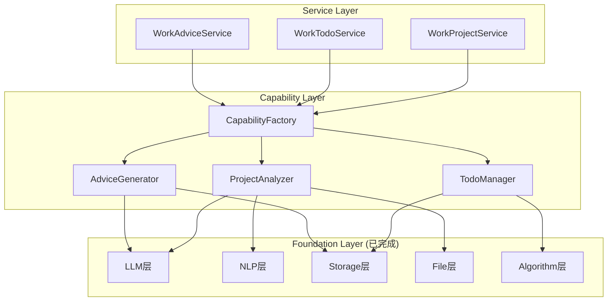
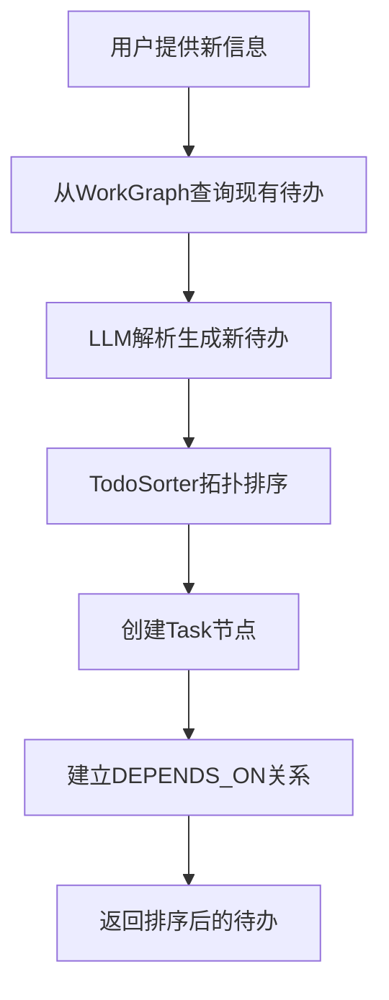
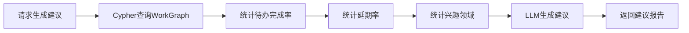

# AME系统Work服务实现设计

## 1. Overview

### 1.1 背景

AME (Another Me Engine) 已完成Foundation层和Life服务的完整实现，当前需要补充Work服务的能力层和服务层实现。

**已完成部分：**
- ✅ Foundation Layer（LLM、Storage、File、NLP、Algorithm）
- ✅ Capability Layer - Life（ContextRetriever、DialogueGenerator、MemoryExtractor）
- ✅ Service Layer - Connect（LLM/Storage配置测试）
- ✅ Service Layer - Life（LifeChatService）

**待实现部分（本次重构重点）：**
1. **Capability Layer - Work**: ProjectAnalyzer、TodoManager、AdviceGenerator
2. **Service Layer - Work**: WorkProjectService、WorkTodoService、WorkAdviceService
3. **CapabilityFactory扩展**: 支持Work能力包创建

### 1.2 实施范围

本次重构聚焦于Work服务的实现，需要创建以下模块：

```
Capability Layer:
  - ame/capability/work/project_analyzer.py    # 项目分析能力
  - ame/capability/work/todo_manager.py        # 待办管理能力
  - ame/capability/work/advice_generator.py    # 建议生成能力

Service Layer:
  - ame/service/work/project.py                # 项目认知服务
  - ame/service/work/todo.py                   # 待办管理服务
  - ame/service/work/suggest.py                # 工作建议服务

Factory扩展:
  - ame/capability/factory.py                  # 新增Work能力创建方法
```

### 1.3 核心设计原则

#### 服务特性差异

| 服务 | 是否对话 | 是否持久化 | 核心能力 |
|------|---------|-----------|----------|
| **ProjectAnalysis** | ❌ | ❌ | 文档解析 + LLM分析，单次输出MD | 
| **TodoManagement** | ❌ | ✅ | 待办CRUD + 依赖排序 + 图谱更新 |
| **WorkAdvice** | ❌ | ❌ | 图谱统计 + LLM建议生成 |

#### 架构分层原则

```
Service Layer - 业务编排
         ↓
Capability Layer - 能力组合
         ↓
Foundation Layer - 原子能力（已完成）
```

### 1.4 设计目标

- **Work Capability实现**: 项目分析、待办管理、建议生成三大核心能力
- **Work Service实现**: 封装业务逻辑，提供场景化服务接口
- **依赖注入规范**: Service只依赖CapabilityFactory，禁止直接使用Foundation组件
- **图谱数据驱动**: WorkGraph支持项目认知、待办依赖、时间演化
- **与Life服务对齐**: 保持架构一致性，复用已验证的模式

## 2. Architecture

### 2.1 整体架构



### 2.2 分层职责

| 层级 | 职责 | 本次涉及模块 |
|------|------|--------------|
| **Service** | 业务逻辑封装 | WorkProject、WorkTodo、WorkAdvice |
| **Capability** | 能力组合 | 项目分析、待办管理、建议生成 |
| **Foundation** | 原子能力（已完成） | LLM、NLP、Storage、File、Algorithm |

## 3. Capability Layer - Work能力层

### 3.1 ProjectAnalyzer - 项目分析能力

**职责**: 分析项目文档，提取结构化信息，生成Markdown格式的项目认知报告。

**核心流程**：


**接口定义**：

```python
# ame/capability/work/project_analyzer.py

from typing import List, Dict, Optional, Any
from dataclasses import dataclass
from loguru import logger

from ame.foundation.llm import LLMCallerBase
from ame.foundation.file import DocumentParsePipeline
from ame.foundation.nlp import EntityExtractor, Entity

@dataclass
class ProjectAnalysis:
    """项目分析结果"""
    markdown_content: str           # Markdown格式的项目报告
    project_name: str
    entities: List[Entity]          # 提取的实体（技术栈、模块等）
    concepts: List[str]             # 核心概念
    metadata: Dict[str, Any]

class ProjectAnalyzer:
    """项目分析器
    
    结合文档解析、实体提取、LLM分析生成项目认知报告。
    """
    
    def __init__(
        self,
        llm_caller: LLMCallerBase,
        doc_parser: DocumentParsePipeline,
        entity_extractor: EntityExtractor
    ):
        """初始化
        
        Args:
            llm_caller: LLM调用器
            doc_parser: 文档解析器
            entity_extractor: 实体提取器
        """
        self.llm = llm_caller
        self.doc_parser = doc_parser
        self.entity_extractor = entity_extractor
    
    async def analyze(
        self,
        doc_paths: List[str],
        project_name: str,
        custom_prompt: Optional[str] = None
    ) -> ProjectAnalysis:
        """分析项目文档
        
        Args:
            doc_paths: 文档路径列表
            project_name: 项目名称
            custom_prompt: 用户自定义提示词（如"重点分析架构"）
            
        Returns:
            项目分析结果
        """
```

**实现要点**：
1. 支持多文档并行解析
2. 实体提取（技术栈、模块、概念）
3. LLM生成结构化Markdown报告
4. 不持久化到图谱（按需生成）

### 3.2 TodoManager - 待办管理能力

**职责**: 根据用户输入生成待办、管理依赖关系、持久化到WorkGraph。

**核心流程**：



**接口定义**：

```python
# ame/capability/work/todo_manager.py

from typing import List, Dict, Optional
from loguru import logger

from ame.foundation.llm import LLMCallerBase
from ame.foundation.storage import GraphStoreBase, GraphNode, GraphEdge, NodeLabel, RelationType
from ame.foundation.algorithm import TodoSorter, TodoItem, SortedTodoList

class TodoManager:
    """待办管理器
    
    生成、排序、更新待办，并同步到WorkGraph。
    """
    
    def __init__(
        self,
        llm_caller: LLMCallerBase,
        graph_store: GraphStoreBase,
        todo_sorter: TodoSorter
    ):
        """初始化
        
        Args:
            llm_caller: LLM调用器
            graph_store: 图存储（WorkGraph）
            todo_sorter: 待办排序器
        """
        self.llm = llm_caller
        self.graph = graph_store
        self.sorter = todo_sorter
    
    async def generate_and_sort(
        self,
        user_id: str,
        new_info: str,
        project_name: Optional[str] = None
    ) -> List[TodoItem]:
        """生成并排序待办
        
        Args:
            user_id: 用户ID
            new_info: 用户提供的新信息
            project_name: 项目名称（可选）
            
        Returns:
            排序后的待办列表
        """
    
    async def update_status(
        self,
        user_id: str,
        task_id: str,
        new_status: str
    ) -> bool:
        """更新待办状态
        
        Args:
            user_id: 用户ID
            task_id: 任务ID
            new_status: 新状态（pending/in_progress/completed）
            
        Returns:
            是否成功
        """
```

**实现要点**：
1. LLM解析用户输入生成待办列表
2. 查询WorkGraph中已有待办避免重复
3. 使用TodoSorter进行拓扑排序
4. 持久化到WorkGraph（Task节点 + DEPENDS_ON关系）
5. 支持状态更新和时间属性管理

### 3.3 AdviceGenerator - 建议生成能力

**职责**: 基于WorkGraph数据统计生成工作建议报告。

**核心流程**：



**接口定义**：

```python
# ame/capability/work/advice_generator.py

from typing import Dict, Optional
from dataclasses import dataclass
from datetime import datetime, timedelta
from loguru import logger

from ame.foundation.llm import LLMCallerBase
from ame.foundation.storage import GraphStoreBase

@dataclass
class TimeRange:
    """时间范围"""
    start: datetime
    end: datetime
    
    @classmethod
    def last_30_days(cls):
        """最近30天"""
        return cls(
            start=datetime.now() - timedelta(days=30),
            end=datetime.now()
        )

@dataclass
class WorkPattern:
    """工作模式分析"""
    avg_completion_time: float      # 平均完成时间（天）
    delay_rate: float               # 延期率
    active_hours: List[int]         # 活跃时段
    preferred_domains: List[str]    # 偏好领域
    efficiency_score: float         # 效率评分

@dataclass
class AdviceReport:
    """建议报告"""
    efficiency_analysis: str        # 效率分析
    capability_assessment: str      # 能力评估
    improvement_suggestions: List[str]  # 改进建议
    pattern: WorkPattern
    generated_at: datetime

class AdviceGenerator:
    """建议生成器
    
    基于WorkGraph数据分析生成工作建议。
    """
    
    def __init__(
        self,
        llm_caller: LLMCallerBase,
        graph_store: GraphStoreBase
    ):
        """初始化
        
        Args:
            llm_caller: LLM调用器
            graph_store: 图存储（WorkGraph）
        """
        self.llm = llm_caller
        self.graph = graph_store
    
    async def generate(
        self,
        user_id: str,
        time_range: Optional[TimeRange] = None
    ) -> AdviceReport:
        """生成工作建议
        
        Args:
            user_id: 用户ID
            time_range: 统计时间范围（默认最近30天）
            
        Returns:
            建议报告
        """
```

**实现要点**：
1. Cypher查询WorkGraph统计数据
2. 计算工作模式指标（完成率、延期率、活跃时段）
3. LLM生成个性化建议
4. 不持久化（按需生成）

## 4. Service Layer - Work服务层

### 4.1 WorkProjectService - 项目认知服务

**服务特性**：
- **无对话**：单次调用，不维护会话
- **无持久化**：直接返回Markdown，不入库
- **核心能力**：文档解析 + 实体提取 + LLM分析 → 生成MD

**接口定义**：

```python
# ame/service/work/project.py

from typing import List, Optional
from dataclasses import dataclass
from datetime import datetime
from loguru import logger

from ame.capability.factory import CapabilityFactory
from ame.capability.work.project_analyzer import ProjectAnalysis

@dataclass
class ProjectAnalysisResult:
    """项目分析结果"""
    markdown_content: str
    entities: List
    concepts: List[str]
    analyzed_at: datetime

class WorkProjectService:
    """项目认知服务
    
    遵循架构规范：
    - 通过CapabilityFactory获取所有能力
    - 不直接使用Foundation层组件
    """
    
    def __init__(
        self,
        capability_factory: CapabilityFactory,
        llm_api_key: str,
        llm_model: str = "gpt-3.5-turbo",
        llm_base_url: Optional[str] = None
    ):
        """初始化
        
        Args:
            capability_factory: 能力工厂
            llm_api_key: LLM API密钥
            llm_model: LLM模型名称
            llm_base_url: LLM API基础URL
        """
        self.factory = capability_factory
        
        # 通过工厂创建能力
        self.project_analyzer = self.factory.create_project_analyzer(
            api_key=llm_api_key,
            model=llm_model,
            base_url=llm_base_url,
            cache_key="work_project_analyzer"
        )
    
    async def analyze_project(
        self,
        user_id: str,
        doc_paths: List[str],
        project_name: str,
        user_prompt: Optional[str] = None
    ) -> ProjectAnalysisResult:
        """分析项目
        
        Args:
            user_id: 用户ID（用于日志记录）
            doc_paths: 文档路径列表
            project_name: 项目名称
            user_prompt: 用户自定义提示词（如"重点分析架构"）
            
        Returns:
            项目分析结果
        """
```

### 4.2 WorkTodoService - 待办管理服务

**服务特性**：
- **无对话**：不需要多轮交互
- **有持久化**：待办存在work_graph，支持CRUD
- **核心能力**：待办CRUD + 依赖排序 + 图谱更新

**接口定义**：

```python
# ame/service/work/todo.py

from typing import List, Optional
from loguru import logger

from ame.capability.factory import CapabilityFactory
from ame.foundation.algorithm import TodoItem, SortedTodoList

class WorkTodoService:
    """待办管理服务
    
    遵循架构规范：
    - 通过CapabilityFactory获取所有能力
    - 不直接使用Foundation层组件
    """
    
    def __init__(
        self,
        capability_factory: CapabilityFactory,
        llm_api_key: str,
        llm_model: str = "gpt-3.5-turbo",
        llm_base_url: Optional[str] = None,
        graph_host: str = "localhost",
        graph_port: int = 6379,
        graph_name: str = "work_graph",
        graph_password: Optional[str] = None
    ):
        """初始化
        
        Args:
            capability_factory: 能力工厂
            llm_api_key: LLM API密钥
            llm_model: LLM模型名称
            llm_base_url: LLM API基础URL
            graph_host: 图数据库主机
            graph_port: 图数据库端口
            graph_name: 图名称
            graph_password: 图数据库密码
        """
        self.factory = capability_factory
        
        # 通过工厂创建能力
        self.todo_manager = self.factory.create_todo_manager(
            api_key=llm_api_key,
            model=llm_model,
            base_url=llm_base_url,
            graph_host=graph_host,
            graph_port=graph_port,
            graph_name=graph_name,
            graph_password=graph_password,
            cache_key="work_todo_manager"
        )
    
    async def generate_todos(
        self,
        user_id: str,
        new_info: str,
        project_name: Optional[str] = None
    ) -> List[TodoItem]:
        """生成新待办
        
        Args:
            user_id: 用户ID
            new_info: 用户提供的新信息
            project_name: 项目名称（可选）
            
        Returns:
            排序后的待办列表
        """
    
    async def update_todo_status(
        self,
        user_id: str,
        task_id: str,
        new_status: str
    ) -> bool:
        """更新待办状态
        
        Args:
            user_id: 用户ID
            task_id: 任务ID
            new_status: 新状态（pending/in_progress/completed）
            
        Returns:
            是否成功
        """
    
    async def get_active_todos(
        self,
        user_id: str,
        project_name: Optional[str] = None
    ) -> SortedTodoList:
        """获取活跃待办（已排序）
        
        Args:
            user_id: 用户ID
            project_name: 项目名称（可选）
            
        Returns:
            排序后的待办列表
        """
```

### 4.3 WorkAdviceService - 工作建议服务

**服务特性**：
- **无对话**：单次生成建议
- **无持久化**：直接返回建议内容
- **核心能力**：图谱统计分析 + LLM生成建议

**接口定义**：

```python
# ame/service/work/suggest.py

from typing import Optional
from loguru import logger

from ame.capability.factory import CapabilityFactory
from ame.capability.work.advice_generator import AdviceReport, TimeRange

class WorkAdviceService:
    """工作建议服务
    
    遵循架构规范：
    - 通过CapabilityFactory获取所有能力
    - 不直接使用Foundation层组件
    """
    
    def __init__(
        self,
        capability_factory: CapabilityFactory,
        llm_api_key: str,
        llm_model: str = "gpt-3.5-turbo",
        llm_base_url: Optional[str] = None,
        graph_host: str = "localhost",
        graph_port: int = 6379,
        graph_name: str = "work_graph",
        graph_password: Optional[str] = None
    ):
        """初始化
        
        Args:
            capability_factory: 能力工厂
            llm_api_key: LLM API密钥
            llm_model: LLM模型名称
            llm_base_url: LLM API基础URL
            graph_host: 图数据库主机
            graph_port: 图数据库端口
            graph_name: 图名称
            graph_password: 图数据库密码
        """
        self.factory = capability_factory
        
        # 通过工厂创建能力
        self.advice_generator = self.factory.create_advice_generator(
            api_key=llm_api_key,
            model=llm_model,
            base_url=llm_base_url,
            graph_host=graph_host,
            graph_port=graph_port,
            graph_name=graph_name,
            graph_password=graph_password,
            cache_key="work_advice_generator"
        )
    
    async def generate_advice(
        self,
        user_id: str,
        time_range: Optional[TimeRange] = None
    ) -> AdviceReport:
        """生成工作建议
        
        Args:
            user_id: 用户ID
            time_range: 统计时间范围（默认最近30天）
            
        Returns:
            建议报告
        """
```

## 5. CapabilityFactory扩展

需要在`ame/capability/factory.py`中新增Work能力创建方法：

```python
# CapabilityFactory新增方法

def create_project_analyzer(
    self,
    api_key: str,
    model: str = "gpt-3.5-turbo",
    base_url: Optional[str] = None,
    cache_key: Optional[str] = None
) -> ProjectAnalyzer:
    """创建项目分析器
    
    Args:
        api_key: LLM API密钥
        model: LLM模型
        base_url: LLM API基础URL
        cache_key: 缓存键
        
    Returns:
        项目分析器实例
    """
    if cache_key and cache_key in self._cache:
        return self._cache[cache_key]
    
    # 创建依赖组件
    llm_caller = self.create_llm_caller(
        api_key=api_key,
        model=model,
        base_url=base_url,
        cache_key=f"{cache_key}_llm" if cache_key else None
    )
    
    entity_extractor = self.create_entity_extractor(
        llm_caller=llm_caller,
        cache_key=f"{cache_key}_entity" if cache_key else None
    )
    
    # 创建文档解析器
    from ame.foundation.file import DocumentParsePipeline
    doc_parser = DocumentParsePipeline()
    
    # 创建ProjectAnalyzer
    from ame.capability.work import ProjectAnalyzer
    analyzer = ProjectAnalyzer(
        llm_caller=llm_caller,
        doc_parser=doc_parser,
        entity_extractor=entity_extractor
    )
    
    if cache_key:
        self._cache[cache_key] = analyzer
    
    return analyzer

def create_todo_manager(
    self,
    api_key: str,
    model: str = "gpt-3.5-turbo",
    base_url: Optional[str] = None,
    graph_host: str = "localhost",
    graph_port: int = 6379,
    graph_name: str = "work_graph",
    graph_password: Optional[str] = None,
    cache_key: Optional[str] = None
) -> TodoManager:
    """创建待办管理器
    
    Args:
        api_key: LLM API密钥
        model: LLM模型
        base_url: LLM API基础URL
        graph_host: 图数据库主机
        graph_port: 图数据库端口
        graph_name: 图名称
        graph_password: 图数据库密码
        cache_key: 缓存键
        
    Returns:
        待办管理器实例
    """
    if cache_key and cache_key in self._cache:
        return self._cache[cache_key]
    
    # 创建依赖组件
    llm_caller = self.create_llm_caller(
        api_key=api_key,
        model=model,
        base_url=base_url,
        cache_key=f"{cache_key}_llm" if cache_key else None
    )
    
    graph_store = self.create_graph_store(
        host=graph_host,
        port=graph_port,
        graph_name=graph_name,
        password=graph_password,
        cache_key=f"{cache_key}_graph" if cache_key else None
    )
    
    todo_sorter = self.create_todo_sorter(
        cache_key=f"{cache_key}_sorter" if cache_key else None
    )
    
    # 创建TodoManager
    from ame.capability.work import TodoManager
    manager = TodoManager(
        llm_caller=llm_caller,
        graph_store=graph_store,
        todo_sorter=todo_sorter
    )
    
    if cache_key:
        self._cache[cache_key] = manager
    
    return manager

def create_advice_generator(
    self,
    api_key: str,
    model: str = "gpt-3.5-turbo",
    base_url: Optional[str] = None,
    graph_host: str = "localhost",
    graph_port: int = 6379,
    graph_name: str = "work_graph",
    graph_password: Optional[str] = None,
    cache_key: Optional[str] = None
) -> AdviceGenerator:
    """创建建议生成器
    
    Args:
        api_key: LLM API密钥
        model: LLM模型
        base_url: LLM API基础URL
        graph_host: 图数据库主机
        graph_port: 图数据库端口
        graph_name: 图名称
        graph_password: 图数据库密码
        cache_key: 缓存键
        
    Returns:
        建议生成器实例
    """
    if cache_key and cache_key in self._cache:
        return self._cache[cache_key]
    
    # 创建依赖组件
    llm_caller = self.create_llm_caller(
        api_key=api_key,
        model=model,
        base_url=base_url,
        cache_key=f"{cache_key}_llm" if cache_key else None
    )
    
    graph_store = self.create_graph_store(
        host=graph_host,
        port=graph_port,
        graph_name=graph_name,
        password=graph_password,
        cache_key=f"{cache_key}_graph" if cache_key else None
    )
    
    # 创建AdviceGenerator
    from ame.capability.work import AdviceGenerator
    generator = AdviceGenerator(
        llm_caller=llm_caller,
        graph_store=graph_store
    )
    
    if cache_key:
        self._cache[cache_key] = generator
    
    return generator

def create_work_capability_package(
    self,
    api_key: str,
    model: str = "gpt-3.5-turbo",
    base_url: Optional[str] = None,
    graph_host: str = "localhost",
    graph_port: int = 6379,
    graph_name: str = "work_graph",
    graph_password: Optional[str] = None,
    cache_prefix: str = "work"
) -> Dict[str, Any]:
    """创建Work能力包（预设组合）
    
    包含：项目分析、待办管理、建议生成
    
    Args:
        api_key: LLM API密钥
        model: LLM模型
        base_url: LLM API基础URL
        graph_host: 图数据库主机
        graph_port: 图数据库端口
        graph_name: 图名称
        graph_password: 图数据库密码
        cache_prefix: 缓存键前缀
        
    Returns:
        Work能力字典
    """
    package = {
        "project_analyzer": self.create_project_analyzer(
            api_key=api_key,
            model=model,
            base_url=base_url,
            cache_key=f"{cache_prefix}_project"
        ),
        "todo_manager": self.create_todo_manager(
            api_key=api_key,
            model=model,
            base_url=base_url,
            graph_host=graph_host,
            graph_port=graph_port,
            graph_name=graph_name,
            graph_password=graph_password,
            cache_key=f"{cache_prefix}_todo"
        ),
        "advice_generator": self.create_advice_generator(
            api_key=api_key,
            model=model,
            base_url=base_url,
            graph_host=graph_host,
            graph_port=graph_port,
            graph_name=graph_name,
            graph_password=graph_password,
            cache_key=f"{cache_prefix}_advice"
        )
    }
    
    logger.info(f"创建Work能力包完成，包含 {len(package)} 个能力")
    return package
```

## 6. 实施计划

### 6.1 开发优先级

按照以下顺序实施，确保每一步都可验证：

**阶段1: Capability层实现（优先）**
1. ProjectAnalyzer实现
2. TodoManager实现
3. AdviceGenerator实现
4. CapabilityFactory扩展

**阶段2: Service层实现**
1. WorkProjectService实现
2. WorkTodoService实现
3. WorkAdviceService实现

**阶段3: 集成与测试**
1. 单元测试补全
2. 集成测试
3. 端到端测试

### 6.2 技术选型

| 组件 | 技术 | 理由 |
|------|------|------|
| 异步编程 | asyncio + async/await | Foundation层已采用 |
| 依赖注入 | CapabilityFactory手动实现 | 轻量级，符合现有架构 |
| 单元测试 | pytest + pytest-asyncio | Python生态标准 |
| 图查询 | Cypher (FalkorDB原生) | 已有FalkorDBStore |

### 6.3 关键实现要点

#### 依赖注入规范

**强制要求**：
- Service层**只能**通过构造函数接收`CapabilityFactory`
- **禁止**在Service内部创建Foundation层组件
- **禁止**直接传递大量Foundation层参数

**正确示例**：
```python
class WorkProjectService:
    def __init__(self, capability_factory: CapabilityFactory, ...):
        self.factory = capability_factory
        self.analyzer = factory.create_project_analyzer(...)
```

**错误示例**：
```python
# ❌ 错误：直接接收Foundation层组件
class WorkProjectService:
    def __init__(self, llm_caller, doc_parser, entity_extractor, ...):
        ...
```

#### 图谱时间语义处理

所有涉及图谱边的操作必须正确处理时间属性：

```python
# 创建新关系
edge = GraphEdge(
    source_id=user_id,
    target_id=task_id,
    relation=RelationType.ASSIGNED_TO,
    valid_from=datetime.now(),
    valid_until=None  # None表示仍然有效
)

# 更新关系（如完成待办）
await graph.update_edge(edge_id, {
    "valid_until": datetime.now()
})
```

#### LLM Prompt设计

**待办生成Prompt示例**：

```python
def build_todo_generation_prompt(new_info: str, existing_todos: List[TodoItem]) -> str:
    existing_desc = "\n".join([
        f"- {todo.title} (优先级: {todo.priority.value}, 状态: {todo.status.value})"
        for todo in existing_todos
    ])
    
    return f"""
用户提供了新的工作信息：
{new_info}

已有待办：
{existing_desc}

请分析并生成新的待办列表（JSON格式），要求：
1. 避免与已有待办重复
2. 合理划分任务粒度
3. 设置优先级和依赖关系
4. 估算截止日期

返回JSON格式：
[
  {{
    "title": "任务标题",
    "priority": "high/medium/low",
    "due_date": "YYYY-MM-DD",
    "dependencies": ["依赖的任务ID"],
    "description": "任务描述"
  }}
]
"""
```

### 6.4 测试策略

#### 单元测试结构

```
test/
├── capability/
│   ├── test_project_analyzer.py
│   ├── test_todo_manager.py
│   └── test_advice_generator.py
└── service/
    ├── test_work_project_service.py
    ├── test_work_todo_service.py
    └── test_work_advice_service.py
```

#### Mock策略

```python
@pytest.fixture
def mock_capability_factory():
    factory = Mock(spec=CapabilityFactory)
    factory.create_project_analyzer = Mock(return_value=Mock(
        analyze=AsyncMock(return_value=ProjectAnalysis(
            markdown_content="# Test Project",
            project_name="Test",
            entities=[],
            concepts=[]
        ))
    ))
    return factory
```

## 7. 下一步行动

1. **创建目录结构**：按照设计创建Capability和Service文件
2. **实现ProjectAnalyzer**：验证文档解析和LLM分析流程
3. **实现TodoManager**：验证图谱CRUD和排序逻辑
4. **实现AdviceGenerator**：验证图谱统计和LLM生成
5. **扩展CapabilityFactory**：新增Work能力创建方法
6. **实现Service层**：封装业务逻辑
7. **编写单元测试**：确保质量
8. **集成测试**：验证端到端流程
