# AME系统服务架构重构设计

## 1. Overview

### 1.1 背景

AME (Another Me Engine) 当前已实现部分Foundation层（LLM、Storage、File），但仍需补充原子能力，同时Capability和Service层尚未建立。现需要对外提供三大核心服务能力：

1. **Connect Service**: 配置测试服务，便于后端验证用户配置
2. **Life Service**: 生活场景对话服务，支持意图识别、上下文检索、对话生成、记忆提取
3. **Work Service**: 工作场景辅助服务，包含项目分析、待办管理、工作建议

### 1.2 核心设计原则

#### 服务特性差异

| 服务 | 是否对话 | 是否持久化 | 核心能力 |
|------|---------|-----------|----------|
| **ProjectAnalysis** | ❌ | ❌ | 文档解析 + LLM分析，单次输出MD | 
| **TodoManagement** | ❌ | ✅ | 待办CRUD + 依赖排序 + 图谱更新 |
| **WorkAdvice** | ❌ | ❌ | 图谱统计 + LLM建议生成 |
| **LifeChat** | ✅ | ✅ | 意图识别 + 上下文检索 + 对话生成 + Session终结后记忆提取入库 |

#### 架构分层原则

```
Application Layer (ame-backend/FastAPI) - 对外暴露
         ↓
Service Layer - 业务编排（本次重构重点）
         ↓
Capability Layer - 能力组合（补全）
         ↓
Foundation Layer - 原子能力（补充NLP/Intent/Summary等）
```

### 1.3 设计目标

- **Foundation层补全**: 新增Intent识别、实体提取、情感分析、摘要生成、待办排序等原子能力
- **Capability层建立**: 组合Foundation能力，形成上下文检索、对话生成、项目分析、待办管理、建议生成等高级能力
- **Service层实现**: 封装业务逻辑，提供场景化服务接口
- **依赖注入规范**: Service只依赖CapabilityFactory，禁止直接使用Foundation组件
- **图谱数据驱动**: Life和Work图谱支持时间演化、增量更新、依赖关系管理

## 2. Architecture

### 2.1 整体架构

```mermaid
graph TB
    subgraph "Application Layer"
        A1[FastAPI Backend]
    end
    
    subgraph "Service Layer"
        S1[ConnectService]
        S2[LifeChatService]
        S3[WorkProjectService]
        S4[WorkTodoService]
        S5[WorkAdviceService]
    end
    
    subgraph "Capability Layer"
        C1[TestCapability]
        C2[ContextRetriever]
        C3[DialogueGenerator]
        C4[MemoryExtractor]
        C5[ProjectAnalyzer]
        C6[TodoManager]
        C7[AdviceGenerator]
        C8[CapabilityFactory]
    end
    
    subgraph "Foundation Layer"
        F1[LLM层]
        F1A[LLMCaller]
        F1B[SessionPipe]
        F1C[DocumentPipe]
        
        F2[NLP层]
        F2A[IntentRecognizer]
        F2B[EntityExtractor]
        F2C[EmotionAnalyzer]
        F2D[Summarizer]
        
        F3[Storage层]
        F3A[GraphStore]
        F3B[LifeGraphPipeline]
        F3C[WorkGraphPipeline]
        
        F4[File层]
        F4A[DocumentParser]
        
        F5[Algorithm层]
        F5A[TodoSorter]
    end
    
    A1 --> S1
    A1 --> S2
    A1 --> S3
    A1 --> S4
    A1 --> S5
    
    S1 --> C8
    S2 --> C8
    S3 --> C8
    S4 --> C8
    S5 --> C8
    
    C8 --> C1
    C8 --> C2
    C8 --> C3
    C8 --> C4
    C8 --> C5
    C8 --> C6
    C8 --> C7
    
    C1 --> F1A
    C1 --> F3A
    C2 --> F3B
    C2 --> F3C
    C3 --> F1B
    C4 --> F2D
    C4 --> F2B
    C5 --> F4A
    C5 --> F1C
    C5 --> F2B
    C6 --> F3C
    C6 --> F5A
    C7 --> F3C
    C7 --> F1C
    
    F1 --> F1A
    F1 --> F1B
    F1 --> F1C
    F2 --> F2A
    F2 --> F2B
    F2 --> F2C
    F2 --> F2D
    F3 --> F3A
    F3 --> F3B
    F3 --> F3C
    F4 --> F4A
    F5 --> F5A
```

### 2.2 分层职责

| 层级 | 职责 | 本次涉及模块 |
|------|------|--------------|
| **Foundation** | 原子能力（LLM、NLP、Storage、File、Algorithm） | LLM调用、意图识别、实体提取、情感分析、摘要生成、待办排序、文档解析、图谱存储 |
| **Capability** | 能力组合（测试、检索、生成、分析、管理） | 测试能力、上下文检索、对话生成、记忆提取、项目分析、待办管理、建议生成 |
| **Service** | 业务逻辑封装 | Connect、LifeChat、WorkProject、WorkTodo、WorkAdvice |
| **Application** | 对外接口 | FastAPI路由（已有ame-backend） |

### 2.3 Foundation层新增原子能力

#### 2.3.1 NLP层 (foundation/nlp/)

**目录结构**：
```
foundation/nlp/
├── atomic/
│   ├── __init__.py
│   ├── intent_recognizer.py    # 意图识别
│   ├── entity_extractor.py     # 实体提取
│   ├── emotion_analyzer.py     # 情感分析
│   └── summarizer.py           # 摘要生成
├── core/
│   ├── __init__.py
│   ├── models.py               # NLP模型定义
│   └── exceptions.py           # NLP异常
└── __init__.py
```

**IntentRecognizer** - 意图识别器

功能：识别用户输入的意图类型

```python
from enum import Enum
from dataclasses import dataclass
from typing import Dict, Any

class IntentType(Enum):
    """"意图类型枚举"""
    CHAT = "chat"              # 普通聊天
    QUERY_SELF = "query_self"  # 查询自己的信息（兴趣、记忆等）
    ANALYZE = "analyze"        # 请求分析（情绪、行为等）
    COMFORT = "comfort"        # 需要安慰、倾诉
    UNKNOWN = "unknown"        # 未知意图

@dataclass
class IntentResult:
    """意图识别结果"""
    intent: IntentType
    confidence: float          # 0-1 置信度
    keywords: List[str]        # 关键词
    metadata: Dict[str, Any]

class IntentRecognizer:
    """意图识别器（基于规则+LLM）"""
    
    def __init__(self, llm_caller: Optional[LLMCallerBase] = None):
        self.llm = llm_caller
        self._rule_patterns = self._init_rules()
    
    def _init_rules(self) -> Dict[IntentType, List[str]]:
        """初始化规则模式"""
        return {
            IntentType.QUERY_SELF: [
                r"我.*?(喜欢|兴趣|爱好)",
                r"我.*?(是谁|什么样)",
                r"介绍.*?我",
            ],
            IntentType.COMFORT: [
                r"(难过|伤心|失落|沮丧|焦虑)",
                r"(安慰|倾诉)",
            ],
            IntentType.ANALYZE: [
                r"分析.*?我",
                r"评价.*?我",
            ],
        }
    
    async def recognize(self, text: str) -> IntentResult:
        """识别意图
        
        先用规则匹配，规则不匹配再用LLM
        """
        # 1. 规则匹配
        intent = self._match_rules(text)
        if intent != IntentType.UNKNOWN:
            return IntentResult(
                intent=intent,
                confidence=0.8,
                keywords=[],
                metadata={"method": "rule"}
            )
        
        # 2. LLM识别
        if self.llm:
            return await self._llm_recognize(text)
        
        # 3. 默认为聊天
        return IntentResult(
            intent=IntentType.CHAT,
            confidence=0.5,
            keywords=[],
            metadata={"method": "default"}
        )
```

**EntityExtractor** - 实体提取器

功能：从文本中提取命名实体（人名、地点、组织、技术概念等）

```python
from typing import List, Dict
from dataclasses import dataclass

@dataclass
class Entity:
    """"实体对象"""
    text: str           # 实体文本
    type: str           # 实体类型（PERSON/LOCATION/ORG/CONCEPT等）
    start: int          # 起始位置
    end: int            # 结束位置
    confidence: float   # 置信度

class EntityExtractor:
    """实体提取器（基于jieba + 自定义词典 + LLM）"""
    
    def __init__(self, llm_caller: Optional[LLMCallerBase] = None):
        self.llm = llm_caller
        self._init_jieba()
    
    def _init_jieba(self):
        """初始化jieba分词"""
        import jieba
        import jieba.posseg as pseg
        self.jieba = jieba
        self.pseg = pseg
    
    async def extract(self, text: str, use_llm: bool = False) -> List[Entity]:
        """提取实体
        
        Args:
            text: 输入文本
            use_llm: 是否使用LLM增强
        """
        entities = []
        
        # 1. jieba词性标注
        words = self.pseg.cut(text)
        for word, flag in words:
            if flag in ['nr', 'ns', 'nt']:  # 人名、地名、机构名
                entity_type = self._map_flag_to_type(flag)
                entities.append(Entity(
                    text=word,
                    type=entity_type,
                    start=0,  # 简化处理
                    end=0,
                    confidence=0.7
                ))
        
        # 2. LLM增强（可选）
        if use_llm and self.llm:
            llm_entities = await self._llm_extract(text)
            entities.extend(llm_entities)
        
        return self._deduplicate(entities)
```

**EmotionAnalyzer** - 情感分析器

功能：分析文本的情绪倾向

```python
@dataclass
class EmotionResult:
    """情感分析结果"""
    emotion: str        # 情绪类型（joy/sadness/anger/fear/neutral）
    intensity: float    # 强度 0-1
    valence: float      # 效价 -1到1（负向到正向）
    keywords: List[str] # 情绪关键词

class EmotionAnalyzer:
    """情感分析器（基于词典+LLM）"""
    
    def __init__(self, llm_caller: Optional[LLMCallerBase] = None):
        self.llm = llm_caller
        self._emotion_dict = self._load_emotion_dict()
    
    async def analyze(self, text: str) -> EmotionResult:
        """分析情感"""
        # 基于词典的简单分析
        return EmotionResult(
            emotion="neutral",
            intensity=0.5,
            valence=0.0,
            keywords=[]
        )
```

**Summarizer** - 摘要生成器

功能：为Session对话生成摘要，提取关键信息

```python
@dataclass
class Summary:
    """摘要结果"""
    content: str                # 摘要内容
    key_points: List[str]       # 关键点
    entities: List[Entity]      # 提取的实体
    emotions: List[EmotionResult] # 情绪变化
    topics: List[str]           # 讨论话题

class Summarizer:
    """摘要生成器（基于LLM）"""
    
    def __init__(
        self, 
        llm_caller: LLMCallerBase,
        entity_extractor: EntityExtractor,
        emotion_analyzer: EmotionAnalyzer
    ):
        self.llm = llm_caller
        self.entity_extractor = entity_extractor
        self.emotion_analyzer = emotion_analyzer
    
    async def summarize_session(
        self, 
        messages: List[Dict[str, str]]
    ) -> Summary:
        """总结Session对话
        
        用于LifeChat服务在对话终结时提取重要信息
        """
        # 1. 合并所有用户消息
        user_messages = [
            msg['content'] 
            for msg in messages 
            if msg['role'] == 'user'
        ]
        full_text = " ".join(user_messages)
        
        # 2. 提取实体和情绪
        entities = await self.entity_extractor.extract(full_text)
        emotion = await self.emotion_analyzer.analyze(full_text)
        
        # 3. LLM生成摘要
        prompt = self._build_summary_prompt(messages)
        summary_text = await self._llm_summarize(prompt)
        
        return Summary(
            content=summary_text,
            key_points=self._extract_key_points(summary_text),
            entities=entities,
            emotions=[emotion],
            topics=self._extract_topics(summary_text)
        )
```

#### 2.3.2 Algorithm层 (foundation/algorithm/)

**目录结构**：
```
foundation/algorithm/
├── __init__.py
├── todo_sorter.py          # 待办排序算法
└── graph_analyzer.py       # 图谱分析算法
```

**TodoSorter** - 待办排序器

功能：根据优先级、截止日期、依赖关系进行拓扑排序

```python
from typing import List, Dict, Set
from dataclasses import dataclass
from datetime import datetime

@dataclass
class TodoItem:
    """"待办项"""
    id: str
    title: str
    priority: str           # high/medium/low
    due_date: Optional[datetime]
    dependencies: List[str]  # 依赖的task_id列表
    status: str             # pending/in_progress/completed

@dataclass
class SortedTodoList:
    """排序后的待办列表"""
    sorted_todos: List[TodoItem]
    groups: Dict[str, List[TodoItem]]  # 按优先级分组
    blocked_todos: List[TodoItem]      # 被阻塞的待办

class TodoSorter:
    """待办排序器（拓扑排序 + 优先级）"""
    
    def sort(
        self, 
        todos: List[TodoItem],
        consider_dependencies: bool = True
    ) -> SortedTodoList:
        """排序待办
        
        Args:
            todos: 待办列表
            consider_dependencies: 是否考虑依赖关系
        
        Returns:
            排序后的待办列表
        """
        if consider_dependencies:
            sorted_todos = self._topological_sort(todos)
        else:
            sorted_todos = self._priority_sort(todos)
        
        return SortedTodoList(
            sorted_todos=sorted_todos,
            groups=self._group_by_priority(sorted_todos),
            blocked_todos=self._find_blocked(todos)
        )
    
    def _topological_sort(self, todos: List[TodoItem]) -> List[TodoItem]:
        """拓扑排序（处理依赖关系）
        
        确保A依赖B时，B排在A前面
        """
        # 构建依赖图
        graph = {todo.id: todo for todo in todos}
        in_degree = {todo.id: 0 for todo in todos}
        
        # 计算入度
        for todo in todos:
            for dep_id in todo.dependencies:
                if dep_id in in_degree:
                    in_degree[todo.id] += 1
        
        # Kahn算法
        queue = [tid for tid, degree in in_degree.items() if degree == 0]
        sorted_ids = []
        
        while queue:
            # 优先级排序
            queue.sort(key=lambda tid: self._priority_score(graph[tid]))
            
            current_id = queue.pop(0)
            sorted_ids.append(current_id)
            
            # 减少依赖此任务的其他任务的入度
            for todo in todos:
                if current_id in todo.dependencies:
                    in_degree[todo.id] -= 1
                    if in_degree[todo.id] == 0:
                        queue.append(todo.id)
        
        return [graph[tid] for tid in sorted_ids]
    
    def _priority_score(self, todo: TodoItem) -> float:
        """计算优先级分数"""
        priority_map = {"high": 3, "medium": 2, "low": 1}
        base_score = priority_map.get(todo.priority, 0)
        
        # 考虑截止日期
        if todo.due_date:
            days_left = (todo.due_date - datetime.now()).days
            urgency_score = max(0, 10 - days_left) / 10
        else:
            urgency_score = 0
        
        return base_score + urgency_score
```
| **Capability** | 能力组合（测试能力、检索、生成、分析） | 测试能力、上下文检索、对话生成、项目分析、待办管理、建议生成 |
| **Service** | 业务逻辑封装 | Connect、LifeChat、WorkProject、WorkTodo、WorkAdvice |
| **Application** | 对外接口 | FastAPI路由（已有ame-backend） |

## 3. Service Layer - 业务服务层

### 3.1 ConnectService - 配置测试服务

服务特性：
- **无对话**：单次调用，返回测试结果
- **无持久化**：不存储任何数据
- **核心能力**：复用现有test_llm.py和test_storage.py的测试逻辑

接口定义：

```python
class ConnectService:
    """配置测试服务"""
    
    def __init__(self, capability_factory: CapabilityFactory):
        self.factory = capability_factory
    
    async def test_llm_config(
        self, 
        api_key: str, 
        model: str, 
        base_url: Optional[str] = None
    ) -> TestSummary:
        """测试LLM配置"""
        test_capability = self.factory.create_llm_test_capability(
            api_key=api_key,
            model=model,
            base_url=base_url
        )
        return await test_capability.run_all_tests()
    
    async def test_storage_config(
        self, 
        host: str, 
        port: int, 
        graph_name: str,
        password: Optional[str] = None
    ) -> TestSummary:
        """测试Storage配置"""
        test_capability = self.factory.create_storage_test_capability(
            host=host,
            port=port,
            graph_name=graph_name,
            password=password
        )
        return await test_capability.run_all_tests()
```

### 3.2 LifeChatService - 生活对话服务

服务特性：
- **有对话**：支持多轮对话，维护Session状态
- **有持久化**：Session终结后提取记忆入life_graph
- **核心能力**：意图识别 → 上下文检索 → 对话生成 → 记忆提取

核心流程：

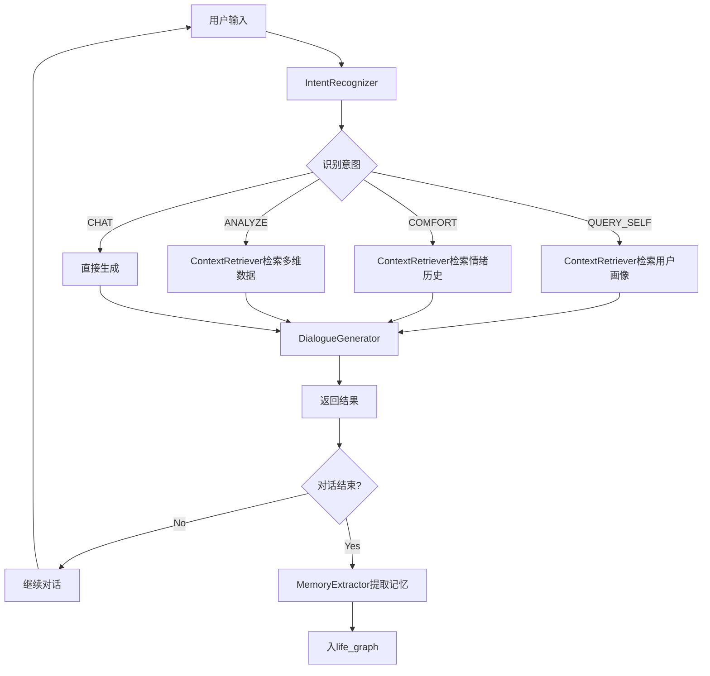

接口定义：

```python
class LifeChatService:
    """生活对话服务"""
    
    def __init__(self, capability_factory: CapabilityFactory):
        self.factory = capability_factory
        self.intent_recognizer = factory.create_intent_recognizer()
        self.context_retriever = factory.create_context_retriever()
        self.dialogue_generator = factory.create_dialogue_generator()
        self.memory_extractor = factory.create_memory_extractor()
        self.sessions: Dict[str, SessionPipe] = {}  # session_id -> pipe
    
    async def chat(
        self, 
        user_id: str,
        message: str,
        session_id: Optional[str] = None
    ) -> ChatResponse:
        """对话（完整输出）
        
        Args:
            user_id: 用户ID
            message: 用户消息
            session_id: 会话 ID，不提供则新建
        """
        # 1. 获取或创建Session
        if session_id and session_id in self.sessions:
            pipe = self.sessions[session_id]
        else:
            pipe = self.factory.create_session_pipe()
            session_id = f"{user_id}_{datetime.now().timestamp()}"
            self.sessions[session_id] = pipe
        
        # 2. 意图识别
        intent_result = await self.intent_recognizer.recognize(message)
        
        # 3. 根据意图检索上下文
        context = await self._retrieve_context(
            user_id, 
            message, 
            intent_result.intent
        )
        
        # 4. 生成回复
        response = await self.dialogue_generator.generate(
            message=message,
            context=context,
            intent=intent_result.intent,
            pipe=pipe
        )
        
        return ChatResponse(
            content=response.content,
            session_id=session_id,
            intent=intent_result.intent,
            context_used=context
        )
    
    async def chat_stream(
        self, 
        user_id: str,
        message: str,
        session_id: Optional[str] = None
    ) -> AsyncIterator[str]:
        """对话（流式输出）"""
        # 类似逻辑，但使用generate_stream
        ...
    
    async def end_session(
        self, 
        user_id: str,
        session_id: str
    ) -> bool:
        """终结会话，提取记忆入库
        
        用户主动调用或超时自动触发
        """
        if session_id not in self.sessions:
            return False
        
        pipe = self.sessions[session_id]
        
        # 1. 从对话历史提取记忆
        memory = await self.memory_extractor.extract(
            user_id=user_id,
            session_messages=pipe.export_session()["history"]["messages"]
        )
        
        # 2. 存入life_graph
        await self._save_memory_to_graph(user_id, memory)
        
        # 3. 清理Session
        del self.sessions[session_id]
        
        return True
    
    async def _retrieve_context(
        self, 
        user_id: str, 
        message: str, 
        intent: IntentType
    ) -> UserContext:
        """根据意图检索上下文"""
        if intent == IntentType.QUERY_SELF:
            # 检索兴趣、记忆等
            return await self.context_retriever.retrieve_user_profile(user_id)
        elif intent == IntentType.COMFORT:
            # 检索情绪历史
            return await self.context_retriever.retrieve_emotion_history(user_id)
        elif intent == IntentType.ANALYZE:
            # 检索全面数据
            return await self.context_retriever.retrieve_comprehensive(user_id)
        else:
            # 普通聊天，返回空上下文
            return UserContext.empty()
```

### 3.3 WorkProjectService - 项目分析服务

服务特性：
- **无对话**：单次调用，不维护会话
- **无持久化**：直接返回Markdown，不入库
- **核心能力**：文档解析 + 实体提取 + LLM分析 → 生成MD

核心流程：

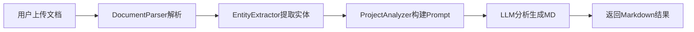

接口定义：

```python
class WorkProjectService:
    """项目分析服务"""
    
    def __init__(self, capability_factory: CapabilityFactory):
        self.factory = capability_factory
        self.project_analyzer = factory.create_project_analyzer()
    
    async def analyze_project(
        self,
        user_id: str,
        doc_paths: List[str],
        project_name: str,
        user_prompt: Optional[str] = None
    ) -> ProjectAnalysisResult:
        """分析项目
        
        Args:
            user_id: 用户ID（用于日志记录）
            doc_paths: 文档路径列表
            project_name: 项目名称
            user_prompt: 用户自定义提示词（如“重点分析架构”）
        
        Returns:
            ProjectAnalysisResult: 包含markdown_content
        """
        result = await self.project_analyzer.analyze(
            doc_paths=doc_paths,
            project_name=project_name,
            custom_prompt=user_prompt
        )
        
        return ProjectAnalysisResult(
            markdown_content=result.markdown,
            entities=result.entities,
            concepts=result.concepts,
            analyzed_at=datetime.now()
        )
```

### 3.4 WorkTodoService - 待办管理服务

服务特性：
- **无对话**：不需要多轮交互
- **有持久化**：待办存在work_graph，支持CRUD
- **核心能力**：待办CRUD + 依赖排序 + 图谱更新 + 时间语义

核心流程：

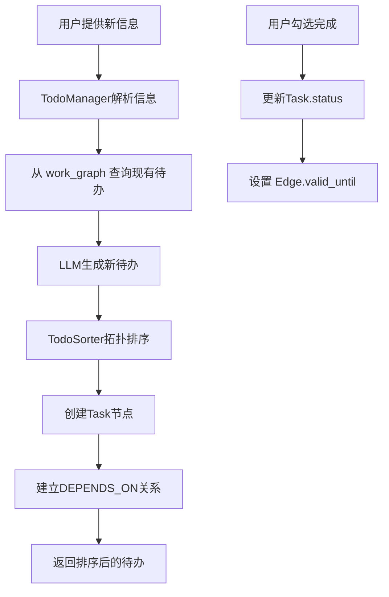

接口定义：

```python
class WorkTodoService:
    """待办管理服务"""
    
    def __init__(self, capability_factory: CapabilityFactory):
        self.factory = capability_factory
        self.todo_manager = factory.create_todo_manager()
    
    async def generate_todos(
        self,
        user_id: str,
        new_info: str,
        project_name: Optional[str] = None
    ) -> List[TodoItem]:
        """生成新待办
        
        Args:
            user_id: 用户ID
            new_info: 用户提供的新信息
            project_name: 项目名称（可选）
        
        Returns:
            排序后的待办列表
        """
        todos = await self.todo_manager.generate_and_sort(
            user_id=user_id,
            new_info=new_info,
            project_name=project_name
        )
        return todos
    
    async def update_todo_status(
        self,
        user_id: str,
        task_id: str,
        new_status: str
    ) -> bool:
        """更新待办状态
        
        如果状态为completed，会自动更新图谱中的时间属性
        """
        return await self.todo_manager.update_status(
            user_id=user_id,
            task_id=task_id,
            new_status=new_status
        )
    
    async def get_active_todos(
        self,
        user_id: str,
        project_name: Optional[str] = None
    ) -> SortedTodoList:
        """获取活跃待办（已排序）"""
        return await self.todo_manager.get_active(
            user_id=user_id,
            project_name=project_name
        )
```

### 3.5 WorkAdviceService - 工作建议服务

服务特性：
- **无对话**：单次生成建议
- **无持久化**：直接返回建议内容
- **核心能力**：图谱统计分析 + LLM生成建议

核心流程：

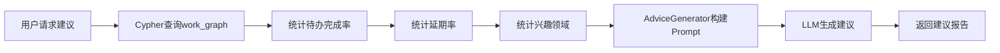

接口定义：

```python
class WorkAdviceService:
    """工作建议服务"""
    
    def __init__(self, capability_factory: CapabilityFactory):
        self.factory = capability_factory
        self.advice_generator = factory.create_advice_generator()
    
    async def generate_advice(
        self,
        user_id: str,
        time_range: Optional[TimeRange] = None
    ) -> AdviceReport:
        """生成工作建议
        
        Args:
            user_id: 用户ID
            time_range: 统计时间范围（默认最近30天）
        
        Returns:
            建议报告
        """
        advice = await self.advice_generator.generate(
            user_id=user_id,
            time_range=time_range or TimeRange.last_30_days()
        )
        return advice

## 4. Capability Layer - 能力组合层

### 4.1 TestCapability - 测试能力

**设计原则**：直接复用service/connect下的test_llm.py和test_storage.py

```python
from ame.service.connect import test_llm_callers, test_storage_graph

class LLMTestCapability:
    def __init__(self, api_key: str, model: str, base_url: Optional[str] = None):
        self.api_key = api_key
        self.model = model
        self.base_url = base_url
    
    async def run_all_tests(self) -> TestSummary:
        return await test_llm_callers(
            api_key=self.api_key,
            model=self.model,
            base_url=self.base_url
        )
```

### 4.2 ContextRetriever - 上下文检索能力

功能：从life_graph/work_graph中检索用户相关上下文。

### 4.3 DialogueGenerator - 对话生成能力

功能：结合上下文和意图生成个性化对话。

### 4.4 MemoryExtractor - 记忆提取能力

功能：Session终结时从HistoryMessages中提取重要信息。

### 4.5 ProjectAnalyzer - 项目分析能力

功能：分析项目文档，生成Markdown报告。

### 4.6 TodoManager - 待办管理能力

功能：生成、排序、更新待办。

### 4.7 AdviceGenerator - 建议生成能力

功能：基于图谱数据统计生成工作建议。

### 4.8 CapabilityFactory扩展

CapabilityFactory需新增以下方法：

```python
class CapabilityFactory:
    def __init__(
        self,
        llm_caller: LLMCallerBase,
        life_graph: LifeGraphPipeline,
        work_graph: WorkGraphPipeline,
        doc_parser: DocumentParsePipeline
    ):
        self.llm = llm_caller
        self.life_graph = life_graph
        self.work_graph = work_graph
        self.doc_parser = doc_parser
        
        # 初始化NLP组件
        self.intent_recognizer = IntentRecognizer(llm_caller)
        self.entity_extractor = EntityExtractor(llm_caller)
        self.emotion_analyzer = EmotionAnalyzer(llm_caller)
        self.summarizer = Summarizer(llm_caller, self.entity_extractor, self.emotion_analyzer)
        
        # 初始化Algorithm组件
        self.todo_sorter = TodoSorter()
        
        self._cache = {}
    
    # ===== 测试能力 =====
    def create_llm_test_capability(self, api_key: str, model: str, base_url: Optional[str] = None):
        return LLMTestCapability(api_key, model, base_url)
    
    def create_storage_test_capability(self, host: str, port: int, graph_name: str, password: Optional[str] = None):
        return StorageTestCapability(host, port, graph_name, password)
    
    # ===== NLP能力 =====
    def create_intent_recognizer(self, cache_key: str = "intent_recognizer"):
        if cache_key not in self._cache:
            self._cache[cache_key] = self.intent_recognizer
        return self._cache[cache_key]
    
    def create_entity_extractor(self, cache_key: str = "entity_extractor"):
        if cache_key not in self._cache:
            self._cache[cache_key] = self.entity_extractor
        return self._cache[cache_key]
    
    # ===== 高级能力 =====
    def create_context_retriever(self, cache_key: str = "context_retriever"):
        if cache_key not in self._cache:
            self._cache[cache_key] = ContextRetriever(
                life_graph=self.life_graph,
                work_graph=self.work_graph
            )
        return self._cache[cache_key]
    
    def create_dialogue_generator(self, cache_key: str = "dialogue_generator"):
        if cache_key not in self._cache:
            self._cache[cache_key] = DialogueGenerator(self.llm)
        return self._cache[cache_key]
    
    def create_memory_extractor(self, cache_key: str = "memory_extractor"):
        if cache_key not in self._cache:
            self._cache[cache_key] = MemoryExtractor(
                summarizer=self.summarizer,
                entity_extractor=self.entity_extractor
            )
        return self._cache[cache_key]
    
    def create_project_analyzer(self, cache_key: str = "project_analyzer"):
        if cache_key not in self._cache:
            self._cache[cache_key] = ProjectAnalyzer(
                doc_parser=self.doc_parser,
                entity_extractor=self.entity_extractor,
                llm_caller=self.llm
            )
        return self._cache[cache_key]
    
    def create_todo_manager(self, cache_key: str = "todo_manager"):
        if cache_key not in self._cache:
            self._cache[cache_key] = TodoManager(
                work_graph=self.work_graph,
                todo_sorter=self.todo_sorter,
                llm_caller=self.llm
            )
        return self._cache[cache_key]
    
    def create_advice_generator(self, cache_key: str = "advice_generator"):
        if cache_key not in self._cache:
            self._cache[cache_key] = AdviceGenerator(
                work_graph=self.work_graph,
                llm_caller=self.llm
            )
        return self._cache[cache_key]
    
    def create_session_pipe(self) -> SessionPipe:
        """创建Session管道（不缓存，每次新建）"""
        return SessionPipe(self.llm, cache_enabled=True, keep_recent=10)
```

### 3.1 ConnectService - 配置测试服务

#### 功能描述
提供LLM和Storage配置的连通性测试，便于后端在用户配置后快速验证。

#### 接口定义

| 方法 | 参数 | 返回 | 说明 |
|------|------|------|------|
| `test_llm_config` | `api_key, model, base_url` | `TestSummary` | 测试LLM配置 |
| `test_storage_config` | `host, port, graph_name, password` | `TestSummary` | 测试Storage配置 |

#### 依赖关系

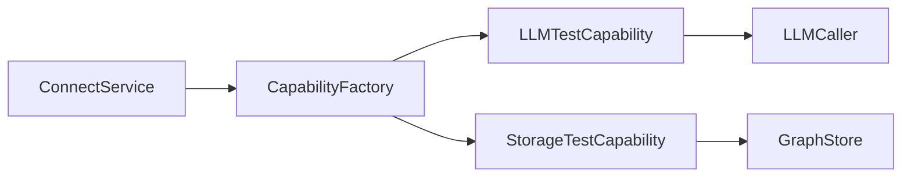

#### 数据流

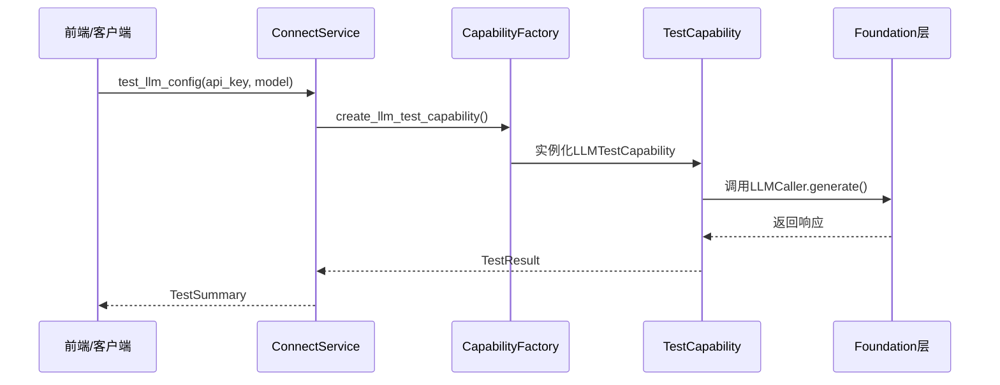

### 3.2 LifeChatService - 生活对话服务

#### 功能描述
基于life_graph中的用户数据（兴趣、情绪、记忆等），提供个性化对话能力。

#### 接口定义

| 方法 | 参数 | 返回 | 说明 |
|------|------|------|------|
| `chat` | `user_id, message, context` | `ChatResponse` | 完整对话 |
| `chat_stream` | `user_id, message, context` | `AsyncIterator[str]` | 流式对话 |
| `save_memory` | `user_id, conversation` | `bool` | 保存对话记忆到图谱 |

#### 依赖关系

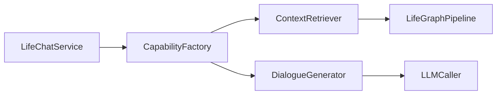

#### 核心流程

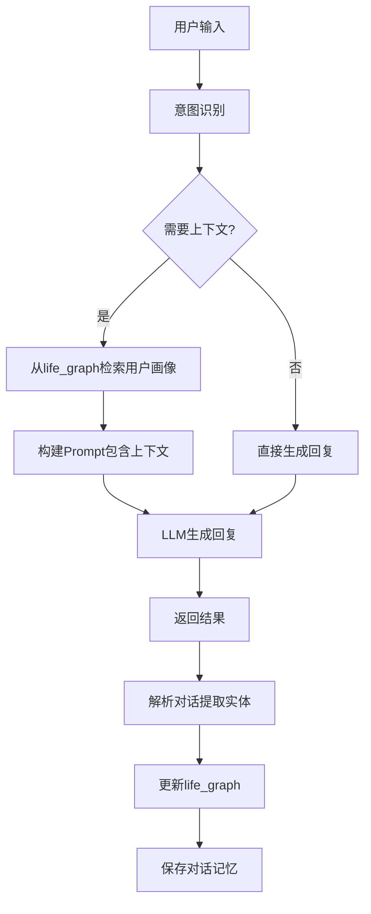

#### 图谱数据示例

Life Graph中存储的用户信息：

| 节点类型 | 属性示例 | 用途 |
|---------|---------|------|
| Person | name, user_id | 用户本人节点 |
| Interest | name, level, valid_from | 用户兴趣 |
| Emotion | type, intensity, timestamp | 历史情绪 |
| Memory | content, date | 重要记忆片段 |
| Topic | name, frequency | 常讨论话题 |

关系示例：
```
Person -[INTERESTED_IN]-> Interest
Person -[FEELS]-> Emotion
Person -[REMEMBERS]-> Memory
Person -[DISCUSSES]-> Topic
```

### 3.3 WorkProjectService - 项目认知服务

#### 功能描述
用户上传项目文档，系统解析并形成项目全面认知，输出Markdown格式结果。

#### 接口定义

| 方法 | 参数 | 返回 | 说明 |
|------|------|------|------|
| `analyze_project` | `user_id, doc_paths, project_name` | `ProjectReport` | 分析项目文档 |
| `get_project_knowledge` | `user_id, project_name` | `MarkdownContent` | 获取项目认知 |
| `update_project` | `user_id, project_name, new_docs` | `bool` | 增量更新项目 |

#### 依赖关系

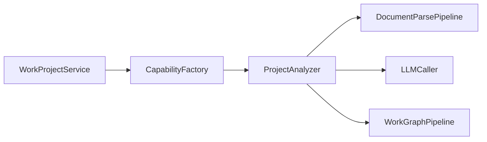

#### 核心流程

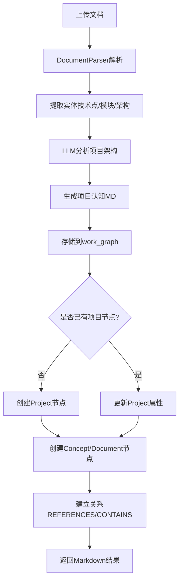

#### 图谱数据示例

Work Graph中存储的项目信息：

| 节点类型 | 属性示例 | 用途 |
|---------|---------|------|
| Project | name, description, created_at | 项目主节点 |
| Document | title, file_path, parsed_content | 项目文档 |
| Concept | name, description, category | 技术概念/模块 |
| Task | title, status | 项目任务 |

关系示例：
```
Project -[CONTAINS]-> Document
Project -[CONTAINS]-> Task
Document -[REFERENCES]-> Concept
Concept -[RELATES_TO]-> Concept
```

#### 输出格式示例

```markdown
# 项目名称: XXX系统

## 项目概述
- 核心功能: ...
- 技术栈: ...

## 架构设计
### 系统架构
- 前端: React + TypeScript
- 后端: FastAPI + Python
- 存储: PostgreSQL + Redis

### 模块划分
- 用户模块
- 订单模块
- ...

## 关键技术点
- 认证鉴权: JWT
- 缓存策略: Redis
- ...

## 待办事项
- [ ] 实现用户登录
- [ ] 优化查询性能
```

### 3.4 WorkTodoService - 待办管理服务

#### 功能描述
根据用户历史待办信息和新提供的信息，生成、更新、完成待办任务，存储在work_graph中。

#### 接口定义

| 方法 | 参数 | 返回 | 说明 |
|------|------|------|------|
| `generate_todos` | `user_id, context_info, project_name` | `List[Todo]` | 生成新待办 |
| `update_todo_status` | `user_id, task_id, status` | `bool` | 更新待办状态 |
| `complete_todo` | `user_id, task_id` | `bool` | 完成待办 |
| `get_active_todos` | `user_id, project_name` | `List[Todo]` | 获取活跃待办 |

#### 依赖关系

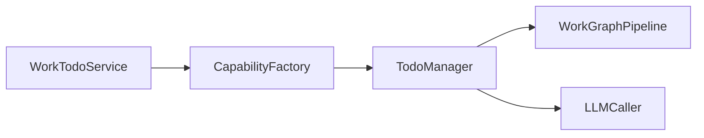

#### 核心流程

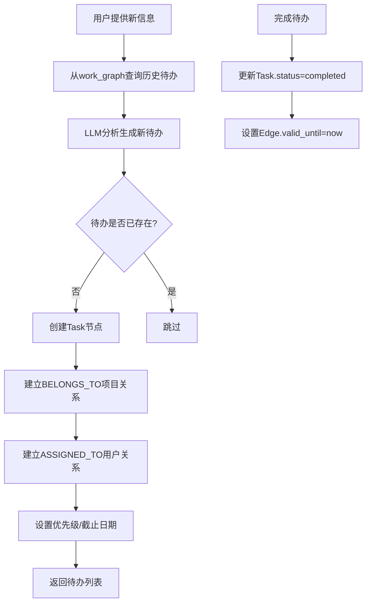

#### 图谱数据示例

待办在Work Graph中的表示：

| 节点类型 | 属性示例 | 状态流转 |
|---------|---------|---------|
| Task | title, status, priority, due_date | pending -> in_progress -> completed |

关系示例：
```
Task -[BELONGS_TO]-> Project
Task -[ASSIGNED_TO]-> Person
Task -[DEPENDS_ON]-> Task
```

时间语义示例：
```python
# 待办被分配
edge = GraphEdge(
    source_id=task_id,
    target_id=person_id,
    relation=RelationType.ASSIGNED_TO,
    valid_from=datetime.now(),  # 分配时间
    valid_until=None  # 仍在负责
)

# 待办完成
await store.update_edge(edge_id, {
    "valid_until": datetime.now()  # 完成时间
})
```

### 3.5 WorkAdviceService - 工作建议服务

#### 功能描述
基于用户执行待办的速度、完成质量、感兴趣领域等数据，生成个性化工作建议。

#### 接口定义

| 方法 | 参数 | 返回 | 说明 |
|------|------|------|------|
| `generate_advice` | `user_id, time_range` | `AdviceReport` | 生成工作建议 |
| `get_work_insights` | `user_id` | `WorkInsights` | 获取工作洞察 |

#### 依赖关系

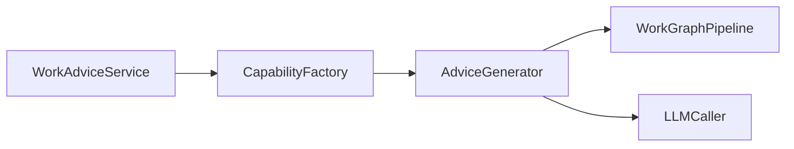

#### 核心流程

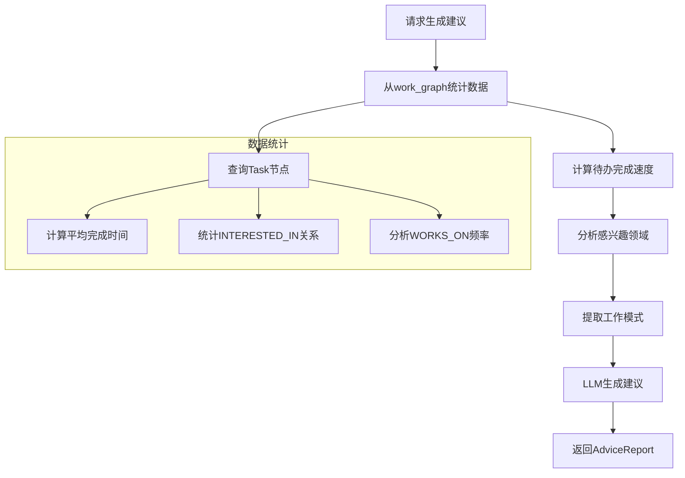

#### 数据分析示例

统计指标：

| 指标 | 计算方式 | 用途 |
|------|---------|------|
| 平均完成时间 | `avg(completed_at - created_at)` | 评估效率 |
| 领域偏好 | `count(INTERESTED_IN) by category` | 推荐任务 |
| 活跃时段 | `histogram(task.created_at.hour)` | 优化工作节奏 |
| 延期率 | `count(completed_at > due_date) / total` | 识别问题 |

Cypher查询示例：
```cypher
// 查询用户最近30天完成的待办
MATCH (p:Person {user_id: $user_id})-[r:ASSIGNED_TO]->(t:Task)
WHERE t.status = 'completed'
  AND r.valid_until >= datetime() - duration({days: 30})
RETURN t.title, t.priority, 
       r.valid_until - r.valid_from AS duration
ORDER BY r.valid_until DESC
```

#### 输出格式示例

```markdown
# 工作建议报告

## 效率分析
- 平均完成时间: 2.3天
- 延期任务: 3个 (15%)
- 最高效时段: 9:00-11:00

## 能力评估
- 擅长领域: 后端开发、数据库优化
- 需提升: 前端技能、项目管理

## 改进建议
1. 减少并行任务，专注度提升20%
2. 学习React框架，补足前端短板
3. 优化工作时段，避免下午低效期
```

## 4. Capability Layer

### 4.1 测试能力

#### LLMTestCapability

封装LLM测试逻辑，提供统一测试接口。

**核心方法**：
```python
class LLMTestCapability:
    def __init__(self, llm_caller: LLMCallerBase):
        self.caller = llm_caller
    
    async def test_connectivity(self) -> TestResult
    async def test_stream(self) -> TestResult
    async def test_complete(self) -> TestResult
    def test_token_estimation(self) -> TestResult
```

#### StorageTestCapability

封装Storage测试逻辑。

**核心方法**：
```python
class StorageTestCapability:
    def __init__(self, graph_store: GraphStoreBase):
        self.store = graph_store
    
    async def test_connectivity(self) -> TestResult
    async def test_node_operations(self) -> TestResult
    async def test_edge_operations(self) -> TestResult
    async def test_query_operations(self) -> TestResult
```

### 4.2 上下文检索能力

#### ContextRetriever

从life_graph或work_graph中检索用户相关上下文。

**核心方法**：
```python
class ContextRetriever:
    def __init__(
        self, 
        life_graph: LifeGraphPipeline,
        work_graph: WorkGraphPipeline
    ):
        self.life_graph = life_graph
        self.work_graph = work_graph
    
    async def retrieve_user_profile(
        self, 
        user_id: str
    ) -> UserProfile
    
    async def retrieve_project_context(
        self, 
        user_id: str, 
        project_name: str
    ) -> ProjectContext
```

### 4.3 对话生成能力

#### DialogueGenerator

结合上下文生成个性化对话回复。

**核心方法**：
```python
class DialogueGenerator:
    def __init__(self, llm_caller: LLMCallerBase):
        self.llm = llm_caller
    
    async def generate(
        self, 
        message: str, 
        context: UserProfile
    ) -> str
    
    async def generate_stream(
        self, 
        message: str, 
        context: UserProfile
    ) -> AsyncIterator[str]
```

### 4.4 项目分析能力

#### ProjectAnalyzer

分析项目文档，提取结构化信息。

**核心方法**：
```python
class ProjectAnalyzer:
    def __init__(
        self, 
        doc_parser: DocumentParsePipeline,
        llm_caller: LLMCallerBase
    ):
        self.parser = doc_parser
        self.llm = llm_caller
    
    async def analyze(
        self, 
        doc_paths: List[str]
    ) -> ProjectAnalysis
    
    def extract_entities(
        self, 
        content: str
    ) -> List[Entity]
```

### 4.5 待办管理能力

#### TodoManager

管理待办的生成、更新、查询。

**核心方法**：
```python
class TodoManager:
    def __init__(
        self, 
        work_graph: WorkGraphPipeline,
        llm_caller: LLMCallerBase
    ):
        self.graph = work_graph
        self.llm = llm_caller
    
    async def generate_todos(
        self, 
        context: str, 
        history: List[Task]
    ) -> List[Task]
    
    async def update_status(
        self, 
        task_id: str, 
        status: str
    ) -> bool
```

### 4.6 建议生成能力

#### AdviceGenerator

基于数据分析生成工作建议。

**核心方法**：
```python
class AdviceGenerator:
    def __init__(
        self, 
        work_graph: WorkGraphPipeline,
        llm_caller: LLMCallerBase
    ):
        self.graph = work_graph
        self.llm = llm_caller
    
    async def analyze_work_pattern(
        self, 
        user_id: str, 
        time_range: TimeRange
    ) -> WorkPattern
    
    async def generate_advice(
        self, 
        pattern: WorkPattern
    ) -> AdviceReport
```

### 4.7 CapabilityFactory扩展

需扩展现有CapabilityFactory，支持新能力的创建。

**新增方法**：
```python
class CapabilityFactory:
    # 现有方法...
    
    def create_llm_test_capability(
        self, 
        cache_key: str = "llm_test"
    ) -> LLMTestCapability
    
    def create_storage_test_capability(
        self, 
        cache_key: str = "storage_test"
    ) -> StorageTestCapability
    
    def create_context_retriever(
        self, 
        cache_key: str = "context_retriever"
    ) -> ContextRetriever
    
    def create_dialogue_generator(
        self, 
        cache_key: str = "dialogue_gen"
    ) -> DialogueGenerator
    
    def create_project_analyzer(
        self, 
        cache_key: str = "project_analyzer"
    ) -> ProjectAnalyzer
    
    def create_todo_manager(
        self, 
        cache_key: str = "todo_manager"
    ) -> TodoManager
    
    def create_advice_generator(
        self, 
        cache_key: str = "advice_gen"
    ) -> AdviceGenerator
```

## 5. Foundation Layer (已完成)

Foundation层已基本完成，包含：

| 模块 | 功能 | 状态 |
|------|------|------|
| `llm/` | LLM调用、流式输出、策略（缓存/重试/压缩） | ✅ 已完成 |
| `storage/` | 图数据库抽象、FalkorDB实现、Pipeline | ✅ 已完成 |
| `file/` | 文档解析（PDF/DOCX/MD/TXT/PPT） | ✅ 已完成 |

**复用方式**：

```python
# LLM调用
from ame.foundation.llm import OpenAICaller, create_user_message

caller = OpenAICaller(api_key="xxx", model="gpt-4")
response = await caller.generate([create_user_message("Hello")])

# 图谱操作
from ame.foundation.storage import LifeGraphPipeline, WorkGraphPipeline

life_graph = LifeGraphPipeline(host="localhost", port=6379)
await life_graph.initialize()

# 文档解析
from ame.foundation.file import DocumentParsePipeline

parser = DocumentParsePipeline()
doc = await parser.parse("/path/to/document.pdf")
```

## 6. Data Models

### 6.1 测试相关模型

```python
@dataclass
class TestResult:
    success: bool
    message: str
    details: Optional[Dict[str, Any]] = None
    error: Optional[str] = None

@dataclass
class TestSummary:
    total: int
    passed: int
    failed: int
    results: Dict[str, TestResult]
    
    @property
    def pass_rate(self) -> float
    
    @property
    def success(self) -> bool
```

### 6.2 对话相关模型

```python
@dataclass
class UserProfile:
    user_id: str
    interests: List[str]
    recent_emotions: List[Dict]
    memories: List[str]
    topics: List[str]

@dataclass
class ChatResponse:
    content: str
    context_used: UserProfile
    timestamp: datetime
```

### 6.3 项目相关模型

```python
@dataclass
class ProjectAnalysis:
    project_name: str
    summary: str
    architecture: Dict[str, Any]
    tech_stack: List[str]
    concepts: List[Entity]
    documents: List[str]

@dataclass
class ProjectReport:
    markdown_content: str
    analysis: ProjectAnalysis
    graph_updated: bool
```

### 6.4 待办相关模型

```python
@dataclass
class Task:
    id: Optional[str]
    title: str
    status: str  # pending/in_progress/completed
    priority: str  # high/medium/low
    due_date: Optional[datetime]
    project_name: Optional[str]
    created_at: datetime
    completed_at: Optional[datetime]

@dataclass
class Todo:
    task: Task
    dependencies: List[str]
    assigned_to: str
```

### 6.5 建议相关模型

```python
@dataclass
class WorkPattern:
    avg_completion_time: float
    delay_rate: float
    active_hours: List[int]
    preferred_domains: List[str]
    efficiency_score: float

@dataclass
class AdviceReport:
    efficiency_analysis: str
    capability_assessment: str
    improvement_suggestions: List[str]
    pattern: WorkPattern
    generated_at: datetime
```

## 8. README架构修正建议

### 8.1 架构图修正

**当前架构图**需要更新为：

```
┌─────────────────────────────────────────────────────┐
│           Application Layer (应用层)                 │
│          FastAPI Backend / CLI / SDK                │
└─────────────────────────────────────────────────────┘
                         ↓
┌─────────────────────────────────────────────────────┐
│            Services Layer (业务服务层)                │
│  Connect | LifeChat | WorkProject | WorkTodo | ...  │
└─────────────────────────────────────────────────────┘
                         ↓
┌─────────────────────────────────────────────────────┐
│          Capabilities Layer (能力层)                 │
│  ContextRetriever | DialogueGen | ProjectAnalyzer   │
└─────────────────────────────────────────────────────┘
                         ↓
┌─────────────────────────────────────────────────────┐
│           Foundation Layer (基础层)                  │
│   LLM | File | Storage (Graph/Vector) | Pipeline    │
└─────────────────────────────────────────────────────┘
```

### 8.2 各层职责表修正

| 层级 | 职责 | 示例 |
|------|------|------|
| **Foundation** | 提供原子化技术能力 | LLM调用、文档解析、图谱存储 |
| **Capabilities** | 组合基础能力，提供高级功能 | 上下文检索、对话生成、项目分析 |
| **Services** | 封装业务逻辑，提供场景化服务 | 配置测试、生活对话、工作辅助 |
| **Application** | 对外接口，集成各种服务 | REST API、命令行工具、SDK |

### 8.3 项目结构修正

更新 `## 📦 项目结构` 部分为：

```
ame/
├── foundation/              # 基础层 - 原子能力
│   ├── llm/                # LLM 调用器
│   │   ├── atomic/        # 原子组件 (Caller, OpenAICaller)
│   │   ├── core/          # 核心模型 (LLMResponse, CallMode)
│   │   └── pipeline/      # LLM管道 (SessionPipe, DocumentPipe)
│   ├── file/               # 文件解析
│   │   ├── atomic/        # 解析器 (PDF, DOCX, MD, TXT, PPT)
│   │   ├── core/          # 核心模型 (ParsedDocument)
│   │   └── pipeline/      # 解析管道 (DocumentParsePipeline)
│   └── storage/            # 存储抽象
│       ├── atomic/        # 原子组件 (GraphStoreBase, FalkorDBStore)
│       ├── core/          # 核心模型 (GraphNode, GraphEdge, Schema)
│       └── pipeline/      # 图谱管道 (LifeGraphPipeline, WorkGraphPipeline)
│
├── capability/              # 能力层 - 组合能力
│   ├── analysis/          # 数据分析 (待实现)
│   ├── test/              # 测试能力 (LLMTest, StorageTest)
│   ├── retrieval/         # 上下文检索 (ContextRetriever)
│   ├── generation/        # 对话生成 (DialogueGenerator)
│   ├── project/           # 项目分析 (ProjectAnalyzer)
│   ├── todo/              # 待办管理 (TodoManager)
│   ├── advice/            # 建议生成 (AdviceGenerator)
│   └── factory.py         # 能力工厂 (依赖注入)
│
├── service/                 # 服务层 - 业务逻辑
│   ├── connect/           # 配置测试服务
│   │   ├── test_llm.py   # LLM配置测试
│   │   └── test_storage.py # Storage配置测试
│   ├── life/              # 生活服务 (待实现)
│   │   └── chat_service.py # 生活对话服务
│   └── work/              # 工作服务 (待实现)
│       ├── project_service.py # 项目认知服务
│       ├── todo_service.py    # 待办管理服务
│       └── advice_service.py  # 工作建议服务
│
└── requirements.txt         # 依赖清单
```

### 8.4 核心功能章节新增

在 `## 📚 核心功能` 部分新增：

#### 0️⃣ 配置测试 (ConnectService)

快速验证LLM和Storage配置是否正确。

```python
from ame.service.connect import test_llm_callers, test_storage_graph

# 测试LLM配置
summary = await test_llm_callers(
    api_key="sk-...",
    model="gpt-4",
    base_url="https://api.openai.com/v1"
)

if summary.success:
    print("LLM配置正确")

# 测试Storage配置
summary = await test_storage_graph(
    host="localhost",
    port=6379,
    graph_name="test_graph"
)

if summary.success:
    print("Storage配置正确")
```

**功能特性**:
- ✅ LLM连通性测试
- ✅ 流式输出测试
- ✅ Token估算测试
- ✅ 图数据库CRUD测试
- ✅ 时间查询测试

#### 3️⃣ 生活助手 (Life Services)

基于life_graph的个性化对话与记忆管理。

```python
from ame.service.life import LifeChatService

# 初始化服务
life_service = LifeChatService(capability_factory=factory)

# 个性化对话
response = await life_service.chat(
    user_id="user_001",
    message="我最近工作压力好大",
    context={}
)

# 流式对话
async for chunk in life_service.chat_stream(
    user_id="user_001",
    message="给我讲个笑话吧"
):
    print(chunk, end="")

# 保存对话记忆
await life_service.save_memory(
    user_id="user_001",
    conversation={"user": "...", "assistant": "..."}
)
```

**功能特性**:
- ✅ 基于用户画像的个性化回复
- ✅ 情绪感知与安慰
- ✅ 自动提取并存储对话记忆
- ✅ 流式输出

#### 4️⃣ 工作助手 (Work Services)

项目认知、待办管理、工作建议三大功能。

```python
from ame.service.work import (
    WorkProjectService,
    WorkTodoService,
    WorkAdviceService
)

# 1. 项目认知
project_service = WorkProjectService(capability_factory=factory)
report = await project_service.analyze_project(
    user_id="user_001",
    doc_paths=["/path/to/design.md", "/path/to/api.md"],
    project_name="AME引擎"
)
print(report.markdown_content)  # 输出Markdown格式的项目认知

# 2. 待办管理
todo_service = WorkTodoService(capability_factory=factory)
todos = await todo_service.generate_todos(
    user_id="user_001",
    context_info="需要实现LLM调用功能",
    project_name="AME引擎"
)

# 完成待办
await todo_service.complete_todo(
    user_id="user_001",
    task_id="task_001"
)

# 3. 工作建议
advice_service = WorkAdviceService(capability_factory=factory)
advice = await advice_service.generate_advice(
    user_id="user_001",
    time_range={"start": "2024-01-01", "end": "2024-01-31"}
)
print(advice.improvement_suggestions)
```

**功能特性**:
- ✅ 多文档项目分析
- ✅ 智能待办生成
- ✅ 待办依赖管理
- ✅ 基于数据的工作建议
- ✅ 图谱自动更新

## 9. 开发实施建议

### 9.1 开发优先级

按照以下顺序实施，确保每一步都可验证：

**阶段1: Foundation层验证 (已完成)**
- ✅ LLM调用器
- ✅ 图数据库Pipeline
- ✅ 文档解析器

**阶段2: Capability层实现 (优先)**
1. 测试能力 (复用现有test_llm.py/test_storage.py)
2. 上下文检索能力 (ContextRetriever)
3. 对话生成能力 (DialogueGenerator)
4. CapabilityFactory扩展

**阶段3: Service层实现**
1. ConnectService (最简单，优先验证架构)
2. LifeChatService (核心功能)
3. WorkProjectService
4. WorkTodoService
5. WorkAdviceService

**阶段4: 集成与测试**
1. 单元测试补全
2. FastAPI接口集成
3. 端到端测试

### 9.2 技术选型建议

| 组件 | 建议技术 | 理由 |
|------|---------|------|
| 异步编程 | asyncio + async/await | Foundation层已采用 |
| 依赖注入 | CapabilityFactory手动实现 | 轻量级，符合现有架构 |
| 单元测试 | pytest + pytest-asyncio | Python生态标准 |
| Mock测试 | pytest-mock | 隔离外部依赖 |
| 图查询 | Cypher (FalkorDB原生) | 已有FalkorDBStore |
| 数据验证 | Pydantic dataclass | FastAPI生态一致 |

### 9.3 关键实现要点

#### 9.3.1 依赖注入规范

**强制要求**：
- Service层**只能**通过构造函数接收`CapabilityFactory`
- **禁止**在Service内部创建Foundation层组件
- **禁止**直接传递大量Foundation层参数

**正确示例**：
```python
class LifeChatService:
    def __init__(self, capability_factory: CapabilityFactory):
        self.factory = capability_factory
        self.retriever = factory.create_context_retriever()
        self.generator = factory.create_dialogue_generator()
```

**错误示例**：
```python
# ❌ 错误：直接接收Foundation层组件
class LifeChatService:
    def __init__(self, llm_caller, life_graph, work_graph, ...):
        ...

# ❌ 错误：内部创建Factory
class LifeChatService:
    def __init__(self, api_key, model, ...):
        self.factory = CapabilityFactory(...)  # 不允许
```

#### 9.3.2 图谱时间语义处理

所有涉及图谱边的操作必须正确处理时间属性：

```python
# 创建新关系
edge = GraphEdge(
    source_id=user_id,
    target_id=interest_id,
    relation=RelationType.INTERESTED_IN,
    valid_from=datetime.now(),
    valid_until=None  # None表示仍然有效
)

# 更新关系（如完成待办）
await graph.update_edge(edge_id, {
    "valid_until": datetime.now()
})

# 查询时间范围内有效的边
valid_edges = await graph.find_valid_edges_at(
    timestamp=datetime.now(),
    source_id=user_id
)
```

#### 9.3.3 LLM Prompt设计

**上下文注入示例**（LifeChatService）：

```python
def build_prompt(user_message: str, profile: UserProfile) -> str:
    context = f"""
你是一个贴心的AI助手，了解用户的以下信息：

兴趣爱好: {', '.join(profile.interests)}
最近情绪: {profile.recent_emotions[-1]['type']} (强度: {profile.recent_emotions[-1]['intensity']})
重要记忆: {profile.memories[0] if profile.memories else '无'}

请根据这些信息，用温暖、个性化的方式回复用户。
"""
    
    return context + f"\n\n用户说: {user_message}\n\n你的回复:"
```

**项目分析Prompt示例**（WorkProjectService）：

```python
def build_analysis_prompt(documents: List[ParsedDocument]) -> str:
    doc_contents = "\n\n".join([
        f"## {doc.title}\n{doc.raw_content[:2000]}..."
        for doc in documents
    ])
    
    return f"""
请分析以下项目文档，提取关键信息：

{doc_contents}

请按以下结构输出Markdown格式的项目认知：

# 项目名称: [自动提取]

## 项目概述
- 核心功能: 
- 技术栈: 

## 架构设计
### 系统架构
### 模块划分

## 关键技术点

## 待办事项
"""
```

#### 9.3.4 流式输出实现

所有对话类Service必须支持流式输出：

```python
class LifeChatService:
    async def chat_stream(
        self, 
        user_id: str, 
        message: str, 
        context: Dict
    ) -> AsyncIterator[str]:
        # 1. 检索用户画像
        profile = await self.retriever.retrieve_user_profile(user_id)
        
        # 2. 构建Prompt
        prompt = self._build_prompt(message, profile)
        
        # 3. 流式生成
        async for chunk in self.generator.generate_stream(prompt, profile):
            yield chunk
        
        # 4. 异步保存记忆（不阻塞流式输出）
        asyncio.create_task(
            self._save_memory_async(user_id, message, full_response)
        )
```

### 9.4 测试策略

#### 9.4.1 单元测试结构

```
test/
├── foundation/
│   ├── test_llm_caller.py
│   ├── test_graph_store.py
│   └── test_document_parser.py
├── capability/
│   ├── test_context_retriever.py
│   ├── test_dialogue_generator.py
│   ├── test_project_analyzer.py
│   └── test_todo_manager.py
└── service/
    ├── test_connect_service.py
    ├── test_life_chat_service.py
    ├── test_work_project_service.py
    ├── test_work_todo_service.py
    └── test_work_advice_service.py
```

#### 9.4.2 Mock策略

**Foundation层Mock**：

```python
@pytest.fixture
def mock_llm_caller():
    caller = Mock(spec=LLMCallerBase)
    caller.generate = AsyncMock(return_value=LLMResponse(
        content="测试回复",
        model="gpt-4",
        total_tokens=100
    ))
    return caller

@pytest.fixture
def mock_life_graph():
    graph = Mock(spec=LifeGraphPipeline)
    graph.find_nodes = AsyncMock(return_value=[
        GraphNode(
            label=NodeLabel.INTEREST,
            properties={"name": "编程"}
        )
    ])
    return graph
```

**Capability层Mock**：

```python
@pytest.fixture
def mock_capability_factory(mock_llm_caller, mock_life_graph):
    factory = Mock(spec=CapabilityFactory)
    factory.create_context_retriever = Mock(return_value=Mock(
        retrieve_user_profile=AsyncMock(return_value=UserProfile(
            user_id="test_user",
            interests=["编程", "阅读"],
            recent_emotions=[],
            memories=[],
            topics=[]
        ))
    ))
    return factory
```

### 9.5 性能优化建议

#### 9.5.1 图查询优化

```python
# ❌ 避免：多次单独查询
for interest in interests:
    node = await graph.get_node(interest.id)

# ✅ 推荐：批量查询
nodes = await graph.find_nodes(
    label=NodeLabel.INTEREST,
    properties={"id": {"$in": [i.id for i in interests]}}
)
```

#### 9.5.2 LLM调用优化

```python
# 使用缓存策略
from ame.foundation.llm.atomic.strategy import CacheStrategy

caller = OpenAICaller(
    api_key="xxx",
    strategies=[CacheStrategy(ttl=3600)]  # 1小时缓存
)
```

#### 9.5.3 并发处理

```python
# 并发检索多个图谱
life_profile, work_context = await asyncio.gather(
    self.retriever.retrieve_user_profile(user_id),
    self.retriever.retrieve_project_context(user_id, project_name)
)
```

### 9.6 安全注意事项

1. **输入验证**：
   - 所有用户输入必须验证长度（防止超长Token）
   - 敏感字段（如user_id）必须验证格式

2. **注入防护**：
   - Cypher查询使用参数化查询，禁止字符串拼接
   - Prompt构建时转义特殊字符

3. **权限控制**：
   - user_id必须与认证token一致
   - 禁止跨用户查询数据

### 9.7 监控与日志

```python
from loguru import logger

class LifeChatService:
    async def chat(self, user_id: str, message: str, context: Dict):
        logger.info(f"[LifeChat] user={user_id} message_len={len(message)}")
        
        try:
            # 业务逻辑
            result = ...
            logger.info(f"[LifeChat] success user={user_id}")
            return result
        except Exception as e:
            logger.error(f"[LifeChat] error user={user_id} error={e}")
            raise
```

### 9.8 迁移路径

如果项目中已有旧的Service实现，按以下步骤迁移：

1. **评估现有Service**：识别依赖的Foundation组件
2. **创建CapabilityFactory**：集中管理依赖
3. **重构Service构造函数**：只接收Factory
4. **逐步替换直接调用**：使用Factory创建的能力
5. **测试验证**：确保功能一致
6. **删除旧代码**：移除冗余依赖传递

### 9.9 常见问题

**Q1: 为什么不使用依赖注入框架（如dependency-injector）？**

A: AME项目规模适中，手动Factory模式已足够。引入额外框架会增加学习成本和复杂度。

**Q2: CapabilityFactory的缓存机制如何工作？**

A: 通过`cache_key`参数复用同一能力实例，避免重复创建LLM Caller等重量级对象。

**Q3: 如何处理图谱数据迁移？**

A: 使用FalkorDB的Cypher脚本进行批量更新，参考`scripts/migrate_vector_store.py`模式。

**Q4: 流式输出如何处理异常？**

A: 在生成器内捕获异常，通过特殊chunk传递错误信息，或直接抛出让上层处理。

### 9.10 下一步行动

1. **创建开发分支**：`feature/service-layer-refactor`
2. **搭建目录结构**：按照设计文档创建文件
3. **实现CapabilityFactory扩展**：新增能力创建方法
4. **实现ConnectService**：验证架构可行性
5. **编写单元测试**：确保质量
6. **提交PR**：代码审查与合并

### 7.1 测试策略

采用单元测试验证各层组件功能：

| 测试层级 | 测试内容 | 工具 |
|---------|---------|------|
| Foundation | LLM调用、Storage操作、文档解析 | pytest + pytest-asyncio |
| Capability | 能力组合逻辑、数据转换 | pytest + mock |
| Service | 业务流程、接口契约 | pytest + mock |

### 7.2 测试用例示例

#### ConnectService测试

```python
@pytest.mark.asyncio
async def test_connect_service_llm():
    factory = CapabilityFactory(llm_caller=mock_llm)
    service = ConnectService(factory)
    
    result = await service.test_llm_config(
        api_key="sk-test",
        model="gpt-3.5-turbo"
    )
    
    assert result.success == True
    assert result.passed > 0
```

#### LifeChatService测试

```python
@pytest.mark.asyncio
async def test_life_chat_service():
    factory = CapabilityFactory(
        llm_caller=mock_llm,
        life_graph=mock_life_graph
    )
    service = LifeChatService(factory)
    
    response = await service.chat(
        user_id="user_001",
        message="我今天很开心",
        context={}
    )
    
    assert response.content is not None
    assert "user_001" in response.context_used.user_id
```

#### WorkTodoService测试

```python
@pytest.mark.asyncio
async def test_work_todo_service():
    factory = CapabilityFactory(
        llm_caller=mock_llm,
        work_graph=mock_work_graph
    )
    service = WorkTodoService(factory)
    
    todos = await service.generate_todos(
        user_id="user_001",
        context_info="需要实现用户登录功能",
        project_name="AME"
    )
    
    assert len(todos) > 0
    assert todos[0].task.status == "pending"
```
