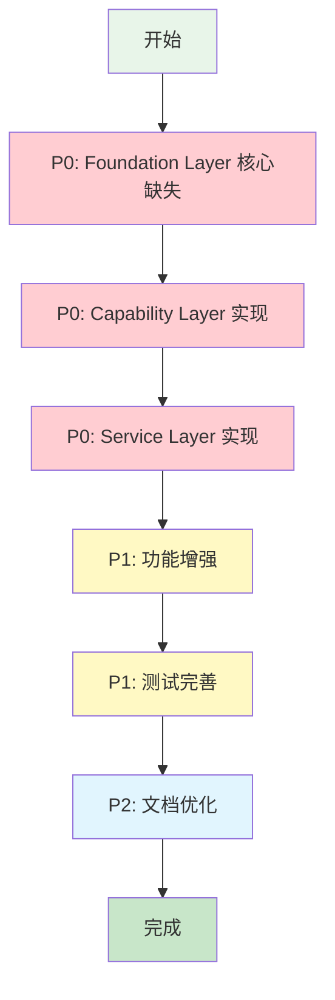
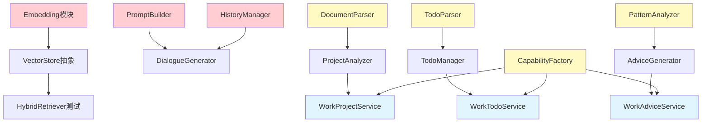

# AME 模块开发实施计划

> **文档目标**: 基于设计文档的全面分析,制定可执行的分层开发计划
> **更新时间**: 2025-11-21
> **文档依据**: architecture.md + codedetail.md

---

## 📊 开发概览

### 整体完成度

| 层级 | 设计要求 | 已实现 | 完成度 | 优先级 |
|------|----------|--------|--------|--------|
| **Foundation Layer** | 5个模块 | 5个模块 | 75% | **P0** |
| **Capability Layer** | 10个能力 | 6个能力 | 60% | **P0** |
| **Service Layer** | 4个服务 | 1个服务 | 25% | **P0** |

### 开发优先级说明

- **P0 (高优先级)**: 核心缺失功能,阻塞上层开发
- **P1 (中优先级)**: 增强功能,提升系统能力
- **P2 (低优先级)**: 优化功能,改善用户体验

---

## 🎯 开发路线图



---

## 📋 详细任务清单

## 【P0】Foundation Layer - 核心缺失功能开发

### 1. LLM模块核心缺失 (预计 7 天)

#### 任务ID: a1b2c3d4e5f6

**现状分析**:
- ✅ `LLMCallerBase` + `OpenAICaller` 完整实现
- ✅ `StreamCaller` 流式调用完整实现
- ✅ Strategy模块 (cache/retry/compress) 部分实现
- ❌ **缺失**: `PromptBuilder` 提示词构建器
- ❌ **缺失**: `HistoryManager` 历史管理器
- ⚠️ **缺失**: Strategy模块完整测试

**子任务**:

##### 1.1 实现 PromptBuilder 类 (2天)
**任务ID**: g7h8i9j0k1l2

**位置**: `foundation/llm/core/prompt_builder.py`

**接口设计**:
```python
class PromptBuilder:
    """提示词构建器"""
    
    def build(self, template: str, context: Dict, variables: Dict) -> str:
        """构建基础提示词"""
        pass
    
    def build_with_history(self, template: str, history: List[Dict]) -> str:
        """带历史的提示词构建"""
        pass
    
    def build_few_shot(self, template: str, examples: List[Dict]) -> str:
        """Few-shot提示词构建"""
        pass
```

**验收标准**:
- [ ] 支持模板变量替换
- [ ] 支持对话历史嵌入
- [ ] 支持Few-shot示例嵌入
- [ ] 编写单元测试 (覆盖率 > 80%)

---

##### 1.2 实现 HistoryManager 类 (3天)
**任务ID**: m3n4o5p6q7r8

**位置**: `foundation/llm/core/history_manager.py`

**接口设计**:
```python
class HistoryManager:
    """对话历史管理器"""
    
    def manage(self, messages: List[Dict], max_length: int) -> List[Dict]:
        """
        管理对话历史
        - 超出max_length时截断或压缩
        """
        pass
    
    def summarize_history(self, messages: List[Dict], llm_caller) -> str:
        """
        压缩历史为摘要
        - 使用LLM总结历史对话
        """
        pass
    
    def estimate_tokens(self, messages: List[Dict]) -> int:
        """估算历史token数"""
        pass
```

**依赖**: `LLMCaller`

**验收标准**:
- [ ] 支持基于token数的历史截断
- [ ] 支持LLM历史摘要压缩
- [ ] 支持滑动窗口策略
- [ ] 编写单元测试 (覆盖率 > 80%)

---

##### 1.3 完善 Strategy 模块测试 (2天)
**任务ID**: s9t0u1v2w3x4

**位置**: `ame-tests/foundation/llm/test_strategies.py`

**测试覆盖**:
- [ ] cache.py 缓存策略测试
- [ ] retry.py 重试策略测试
- [ ] compress.py 压缩策略测试
- [ ] 策略组合测试

**验收标准**:
- [ ] 测试覆盖率 > 90%
- [ ] 包含边界情况测试
- [ ] 包含性能测试

---

### 2. Storage模块核心缺失 (预计 10 天)

#### 任务ID: y5z6a7b8c9d0

**现状分析**:
- ✅ `GraphStoreBase` + `FalkorDBStore` 完整实现
- ✅ `FaissVectorStore` 完整实现
- ✅ `HybridRetriever` 完整实现
- ❌ **缺失**: Embedding模块 (完全未实现)
- ❌ **缺失**: VectorStore抽象基类
- ⚠️ **未验证**: Storage Pipeline

**子任务**:

##### 2.1 实现 Embedding 模块 (4天)
**任务ID**: e1f2g3h4i5j6

**位置**: `foundation/embedding/`

**目录结构**:
```
foundation/embedding/
├── __init__.py
├── atomic/
│   ├── __init__.py
│   ├── base.py              # EmbeddingBase抽象基类
│   └── openai_embedding.py  # OpenAI Embedding实现
├── core/
│   ├── __init__.py
│   ├── models.py            # 数据模型
│   └── exceptions.py        # 异常定义
```

**接口设计**:
```python
class EmbeddingBase(ABC):
    """Embedding抽象基类"""
    
    @abstractmethod
    def embed_text(self, text: str) -> List[float]:
        """文本向量化"""
        pass
    
    @abstractmethod
    def embed_batch(self, texts: List[str]) -> List[List[float]]:
        """批量文本向量化"""
        pass
    
    @abstractmethod
    def get_dimension(self) -> int:
        """获取向量维度"""
        pass

class OpenAIEmbedding(EmbeddingBase):
    """OpenAI Embedding实现"""
    
    def __init__(self, model: str = "text-embedding-ada-002"):
        self.model = model
        self.dimension = 1536
```

**验收标准**:
- [ ] OpenAIEmbedding完整实现
- [ ] 支持同步和异步调用
- [ ] 支持批量处理优化
- [ ] 编写单元测试 (覆盖率 > 80%)

---

##### 2.2 提取 VectorStore 抽象基类 (2天)
**任务ID**: k7l8m9n0o1p2

**位置**: `foundation/storage/atomic/vector_store.py`

**任务描述**:
1. 从`FaissVectorStore`提取抽象接口
2. 定义`VectorStoreBase`抽象基类
3. 重构`FaissVectorStore`继承`VectorStoreBase`

**接口设计**:
```python
class VectorStoreBase(ABC):
    """向量存储抽象基类"""
    
    @abstractmethod
    def add_vector(self, id: str, vector: List[float], metadata: Dict) -> bool:
        pass
    
    @abstractmethod
    def search(self, query_vector: List[float], top_k: int, filter: Dict = None):
        pass
    
    @abstractmethod
    def delete_vector(self, id: str) -> bool:
        pass
    
    @abstractmethod
    def update_vector(self, id: str, vector: List[float], metadata: Dict) -> bool:
        pass
```

**验收标准**:
- [ ] VectorStoreBase抽象基类完整
- [ ] FaissVectorStore正确继承
- [ ] 不影响现有功能
- [ ] 更新相关测试

---

##### 2.3 检查并完善 Storage Pipeline (2天)
**任务ID**: q3r4s5t6u7v8

**位置**: `foundation/storage/pipeline/`

**任务描述**:
1. 读取并验证`life_graph_pipeline.py`
2. 读取并验证`work_graph_pipeline.py`
3. 完善Pipeline功能

**验收标准**:
- [ ] Pipeline实现完整
- [ ] 支持数据流水线处理
- [ ] 编写Pipeline使用示例

---

##### 2.4 补充 HybridRetriever 集成测试 (2天)
**任务ID**: w9x0y1z2a3b4

**位置**: `ame-tests/foundation/storage/test_hybrid_retriever.py`

**测试覆盖**:
- [ ] 混合检索融合测试 (0.6+0.4)
- [ ] MMR多样性过滤测试
- [ ] 权重动态调整测试
- [ ] 与FaissStore+FalkorDB集成测试

**验收标准**:
- [ ] 集成测试完整
- [ ] 测试覆盖率 > 85%

---

### 3. File模块验证与完善 (预计 4 天)

#### 任务ID: a9b0c1d2e3f4

**现状分析**:
- ✅ `FileParserBase` 抽象基类完整
- ✅ 各解析器文件存在 (pdf/docx/md/txt/ppt)
- ✅ `DocumentPipeline` 文件存在
- ⚠️ **未读取**: 各解析器具体实现内容
- ⚠️ **未验证**: DocumentPipeline功能

**子任务**:

##### 3.1 读取并验证各解析器实现 (1天)
**任务ID**: g5h6i7j8k9l0

**检查点**:
- [ ] `pdf_parser.py` 是否完整实现 `can_parse()` 和 `parse()`
- [ ] `docx_parser.py` 是否完整实现
- [ ] `markdown_parser.py` 是否完整实现
- [ ] `text_parser.py` 是否完整实现
- [ ] `ppt_parser.py` 是否完整实现

##### 3.2 验证 DocumentPipeline 功能 (1天)
**任务ID**: m1n2o3p4q5r6

**检查点**:
- [ ] 是否支持自动格式识别
- [ ] 是否支持批量处理
- [ ] 是否正确调用各解析器

##### 3.3 补充异常处理和日志 (2天)
**任务ID**: s7t8u9v0w1x2

**任务描述**:
- 为各解析器补充完善的异常处理
- 添加详细的日志记录
- 处理边界情况

---

## 【P0】Capability Layer - 能力实现

### 4. Life场景能力完善 (预计 8 天)

#### 任务ID: y3z4a5b6c7d8

**现状分析**:
- ✅ 基础框架存在
- ⚠️ 需完善依赖Foundation层的功能

**子任务**:

##### 4.1 完善 IntentRecognizer (2天)
**任务ID**: e9f0g1h2i3j4

**位置**: `capability/life/intent_recognizer.py`

**功能要求**:
- 集成LLMCaller
- 集成IntentClassifier (NLP)
- 支持上下文意图识别

**验收标准**:
- [ ] 正确识别意图类型
- [ ] 返回置信度评分
- [ ] 编写单元测试

---

##### 4.2 完善 ContextRetriever (2天)
**任务ID**: k5l6m7n8o9p0

**位置**: `capability/life/context_retriever.py`

**功能要求**:
- 集成HybridRetriever
- 实现混合检索 (Faiss 0.6 + Falkor 0.4)
- 支持session_id过滤

**验收标准**:
- [ ] 混合检索正确融合
- [ ] 返回相关上下文
- [ ] 编写单元测试

---

##### 4.3 完善 DialogueGenerator (2天)
**任务ID**: q1r2s3t4u5v6

**位置**: `capability/life/dialogue_generator.py`

**功能要求**:
- 集成LLMCaller
- 集成PromptBuilder
- 支持风格模仿

**验收标准**:
- [ ] 生成个性化回复
- [ ] 支持风格参数
- [ ] 编写单元测试

---

##### 4.4 完善 MemoryExtractor (2天)
**任务ID**: w7x8y9z0a1b2

**位置**: `capability/life/memory_extractor.py`

**功能要求**:
- 集成LLMCaller
- 集成EmotionAnalyzer (NLP)
- 集成EntityExtractor (NLP)
- 集成TimeAnalyzer (Algorithm)

**验收标准**:
- [ ] 正确提取记忆点
- [ ] 识别情绪和实体
- [ ] 提取时间属性
- [ ] 编写单元测试

---

### 5. Work场景能力实现 (预计 12 天)

#### 任务ID: c3d4e5f6g7h8

**子任务**:

##### 5.1 实现 DocumentParser (2天)
**任务ID**: i9j0k1l2m3n4

**位置**: `capability/work/document_parser.py`

**功能要求**:
- 集成DocumentPipeline (File)
- 支持多格式解析

**验收标准**:
- [ ] 正确调用各FileParser
- [ ] 返回ParsedDocument列表
- [ ] 编写单元测试

---

##### 5.2 完善 ProjectAnalyzer (2天)
**任务ID**: o5p6q7r8s9t0

**位置**: `capability/work/project_analyzer.py`

**功能要求**:
- 集成EntityExtractor (NLP)
- 集成LLMCaller
- 构建(Document)-[:MENTIONS]->(Entity)图谱

**验收标准**:
- [ ] 正确提取项目实体
- [ ] 生成项目分析报告
- [ ] 编写单元测试

---

##### 5.3 完善 TodoParser (2天)
**任务ID**: u1v2w3x4y5z6

**位置**: `capability/work/todo_parser.py`

**功能要求**:
- 集成LLMCaller
- 集成TimeAnalyzer (Algorithm)
- 解析任务描述

**验收标准**:
- [ ] 正确解析任务
- [ ] 提取时间和优先级
- [ ] 编写单元测试

---

##### 5.4 完善 TodoManager (2天)
**任务ID**: a7b8c9d0e1f2

**位置**: `capability/work/todo_manager.py`

**功能要求**:
- 集成GraphStore
- 集成SimilarityCalculator (Algorithm)
- 集成TopologicalSorter (Algorithm)

**验收标准**:
- [ ] 正确去重合并
- [ ] 拓扑排序正确
- [ ] 持久化到图谱
- [ ] 编写单元测试

---

##### 5.5 实现 PatternAnalyzer (2天)
**任务ID**: g3h4i5j6k7l8

**位置**: `capability/work/pattern_analyzer.py`

**功能要求**:
- 集成GraphStore
- 集成StatisticsCalculator (Algorithm)
- 分析工作模式

**验收标准**:
- [ ] 计算完成率
- [ ] 计算延期率
- [ ] 计算效率分数
- [ ] 编写单元测试

---

##### 5.6 完善 AdviceGenerator (2天)
**任务ID**: m9n0o1p2q3r4

**位置**: `capability/work/advice_generator.py`

**功能要求**:
- 集成LLMCaller
- 集成PromptBuilder
- 生成个性化建议

**验收标准**:
- [ ] 生成Markdown格式建议
- [ ] 建议质量高
- [ ] 编写单元测试

---

### 6. CapabilityFactory完善 (预计 3 天)

#### 任务ID: s5t6u7v8w9x0

##### 6.1 完善 CapabilityFactory (3天)
**任务ID**: y1z2a3b4c5d6

**位置**: `capability/factory.py`

**功能要求**:
- 实现所有能力的工厂方法
- 正确处理依赖注入
- 支持单例模式

**验收标准**:
- [ ] 10个能力全部支持
- [ ] 依赖注入正确
- [ ] 编写单元测试

---

## 【P0】Service Layer - 服务实现

### 7. Work场景服务实现 (预计 9 天)

#### 任务ID: e7f8g9h0i1j2

**现状分析**:
- ✅ ChatService (Life) 已实现
- ❌ WorkProjectService 未实现
- ❌ WorkTodoService 未实现
- ❌ WorkAdviceService 未实现

**子任务**:

##### 7.1 实现 WorkProjectService (3天)
**任务ID**: k3l4m5n6o7p8

**位置**: `service/work/project.py`

**能力编排**:
- DocumentParser
- ProjectAnalyzer

**接口设计**:
```python
class WorkProjectService:
    def analyze_project(self, files: List[str]) -> str:
        """
        分析项目文档
        返回: Markdown格式报告
        """
```

**验收标准**:
- [ ] 正确编排能力
- [ ] 生成完整报告
- [ ] 编写集成测试

---

##### 7.2 实现 WorkTodoService (3天)
**任务ID**: q9r0s1t2u3v4

**位置**: `service/work/todo.py`

**能力编排**:
- TodoParser
- TodoManager

**接口设计**:
```python
class WorkTodoService:
    def add_todos(self, description: str, user_id: str) -> List[Dict]:
        """
        添加待办
        返回: 排序后的待办列表
        """
```

**验收标准**:
- [ ] 正确编排能力
- [ ] 待办管理完整
- [ ] 编写集成测试

---

##### 7.3 实现 WorkAdviceService (3天)
**任务ID**: w5x6y7z8a9b0

**位置**: `service/work/suggest.py`

**能力编排**:
- PatternAnalyzer
- AdviceGenerator

**接口设计**:
```python
class WorkAdviceService:
    def generate_advice(self, user_id: str) -> str:
        """
        生成工作建议
        返回: Markdown格式建议
        """
```

**验收标准**:
- [ ] 正确编排能力
- [ ] 建议生成完整
- [ ] 编写集成测试

---

## 【P1】测试完善与集成测试 (预计 8 天)

### 8. 测试完善

#### 任务ID: c1d2e3f4g5h6

##### 8.1 编写 Capability Layer 单元测试 (3天)
**任务ID**: i7j8k9l0m1n2

**测试覆盖**:
- Life场景4个能力
- Work场景6个能力

**验收标准**:
- [ ] 测试覆盖率 > 80%

##### 8.2 编写 Service Layer 集成测试 (3天)
**任务ID**: o3p4q5r6s7t8

**测试覆盖**:
- ChatService
- WorkProjectService
- WorkTodoService
- WorkAdviceService

**验收标准**:
- [ ] 测试覆盖率 > 75%

##### 8.3 编写端到端测试 (2天)
**任务ID**: u9v0w1x2y3z4

**测试场景**:
- 生活场景完整流程
- 工作场景完整流程

---

## 【P1】NLP模块增强 (预计 7 天)

### 9. NLP模块增强功能

#### 任务ID: c5d6e7f8g9h0

##### 9.1 实现 spaCy 中文 NER 后端 (3天)
**任务ID**: i1j2k3l4m5n6

**模型**: `zh_core_web_sm`

##### 9.2 增强 IntentRecognizer (2天)
**任务ID**: o7p8q9r0s1t2

**功能**: 分层意图识别、置信度评估

##### 9.3 扩展 Summarizer 策略 (2天)
**任务ID**: u3v4w5x6y7z8

**功能**: 多级别摘要、质量评估

---

## 【P2】文档更新与优化 (预计 5 天)

### 10. 文档更新

#### 任务ID: a5b6c7d8e9f0

##### 10.1 更新 architecture.md 和 codedetail.md (2天)
**任务ID**: g1h2i3j4k5l6

##### 10.2 编写使用示例和最佳实践文档 (2天)
**任务ID**: m7n8o9p0q1r2

##### 10.3 编写 API 文档 (1天)
**任务ID**: s3t4u5v6w7x8

---

## 📈 里程碑计划

| 阶段 | 里程碑 | 预计完成时间 | 关键成果 |
|------|--------|--------------|----------|
| **阶段1** | Foundation Layer完成 | 第3周结束 | 5个模块核心功能完整 |
| **阶段2** | Capability Layer完成 | 第6周结束 | 10个能力全部实现 |
| **阶段3** | Service Layer完成 | 第8周结束 | 4个服务全部可用 |
| **阶段4** | 测试与文档完成 | 第10周结束 | 测试覆盖率>80%,文档完整 |

---

## 🔍 关键依赖关系



---

## ✅ 验收标准

### Foundation Layer
- [ ] 所有模块核心功能完整
- [ ] 单元测试覆盖率 > 80%
- [ ] 代码符合Black/isort规范

### Capability Layer
- [ ] 所有组合能力实现完整
- [ ] 正确依赖Foundation层
- [ ] 单元测试覆盖率 > 80%

### Service Layer
- [ ] 4个服务全部可用
- [ ] 正确编排Capability层
- [ ] 集成测试覆盖率 > 75%

### 整体系统
- [ ] 端到端测试通过
- [ ] 文档完整且准确
- [ ] 代码质量工具检查通过

---

## 📝 注意事项

1. **测试驱动**: 每个模块开发必须编写测试,不使用pytest,使用独立Python测试脚本
2. **代码规范**: 严格遵守Black格式化(行长100)和isort导入排序
3. **依赖管理**: 确保依赖关系正确,优先完成Foundation层
4. **渐进式开发**: 按P0→P1→P2顺序开发,不跨阶段
5. **文档同步**: 代码变更必须同步更新文档

---

## 🚀 下一步行动

1. **立即开始**: P0 Foundation Layer - LLM模块
2. **并行开发**: 可以并行开发LLM和Storage模块
3. **持续集成**: 每完成一个子任务,立即运行测试验证

---

**文档版本**: v1.0
**最后更新**: 2025-11-21
