# Another-Me 系统架构设计

> **架构理念**: 自下而上的能力提供 - 从底层原子能力向上组装,层层组合,最终提供智能服务

## 📚 文档目录

1. [架构概述](#架构概述)
   - [1.1 系统定位](#系统定位)
   - [1.2 架构分层](#架构分层)
   - [1.3 能力提供方向](#能力提供方向)
   - [1.4 完整架构视图](#完整架构视图)
2. [基础能力层 Foundation Layer](#基础能力层-foundation-layer)
   - [2.0 两层架构设计](#20-两层架构设计)
   - [2.1 原子层技术选型](#21-原子层技术选型)
   - [2.2 模块抽象层架构详解](#22-模块抽象层架构详解)
   - [2.3 模块与原子能力映射](#23-模块与原子能力映射)
   - [2.4 模块能力矩阵](#24-模块能力矩阵)
   - [2.5 模块间协作关系](#25-模块间协作关系)
3. [组合能力层 Capability Layer](#组合能力层-capability-layer)
   - [3.1 Life场景能力编排](#life场景能力编排)
   - [3.2 Work场景能力编排](#work场景能力编排)
   - [3.3 能力工厂模式](#能力工厂模式)
4. [服务层 Service Layer](#服务层-service-layer)
   - [4.1 ChatService 生活对话服务](#chatservice-生活对话服务)
   - [4.2 WorkProjectService 项目分析服务](#workprojectservice-项目分析服务)
   - [4.3 WorkTodoService 待办管理服务](#worktodoservice-待办管理服务)
   - [4.4 WorkAdviceService 工作建议服务](#workadviceservice-工作建议服务)
5. [数据流转与业务流程](#数据流转与业务流程)
   - [5.1 生活场景数据流](#生活场景数据流)
   - [5.2 工作场景数据流](#工作场景数据流)
6. [架构设计原则](#架构设计原则)

> 📝 **代码实现细节**: 请参考 [codedetail.md](./codedetail.md) 查看完整的目录结构、代码示例和实现细节

---

## 架构概述

### 系统定位

Another-Me是一个**基于个人数据的AI数字分身引擎**，采用**三层能力提供架构**：

- 🏗️ **原子能力层 (Foundation)**: 提供最小粒度的基础能力
- 🔧 **组合能力层 (Capability)**: 基于原子能力的组合
- 🚀 **服务层 (Service)**: 业务流程编排,对外提供完整服务

### 架构分层

系统覆盖两大场景,提供四种智能服务:

**🏡 生活场景 (Life)**
- ChatService: 个性化对话,支持风格模仿与记忆管理

**💼 工作场景 (Work)**
- WorkProjectService: 项目文档智能分析
- WorkTodoService: 待办任务智能管理
- WorkAdviceService: 工作效率优化建议

### 能力提供方向

```
┌─────────────────────────────────┐
│   🚀 服务层 Service Layer       │  ← 用户交互层
│   基于组合能力编排业务流程      │
│   （ChatService、WorkService）  │
└──────────────┬──────────────────┘
               ↑ 组装能力
┌──────────────┴──────────────────┐
│   🔧 组合能力层 Capability       │  ← 抽象能力层
│   组合多个原子能力完成抽象步骤   │
│   （Retriever、Generator、Parser）│
└──────────────┬──────────────────┘
               ↑ 提供模块能力
┌──────────────┴──────────────────┐
│   ⭐ 模块抽象层 Module Layer     │  ← 能力抽象层
│   屏蔽底层实现，定义能力边界     │
│   （LLM、Storage、NLP、File）    │
└──────────────┬──────────────────┘
               ↑ 提供原子实现
┌──────────────┴──────────────────┐
│   🔬 原子能力层 Atomic Layer     │  ← 能力实现层
│   提供最小粒度的原子操作         │
│   （OpenAI、Faiss、spaCy、PyPDF2） │
└─────────────────────────────────┘
```

**核心理念**: 能力从下往上提供，用户从上往下使用

**分层职责**：
- 🔬 **原子能力层**: 具体技术实现（OpenAI、Faiss、FalkorDB、spaCy等）
- ⭐ **模块抽象层**: 屏蔽底层差异，提供统一接口（LLM、Storage、NLP、File、Algorithm）
- 🔧 **组合能力层**: 组合多个模块能力，完成抽象步骤（Retriever、Generator、Parser）
- 🚀 **服务层**: 编排组合能力，实现完整业务流程（ChatService、WorkService）

### 完整架构视图

```mermaid
graph BT
    subgraph Atomic["🔬 原子能力层 Atomic Layer"]
        direction LR
        
        subgraph LLM_Atomic["🧠 LLM原子"]
            OAI["OpenAI API"]
            Claude["Claude API"]
            Local["本地模型"]
        end
        
        subgraph Storage_Atomic["💾 Storage原子"]
            Faiss["Faiss<br/>向量存储"]
            Falkor["FalkorDB<br/>图数据库"]
        end
        
        subgraph NLP_Atomic["📝 NLP原子"]
            spaCy["spaCy<br/>NER"]
            HF["HuggingFace<br/>情感分析"]
        end
        
        subgraph File_Atomic["📄 File原子"]
            PyPDF["PyPDF2"]
            Docx["python-docx"]
            MD["markdown"]
            PPT["python-pptx"]
        end
        
        subgraph Algo_Atomic["⚙️ Algorithm原子"]
            NX["NetworkX<br/>图算法"]
            NP["NumPy<br/>数值计算"]
        end
    end
    
    subgraph Module["⭐ 模块抽象层 Module Layer"]
        LLM["🧠 LLM模块<br/>Caller + PromptBuilder + HistoryManager"]
        Storage["💾 Storage模块<br/>VectorStore + GraphStore + HybridRetriever"]
        NLP["📝 NLP模块<br/>EntityExtractor + EmotionAnalyzer + IntentClassifier"]
        File["📄 File模块<br/>PDFParser + DocxParser + MarkdownParser"]
        Algorithm["⚙️ Algorithm模块<br/>SimilarityCalculator + TimeAnalyzer + TopologicalSorter"]
    end
    
    subgraph Capability["🔧 组合能力层 Capability Layer"]
        direction TB
        IR[IntentRecognizer]
        CR[ContextRetriever]
        DG[DialogueGenerator]
        ME[MemoryExtractor]
        DP[DocumentParser]
        PA[ProjectAnalyzer]
        TP[TodoParser]
        TM[TodoManager]
        PtA[PatternAnalyzer]
        AG[AdviceGenerator]
    end
    
    subgraph Service["🚀 服务层 Service Layer"]
        CS["💬 ChatService<br/>生活对话"]
        WPS["📁 WorkProjectService<br/>项目分析"]
        WTS["✅ WorkTodoService<br/>待办管理"]
        WAS["💡 WorkAdviceService<br/>工作建议"]
    end
    
    %% 原子层向模块层提供实现
    OAI -.-> LLM
    Claude -.-> LLM
    Local -.-> LLM
    
    Faiss -.-> Storage
    Falkor -.-> Storage
    
    spaCy -.-> NLP
    HF -.-> NLP
    
    PyPDF -.-> File
    Docx -.-> File
    MD -.-> File
    PPT -.-> File
    
    NX -.-> Algorithm
    NP -.-> Algorithm
    
    %% 模块层向组合层提供能力
    LLM -.->|提供LLM调用| IR
    LLM -.->|提供LLM调用| DG
    LLM -.->|提供LLM调用| ME
    LLM -.->|提供LLM调用| PA
    LLM -.->|提供LLM调用| TP
    LLM -.->|提供LLM调用| AG
    
    Storage -.->|提供混合检索| CR
    Storage -.->|提供图存储| TM
    Storage -.->|提供图查询| PtA
    
    NLP -.->|提供NLP分析| ME
    NLP -.->|提供NER提取| PA
    
    File -.->|提供文件解析| DP
    
    Algorithm -.->|提供时间解析| TP
    Algorithm -.->|提供排序算法| TM
    Algorithm -.->|提供统计计算| PtA
    
    %% 组合层向服务层提供能力
    IR ==>|组装到| CS
    CR ==>|组装到| CS
    DG ==>|组装到| CS
    ME ==>|组装到| CS
    
    DP ==>|组装到| WPS
    PA ==>|组装到| WPS
    
    TP ==>|组装到| WTS
    TM ==>|组装到| WTS
    
    PtA ==>|组装到| WAS
    AG ==>|组装到| WAS
    
    style Atomic fill:#e8f5e9
    style Module fill:#fff4e1
    style Capability fill:#fff9c4
    style Service fill:#e1f5fe
```

---

## 基础能力层 Foundation Layer

> 💡 **设计理念**: 基础能力层是整个系统的**能力基座**，采用**模块抽象层 + 原子能力层**的两层设计。

> 🏛️ **两层架构**: 
> - **模块抽象层 (Module Layer)**: 定义能力边界，屏蔽底层实现差异
> - **原子能力层 (Atomic Layer)**: 提供具体的技术实现方案

### 2.0 两层架构设计

基础能力层采用**模块抽象层(Module Layer) + 原子能力层(Atomic Layer)**的两层设计：

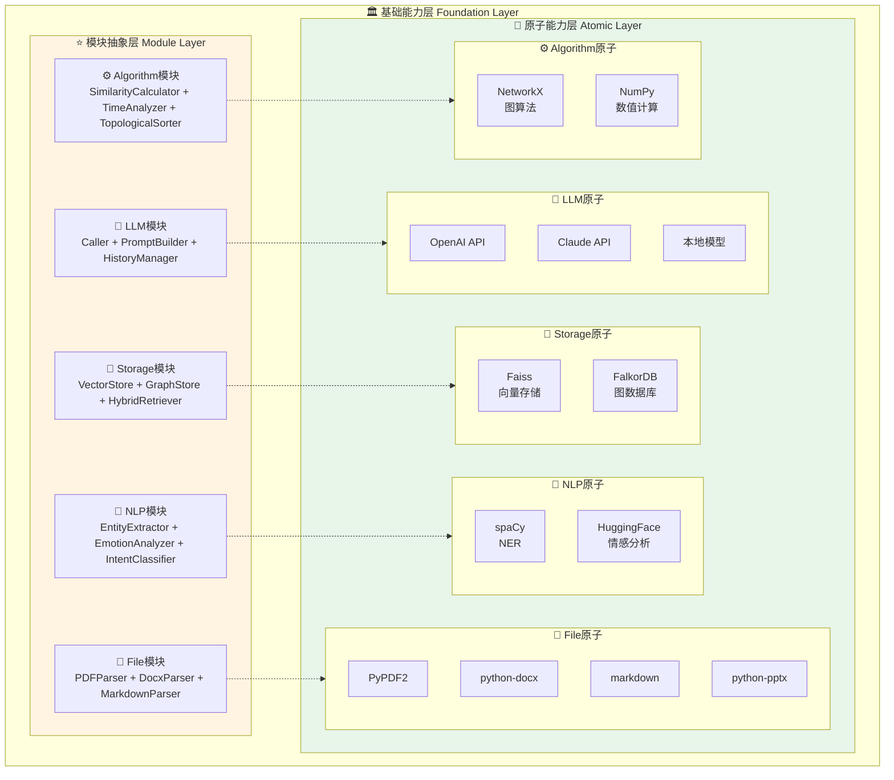

**两层架构说明**：

#### ⭐ 模块抽象层 (Module Layer)

模块层定义了5个核心能力模块，每个模块提供一类能力的抽象接口：

| 模块 | 能力边界 | 对外接口 | 设计原则 |
|------|----------|----------|----------|
| **🧠 LLM模块** | 大模型调用、Prompt管理 | `call()`, `build_prompt()`, `manage_history()` | 屏蔽具体LLM实现细节 |
| **💾 Storage模块** | 向量存储、图存储、混合检索 | `vector_search()`, `graph_query()`, `hybrid_retrieve()` | 统一存储抽象层 |
| **📝 NLP模块** | NER、情感分析、意图识别 | `extract_entity()`, `analyze_emotion()`, `classify_intent()` | 通用NLP能力封装 |
| **📄 File模块** | 多格式文档解析 | `parse(file)` | 自动识别格式 |
| **⚙️ Algorithm模块** | 文本相似度、时间解析、拓扑排序 | `calculate_similarity()`, `parse_time()`, `topo_sort()` | 通用算法工具集 |

**模块层的价值**：
- 🛡️ **隔离变化**：上层不感知底层技术切换(如OpenAI→Claude)
- 🔌 **能力边界**：明确各模块职责，避免能力散化
- 🔧 **替换性**：支持同类能力的多种实现方案

#### 🔬 原子能力层 (Atomic Layer)

原子层是每个模块的**具体实现**，包含具体的开源技术方案：

| 模块 | 原子层实现 | 说明 | 替代方案 |
|------|------------|------|----------|
| **🧠 LLM** | OpenAI API, Claude, 本地模型 | GPT-4/GPT-3.5-turbo | Anthropic Claude, Google Gemini, LLaMA |
| **💾 Storage** | **Faiss**(向量) + **FalkorDB**(图) | 轻量高效 + Redis生态 | Milvus + Neo4j, Qdrant + ArangoDB |
| **📝 NLP** | **spaCy** + **HuggingFace** | 工业级 + 生态丰富 | NLTK, Stanford CoreNLP, AllenNLP |
| **📄 File** | **PyPDF2**, **python-docx**, **markdown** | Python生态成熟 | pdfplumber, PyMuPDF, mammoth |
| **⚙️ Algorithm** | **NetworkX** + **NumPy** | 专业图算法 + 高性能计算 | SciPy, pandas, scikit-learn |

**Storage模块示例**：
```
Storage模块(抽象层)
├── Faiss(向量存储)     ← 原子层实现
└── FalkorDB(图数据库)   ← 原子层实现
```

**原子层的价值**：
- 🔌 **具体实现**：提供具体的技术实现方案
- 🔄 **可替换性**：同一模块可有多种实现(如Faiss→Milvus)
- ⚙️ **技术选型**：基于场景选择最优方案

### 2.1 原子层技术选型

以下为原子能力层的具体技术方案：

| 模块 | 开源技术方案 | 说明 | 替代方案 |
|------|------------|------|--------|
| **🧠 LLM模块** | OpenAI API | GPT-4/GPT-3.5-turbo | Anthropic Claude, Google Gemini, 本地LLaMA/ChatGLM |
| **💾 Storage模块** | Faiss + FalkorDB | 向量存储 + 图数据库 | Milvus + Neo4j, Qdrant + ArangoDB |
| **📝 NLP模块** | spaCy + HuggingFace | NER + 情感分析 | NLTK, Stanford CoreNLP, AllenNLP |
| **📄 File模块** | PyPDF2 + python-docx | 多格式文档解析 | pdfplumber, PyMuPDF, mammoth |
| **⚙️ Algorithm模块** | NetworkX + NumPy | 图算法 + 数值计算 | SciPy, pandas, scikit-learn |

**技术选型原则**:
1. **LLM**: 优先OpenAI API,支持本地模型替换
2. **Storage**: Faiss轻量高效 + FalkorDB与Redis生态集成
3. **NLP**: spaCy工业级 + HuggingFace生态丰富
4. **File**: Python生态成熟的库,稳定可靠
5. **Algorithm**: NetworkX专业图算法 + NumPy高性能计算

### 2.2 模块抽象层架构详解

模块抽象层包含5个核心模块，每个模块内部包含多个能力组件：

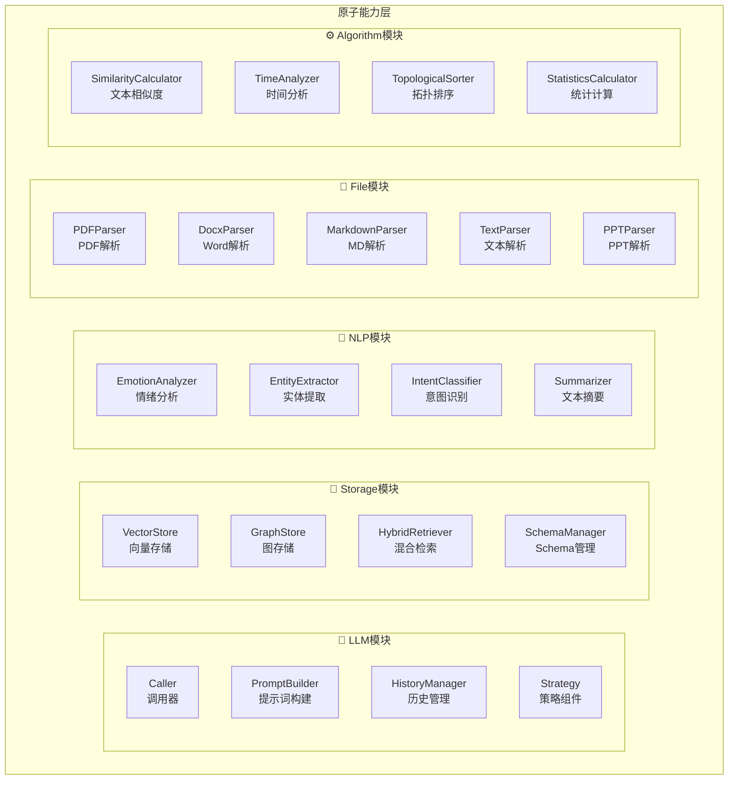

### 2.3 模块与原子能力映射

以下表格展示了模块抽象层如何映射到原子能力层：

| 模块抽象层 | 能力组件 | 原子能力层实现 | 说明 |
|------------|----------|-------------------|------|
| **🧠 LLM模块** | Caller<br/>PromptBuilder<br/>HistoryManager<br/>Strategy | **OpenAI API**<br/>Claude API<br/>本地模型 | 大模型调用、Prompt管理、历史管理、策略组件 |
| **💾 Storage模块** | VectorStore<br/>GraphStore<br/>HybridRetriever<br/>SchemaManager | **Faiss** (向量存储)<br/>**FalkorDB** (图数据库) | 向量存储、图谱存储、混合检索(0.6+0.4) |
| **📝 NLP模块** | EmotionAnalyzer<br/>EntityExtractor<br/>IntentClassifier<br/>Summarizer | **spaCy** (NER)<br/>**HuggingFace** (情感分析) | 情绪分析、实体提取、意图识别、文本摘要 |
| **📄 File模块** | PDFParser<br/>DocxParser<br/>MarkdownParser<br/>TextParser<br/>PPTParser | **PyPDF2**<br/>**python-docx**<br/>**markdown**<br/>**python-pptx** | 多格式文档解析（PDF/Word/MD/PPT/TXT） |
| **⚙️ Algorithm模块** | SimilarityCalculator<br/>TimeAnalyzer<br/>TopologicalSorter<br/>StatisticsCalculator | **NetworkX** (图算法)<br/>**NumPy** (数值计算) | 文本相似度、时间解析、拓扑排序、统计计算 |

**映射关系说明**：
- 🔹 **模块抽象层**：提供统一的接口抽象，屏蔽底层实现差异
- 🔹 **原子能力层**：提供具体的技术实现，支持替换（如OpenAI→Claude）
- 🔹 **一对多映射**：一个模块可以有多种原子实现（如LLM模块支持OpenAI/Claude/本地模型）

### 2.4 模块能力矩阵

#### 🧠 LLM模块

| 能力组件 | 核心功能 | 输入 | 输出 | 应用场景 |
|---------|---------| ------|------|---------|
| **Caller** | LLM调用(同步/流式/批量) | prompt + params | 文本响应 | 对话生成、内容分析 |
| **PromptBuilder** | 提示词构建(支持Few-shot) | template + variables | 完整提示词 | 风格模仿、任务解析 |
| **HistoryManager** | 对话历史管理 | messages + max_length | 处理后的历史 | 上下文控制、历史压缩 |
| **Strategy** | 策略管理(缓存/重试/压缩) | func + config | 执行结果 | 性能优化、容错处理 |

#### 💾 Storage模块  

| 能力组件 | 核心功能 | 输入 | 输出 | 应用场景 |
|---------|---------| ------|------|---------|
| **VectorStore** | 向量存储与检索 | vector + metadata | 相似结果 | 语义检索、内容推荐 |
| **GraphStore** | 图谱存储与查询(支持时间边) | node/edge + properties | 图谱结果 | 关系分析、知识推理 |
| **HybridRetriever** | 混合检索(Faiss 0.6 + Falkor 0.4) | query + top_k | 融合结果 | 上下文检索 |
| **SchemaManager** | 图谱Schema管理 | node_type + edge_type | schema定义 | 图谱规范、数据验证 |

**关键特性**:
- 图边支持时间属性: `create_time`(生效时间) / `invalid_time`(失效时间)
- 混合检索融合策略: 并行调用Faiss(语义)和Falkor(关系), 加权融合0.6+0.4
- 向量存储直接使用FaissStore实现,承载向量+文本+元数据

#### 📝 NLP模块

| 能力组件 | 核心功能 | 输入 | 输出 | 应用场景 |
|---------|---------| ------|------|---------|
| **EmotionAnalyzer** | 情绪分析 | 文本 | 情绪类型+强度 | 情绪追踪、趋势分析 |
| **EntityExtractor** | 实体提取(NER) | 文本 | 实体列表+关系 | 构建知识图谱 |
| **IntentClassifier** | 意图识别(分层) | 文本+上下文 | 意图类型 | 对话路由、功能分发 |
| **Summarizer** | 文本摘要 | 文本/对话 | 摘要/关键点 | 会话总结、记忆提取 |

**关键特性**:
- 基于NER构建实体图谱: `(Document/Memory)-[:MENTIONS]->(Entity)`
- 支持实体关系联合提取,用于多跳推理和关系演化分析

#### 📄 File模块

| 能力组件 | 核心功能 | 输入 | 输出 | 应用场景 |
|---------|---------| ------|------|---------|
| **PDFParser** | PDF解析 | pdf_file | 文本+元数据 | 文档分析、知识提取 |
| **DocxParser** | Word解析 | docx_file | 文本+表格 | 文档处理、内容提取 |
| **MarkdownParser** | Markdown解析 | md_file | 结构化文本 | 文档转换、内容分析 |
| **TextParser** | 文本解析 | txt_file | 清洗后文本 | 通用文本处理 |
| **PPTParser** | PPT解析 | ppt_file | 幻灯片文本 | 演示文档分析 |

#### ⚙️ Algorithm模块

| 能力组件 | 核心功能 | 输入 | 输出 | 应用场景 |
|---------|---------| ------|------|---------|
| **SimilarityCalculator** | 文本相似度计算 | text1 + text2 | 相似度分数 | 去重、合并、推荐 |
| **TimeAnalyzer** | 时间解析(create_time/invalid_time) | 文本 | TimeInfo | 提取时间属性 |
| **TopologicalSorter** | 拓扑排序(依赖分析) | tasks + dependencies | 排序结果 | 任务排序、依赖分析 |
| **StatisticsCalculator** | 统计计算(完成率/延期率/效率) | 数据列表 | 统计指标 | 工作模式分析 |

### 2.5 模块间协作关系

模块抽象层内部存在一定的协作关系，以提供更强大的组合能力：

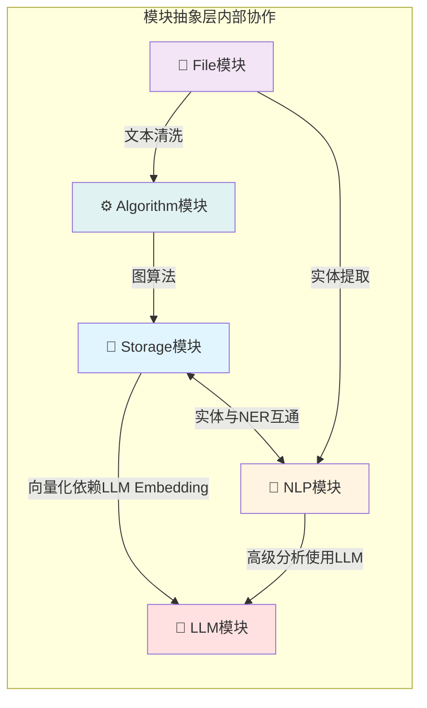

**协作关系说明**：

1. **Storage → LLM (Embedding API)**
   - VectorStore的向量化需要调用LLM的Embedding API
   - 如OpenAI的text-embedding-ada-002

2. **NLP → LLM (高级分析)**
   - EmotionAnalyzer、Summarizer等高级NLP任务可调用LLM
   - 基础NER使用spaCy本地模型

3. **Storage ↔ NLP (实体关联)**
   - EntityExtractor提取的实体存储到GraphStore
   - 构建(Document)-[:MENTIONS]->(Entity)关系

4. **File → Algorithm (文本预处理)**
   - 文档解析后的文本清洗、标准化
   - 文本分割、去重等

5. **File → NLP (实体提取)**
   - 解析后的文档进行NER提取
   - 支持文档级别的语义分析

6. **Algorithm → Storage (图算法)**
   - TopologicalSorter对GraphStore中的依赖关系排序
   - 图遍历、路径查找等

> 💡 **设计原则**: 模块间协作遵循分层原则，上层模块可调用下层模块，同层模块之间通过接口交互。

> 💡 **详细架构图**: 详细的模块能力图和目录结构请参考 [codedetail.md](./codedetail.md)

---

## 3. 组合能力层 Capability Layer

> 🔧 **设计理念**: 组合能力层将多个原子能力组合起来,完成某个抽象的业务步骤

### 3.1 Life场景能力编排

| 组合能力 | 组合的原子能力 | 核心功能 | 数据输入 | 数据输出 |
|----------|-----------------|----------|----------|----------|
| **IntentRecognizer** | LLMCaller + IntentClassifier | 识别用户意图 | 消息+上下文 | 意图类型+置信度 |
| **ContextRetriever** | VectorStore + GraphStore + HybridRetriever | 混合检索上下文 | 查询+会话ID | 上下文列表 |
| **DialogueGenerator** | LLMCaller + PromptBuilder + HistoryManager | 生成个性化回复 | 上下文+消息 | 生成回复 |
| **MemoryExtractor** | LLMCaller + EmotionAnalyzer + EntityExtractor + TimeAnalyzer | 提取记忆点 | 对话历史 | 记忆对象列表 |

### 3.2 Work场景能力编排

| 组合能力 | 组合的原子能力 | 核心功能 | 数据输入 | 数据输出 |
|----------|-----------------|----------|----------|----------|
| **DocumentParser** | 多个FileParser | 多格式文档解析 | 文件列表 | 文档对象列表 |
| **ProjectAnalyzer** | EntityExtractor + LLMCaller | 项目分析报告 | 文档列表 | 分析报告 |
| **TodoParser** | LLMCaller + TimeAnalyzer | 任务解析 | 任务描述 | 待办列表 |
| **TodoManager** | GraphStore + SimilarityCalculator + TopologicalSorter | 待办管理 | 待办列表 | 排序后的待办 |
| **PatternAnalyzer** | GraphStore + StatisticsCalculator | 工作模式分析 | 用户ID | 工作模式对象 |
| **AdviceGenerator** | LLMCaller + PromptBuilder | 建议生成 | 工作模式 | Markdown建议 |

### 3.3 能力工厂模式

使用`CapabilityFactory`统一管理组合能力的创建和依赖注入，确保:
- 统一的能力实例创建
- 依赖关系自动处理
- 简化服务层调用
```
├── atomic/
│   ├── caller.py              # LLM调用抽象基类
│   ├── openai_caller.py       # OpenAI实现
│   └── strategy/
│       ├── cache.py           # 缓存策略
│       ├── retry.py           # 重试策略
│       └── compress.py        # 压缩策略
├── core/
│   ├── models.py              # 数据模型
│   ├── exceptions.py          # 异常定义
│   └── history.py             # 历史管理
└── pipeline/
    ├── session_pipe.py        # 会话管道
    └── document_pipe.py       # 文档管道
```

> 💡 **代码实现**: 详细的代码示例请参考 [codedetail.md](./codedetail.md) - LLM模块部分

> 💡 **代码实现**: 详细的代码示例和目录结构请参考 [codedetail.md](./codedetail.md) - Storage模块部分
    


> 💡 **代码实现**: 详细的代码示例和目录结构请参考 [codedetail.md](./codedetail.md) - NLP模块部分

> 💡 **代码实现**: 详细的代码示例和目录结构请参考 [codedetail.md](./codedetail.md) - File模块部分

> 💡 **代码实现**: 详细的代码示例和目录结构请参考 [codedetail.md](./codedetail.md) - Algorithm模块部分

## 3. 组合能力层 Capability Layer

> 🔧 **设计理念**: 组合能力层将多个原子能力组合起来,完成某个抽象的业务步骤。服务层通过编排这些组合能力实现完整业务流程。

### 3.1 组合能力架构视图

组合能力层分为Life场景和Work场景两大类能力编排：

```mermaid
graph TB
    subgraph CapabilityLayer["🔧 组合能力层 Capability Layer"]
        subgraph LifeCapabilities["🏡 Life场景能力"]
            direction TB
            IR["IntentRecognizer<br/>意图识别器"]
            CR["ContextRetriever<br/>上下文检索器"]
            DG["DialogueGenerator<br/>对话生成器"]
            ME["MemoryExtractor<br/>记忆提取器"]
        end
        
        subgraph WorkCapabilities["💼 Work场景能力"]
            direction TB
            DP["DocumentParser<br/>文档解析器"]
            PA["ProjectAnalyzer<br/>项目分析器"]
            TP["TodoParser<br/>待办解析器"]
            TM["TodoManager<br/>待办管理器"]
            PtA["PatternAnalyzer<br/>模式分析器"]
            AG["AdviceGenerator<br/>建议生成器"]
        end
        
        Factory["CapabilityFactory<br/>能力工厂"]
    end
    
    subgraph Foundation["⭐ 原子能力层"]
        LLM["🧠 LLM"]
        Storage["💾 Storage"]
        NLP["📝 NLP"]
        File["📄 File"]
        Algorithm["⚙️ Algorithm"]
    end
    
    %% Life场景依赖
    LLM -.->|提供LLM调用| IR
    LLM -.->|提供LLM调用| DG
    LLM -.->|提供LLM调用| ME
    Storage -.->|提供混合检索| CR
    NLP -.->|提供NLP分析| ME
    
    %% Work场景依赖
    File -.->|提供文档解析| DP
    NLP -.->|提供实体提取| PA
    LLM -.->|提供LLM分析| PA
    LLM -.->|提供LLM解析| TP
    Algorithm -.->|提供时间解析| TP
    Storage -.->|提供图存储| TM
    Algorithm -.->|提供拓扑排序| TM
    Storage -.->|提供图查询| PtA
    Algorithm -.->|提供统计计算| PtA
    LLM -.->|提供LLM生成| AG
    
    %% 工厂管理
    Factory -.->|创建| IR
    Factory -.->|创建| CR
    Factory -.->|创建| DG
    Factory -.->|创建| ME
    Factory -.->|创建| DP
    Factory -.->|创建| PA
    Factory -.->|创建| TP
    Factory -.->|创建| TM
    Factory -.->|创建| PtA
    Factory -.->|创建| AG
    
    style LifeCapabilities fill:#fff4e1
    style WorkCapabilities fill:#e3f2fd
    style Factory fill:#f3e5f5
    style Foundation fill:#e8f5e9
```

### 3.2 Life场景能力

| 组合能力 | 组合的原子能力 | 主要功能 |
|----------|-----------------|----------|
| **IntentRecognizer**<br/>意图识别器 | LLMCaller + IntentClassifier | 识别用户意图类型 |
| **ContextRetriever**<br/>上下文检索器 | VectorStore + GraphStore + HybridRetriever | 检索相关历史对话和生活记忆<br/>混合融合(Faiss 0.6 + Falkor 0.4) |
| **DialogueGenerator**<br/>对话生成器 | LLMCaller + StyleAnalyzer + PromptBuilder | 生成个性化回复,模仿用户风格 |
| **MemoryExtractor**<br/>记忆提取器 | LLMCaller + EmotionAnalyzer +<br/>EntityExtractor + TimeAnalyzer | 提取对话中的记忆点<br/>识别情绪和事件<br/>构建带时间属性的图谱 |

### 3.3 Work场景能力

| 组合能力 | 组合的原子能力 | 主要功能 |
|----------|-----------------|----------|
| **DocumentParser**<br/>文档解析器 | 多个FileParser | 解析多格式文档<br/>PDF/Word/MD/PPT |
| **ProjectAnalyzer**<br/>项目分析器 | EntityExtractor + LLMCaller +<br/>StructureAnalyzer | 分析项目结构,识别核心要素<br/>构建(Document)-[:MENTIONS]->(Entity)图谱 |
| **TodoParser**<br/>待办解析器 | LLMCaller + TimeAnalyzer +<br/>PriorityExtractor | 解析用户任务描述<br/>提取时间和优先级 |
| **TodoManager**<br/>待办管理器 | GraphStore + SimilarityCalculator +<br/>TopologicalSorter | 管理待办任务<br/>去重、拓扑排序、持久化 |
| **PatternAnalyzer**<br/>模式分析器 | GraphStore + StatisticsCalculator +<br/>多个指标计算器 | 分析工作模式<br/>计算完成率、延期率、效率分数 |
| **AdviceGenerator**<br/>建议生成器 | LLMCaller + PromptBuilder +<br/>MarkdownFormatter | 生成个性化工作建议 |

### 3.4 能力工厂模式

使用 `CapabilityFactory` 统一管理组合能力的创建和依赖注入：

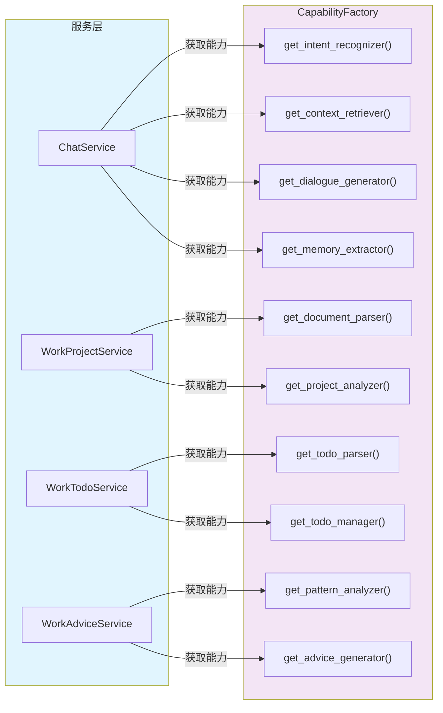

**工厂模式价值**：
- 🔌 **统一依赖管理**: 服务层无需关心能力实例创建细节
- 🔄 **依赖注入**: 自动处理能力之间的依赖关系
- 🧪 **可测试性**: 支持Mock替换,便于单元测试
- 🎯 **单一入口**: 简化服务层调用,提升代码可维护性

> 💡 **代码实现**: 详细的代码示例请参考 [codedetail.md](./codedetail.md) - 能力工厂模式

---

## 4. 服务层 Service Layer

> 🚀 **设计理念**: 服务层编排组合能力,实现完整的业务流程，直接对外提供服务。用户只需调用Service层接口,底层Capability和Foundation由系统自动编排执行。

### 4.1 服务层架构视图

服务层提供四个核心服务,分别对应生活和工作场景：

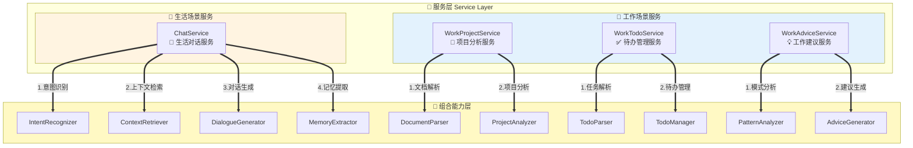

### 4.2 ChatService 生活对话服务

**服务职责**: 提供个性化对话能力,模仿用户风格,管理对话记忆

**能力编排流程**:

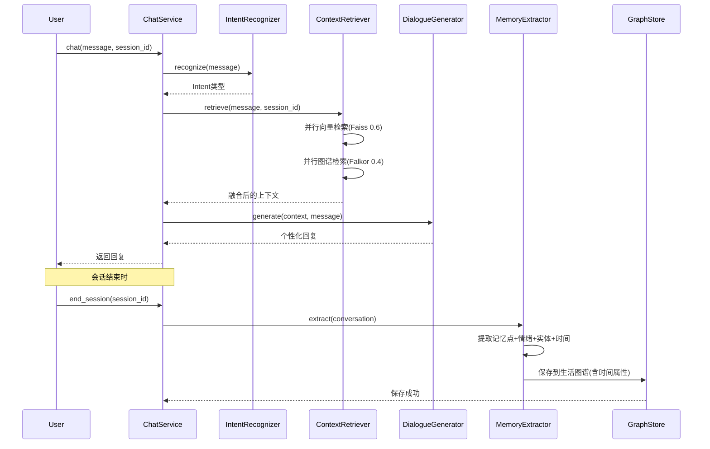

> 💡 **代码实现**: 详细的代码示例请参考 [codedetail.md](./codedetail.md) - ChatService实现

### 4.3 WorkProjectService 项目分析服务

**服务职责**: 分析项目文档,提取核心要素,生成结构化报告

**能力编排流程**:

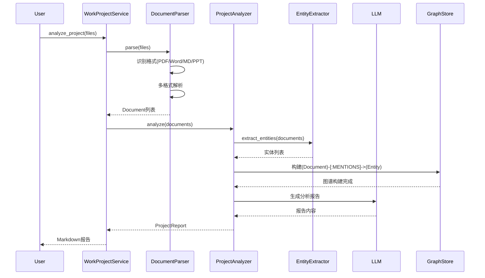

> 💡 **代码实现**: 详细的代码示例请参考 [codedetail.md](./codedetail.md) - WorkProjectService实现

### 4.4 WorkTodoService 待办管理服务

**服务职责**: 智能解析任务,去重合并,拓扑排序,持久化管理

**能力编排流程**:

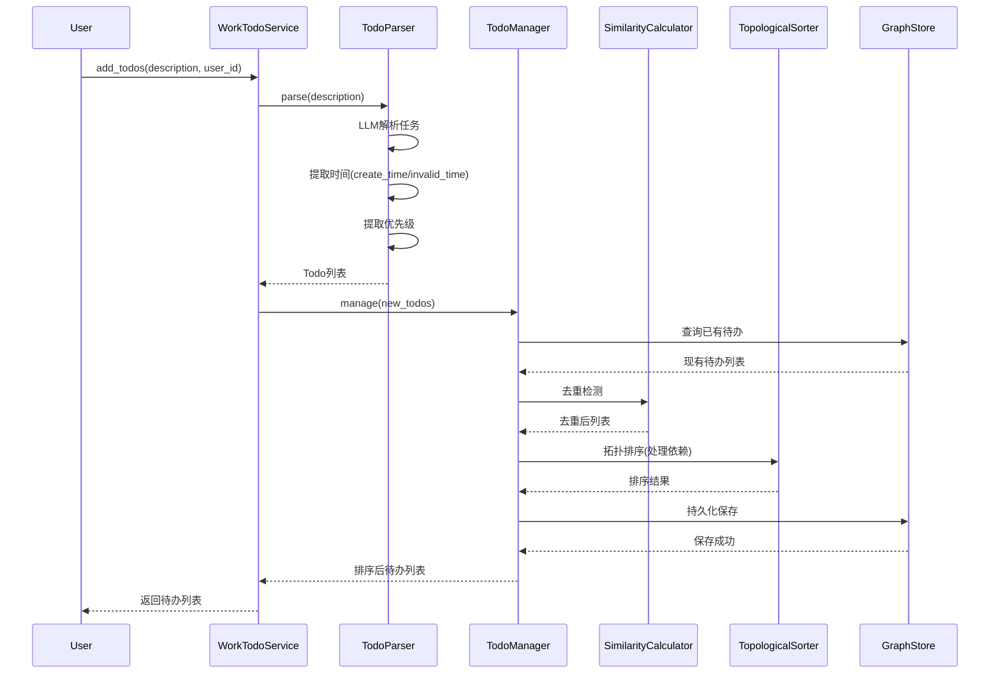

> 💡 **代码实现**: 详细的代码示例请参考 [codedetail.md](./codedetail.md) - WorkTodoService实现

### 4.5 WorkAdviceService 工作建议服务

**服务职责**: 分析工作模式,生成个性化改进建议

**能力编排流程**:

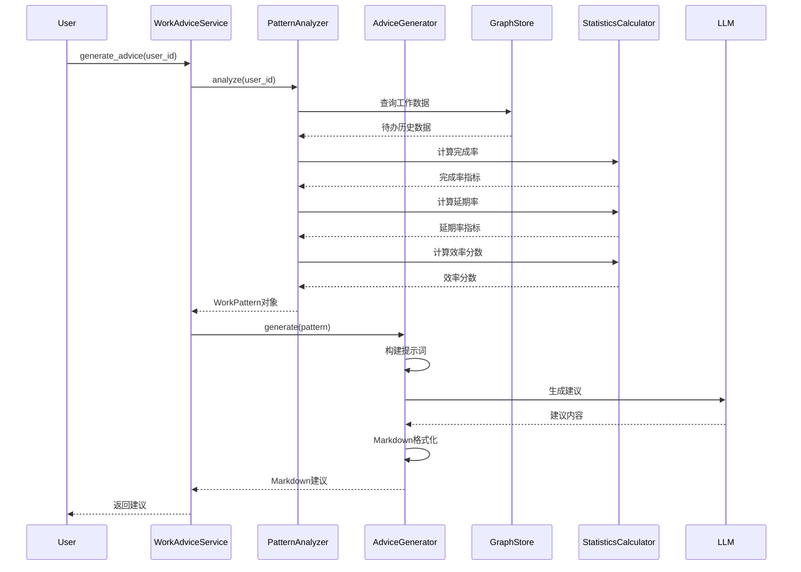

> 💡 **代码实现**: 详细的代码示例请参考 [codedetail.md](./codedetail.md) - WorkAdviceService实现
### 4.6 服务编排总览

四个服务的编排逻辑对比：

| 服务 | 编排的组合能力 | 流程步骤 | 输入/输出 |
|------|-----------------|----------|-------------|
| **ChatService** | IntentRecognizer +<br/>ContextRetriever +<br/>DialogueGenerator +<br/>MemoryExtractor | 1. 意图识别<br/>2. 上下文检索<br/>3. 对话生成<br/>4. 记忆提取(会话结束) | 输入: message + session_id<br/>输出: 个性化回复 |
| **WorkProjectService** | DocumentParser +<br/>ProjectAnalyzer | 1. 文档解析<br/>2. 实体提取<br/>3. 项目分析<br/>4. 报告生成 | 输入: 文件列表<br/>输出: Markdown报告 |
| **WorkTodoService** | TodoParser +<br/>TodoManager | 1. 任务解析<br/>2. 去重合并<br/>3. 拓扑排序<br/>4. 持久化 | 输入: 任务描述<br/>输出: 排序后待办列表 |
| **WorkAdviceService** | PatternAnalyzer +<br/>AdviceGenerator | 1. 数据收集<br/>2. 模式分析<br/>3. 建议生成<br/>4. Markdown格式化 | 输入: user_id<br/>输出: Markdown建议 |

> 💡 **代码实现**: 详细的服务层代码示例请参考 [codedetail.md](./codedetail.md) - 服务层部分

---

## 5. 数据流转与业务流程

### 5.1 生活场景数据流

从用户输入到记忆沉淀的完整数据流转：

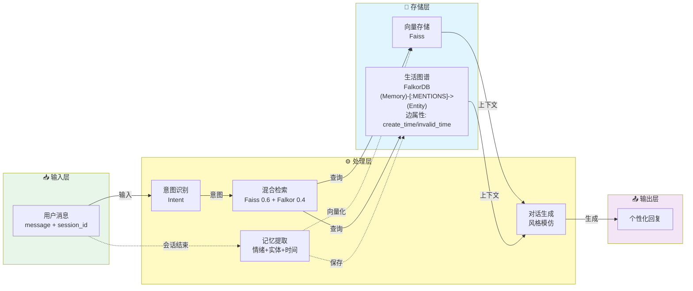

**关键特性**:
- 🔄 **混合检索**: 并行调用向量(语义)和图谱(关系),加权融合0.6+0.4
- ⏰ **时间属性**: 图边记录 create_time(开始喜欢) 和 invalid_time(不再喜欢)
- 🧠 **记忆沉淀**: 会话结束时提取记忆,构建实体图谱

### 5.2 工作场景数据流

从文档分析到工作建议的完整数据流转：

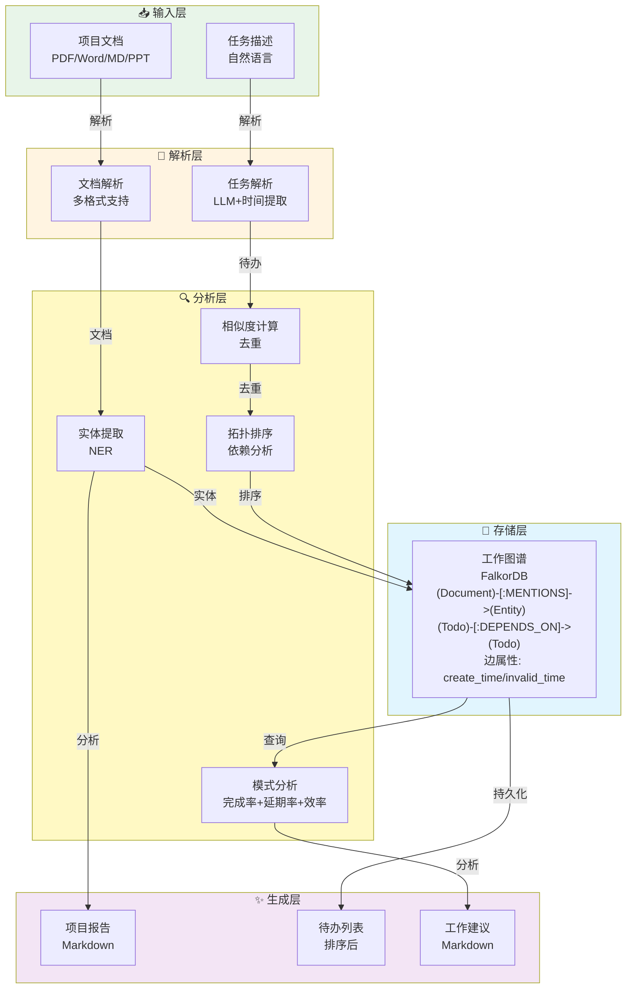

**关键特性**:
- 📊 **实体图谱**: 基于NER构建 (Document)-[:MENTIONS]->(Entity) 关系
- 🔗 **依赖管理**: (Todo)-[:DEPENDS_ON]->(Todo) 支持拓扑排序
- ⏰ **时间属性**: 图边记录 create_time(开始时间) 和 invalid_time(完成时间)
- 📈 **模式分析**: 统计完成率、延期率、效率分数

---

## 6. 架构设计原则

### 1. 分层职责

- **服务层(Service Layer)**: 业务流程编排,用户只需调用服务层接口
- **组合能力层(Capability Layer)**: 封装抽象步骤,组合多个原子能力
- **原子能力层(Foundation Layer)**: 提供最小粒度的原子操作

### 2. 依赖原则

- 服务层仅依赖组合能力层,通过`CapabilityFactory`获取
- 组合能力层仅依赖原子能力层
- 原子能力层互相独立,可组合使用

### 3. 核心规范

- **双能力模型**: 明确区分'模仿我'(生成)与'分析我'(分析)
- **混合检索**: Faiss权重0.6 + Falkor权重0.4
- **实体图谱**: 基于NER构建(Document)-[:MENTIONS]->(Entity)等关系
- **时间属性**: 图边支持create_time/invalid_time属性

### 4. 自动编排

用户只需调用Service层接口,底层Capability和Foundation逻辑由系统自动编排执行,无需外部显式调用。
