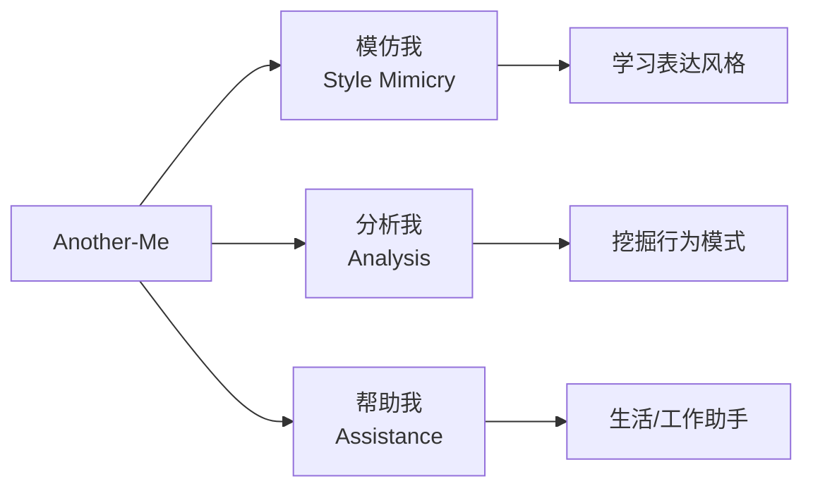
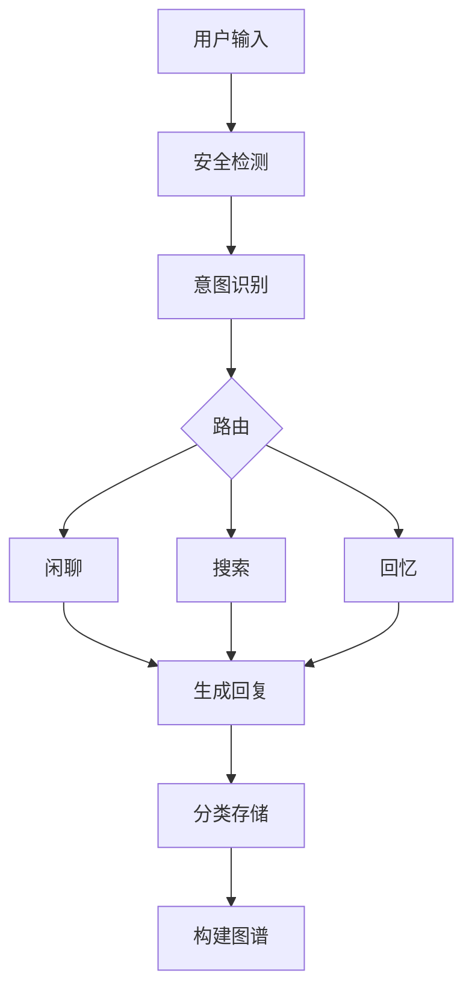
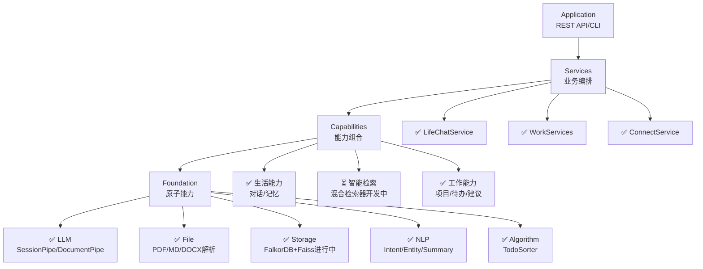

# Another-Me 架构设计核心文档

> **项目定位**: 基于个人数据的AI数字分身引擎  
> **核心理念**: 模仿我 + 分析我 + 帮助我  
> **技术架构**: Foundation → Capability → Service → Application  
> **文档版本**: v3.0 Simplified  
> **更新时间**: 2025-11-19  
> **说明**: 精简版架构文档,详细实现请参考代码

---

## 📋 核心概念

### 愿景定位

构建一个**真正理解你**的AI助手，能像你一样说话、像你一样思考、像朋友一样陪伴。

### 三大核心能力



---

## 业务场景

### 场景分类

| 场景 | 核心价值 | 数据策略 |
|-----|---------|---------|
| **生活** | 情感陪伴、个性化交流 | 持久化、构建图谱 |
| **工作** | 效率提升、智能辅助 | 临时分析、待办图谱 |

### 生活场景流程



**记忆分类**：
- PERMANENT：永久保留→构建图谱
- TEMPORARY：临时保留→短期存储
- EPHEMERAL：一次性→不存储

### 工作场景流程

**项目解析**：文档解析 → 实体提取 → Markdown报告（不入库）

**待办排序**：
```
评分 = 紧急度(40%) + 重要性(40%) + 依赖关系(20%)
分组 = {高≥70, 中40-70, 低<40}
```

---

## 技术架构

### 分层设计



**图例**:✅已完成 ⏳开发中

### Foundation Layer（已完成）

**LLM模块**：
```
- OpenAICaller: tiktoken精确token估算
- 策略模式: Cache/Compress/Retry
- 管道模式: SessionPipe(对话)/DocumentPipe(文档)
```

**File模块**：
```
- 支持格式: PDF/Markdown/DOCX/PPT/Text
- 自动识别: 根据扩展名选择解析器
- 统一模型: ParsedDocument结构化输出
```

### Capabilities Layer（待开发）

**风格模仿**：
```python
学习维度：词汇习惯、语气语调、表达结构、情感倾向
生成策略：检索历史风格 → 构建Prompt → LLM生成
```

**智能检索**：
```python
混合检索：60% Faiss向量 + 40% FalkorDB图谱
处理流程：向量检索 → 图谱检索 → 加权融合 → 重排序
```

**记忆管理**：
```python
存储流程：分类 → 实体提取 → 向量化 → 图谱构建
图谱结构：(对话)-[:MENTIONS]->(实体)-[:RELATED_TO]->(实体)
```

### Services Layer（待开发）

**对话服务**：
```python
流程：安全检测 → 意图识别 → 智能路由 → 风格生成 → 记忆存储
```

**待办服务**：
```python
流程：检索历史 → 优先级评分 → 智能分组 → 图谱更新
```

**项目服务**：
```python
流程：文档解析 → 实体识别 → 生成报告（不入库）
```

---

## 数据存储

### 存储架构

| 类型 | 技术 | 用途 | 权重 |
|-----|-----|-----|-----|
| **向量** | Faiss | 语义检索 | 60% |
| **图谱** | FalkorDB | 关系推理 | 40% |
| **文档** | SQLite/JSON | 原始数据 | - |

### 图谱Schema

**生活场景**：
```cypher
(User)-[:SAYS]->(Conversation)-[:MENTIONS]->(Entity)
(Conversation)-[:ABOUT]->(Topic)
(User)-[:INTERESTED_IN]->(Topic)
```

**工作场景**：
```cypher
(Task)-[:MENTIONS]->(Person)
(Task)-[:BELONGS_TO]->(Project)
(Task)-[:DEPENDS_ON]->(Task)
```

---

## 实施路线

### 已完成模块
- ✅ **Foundation层**: LLM(调用器、策略、管道)、File(解析器)、NLP(意图识别、实体提取、摘要)、Storage(FalkorDB)、Algorithm(待办排序)
- ✅ **Capability层**: CapabilityFactory、生活能力(对话生成、记忆提取)、工作能力(项目分析、待办管理、建议生成)
- ✅ **Service层**: ConnectService、LifeChatService、WorkProjectService、WorkTodoService、WorkAdviceService

### 开发中模块
- ⏳ **Storage增强**: Faiss向量存储、混合检索器、批量操作优化
- ⏳ **NLP增强**: 可配置意图识别、自定义词典支持、多策略摘要
- ⏳ **Algorithm增强**: 可配置TodoSorter、文本相似度计算、时间模式分析
- ⏳ **测试覆盖**: NLP/Storage/Algorithm单元测试、集成测试

---

## 关键技术决策

| 决策点 | 方案 | 理由 |
|-------|-----|-----|
| **架构模式** | 四层分层架构 | 职责清晰、便于扩展 |
| **LLM调用** | OpenAI API + tiktoken | 成熟稳定、精确计费 |
| **向量存储** | Faiss（本地） | 高性能、无需外部服务 |
| **图存储** | FalkorDB（Redis兼容） | 轻量级、易部署 |
| **检索策略** | 混合检索（向量+图谱） | 语义理解+关系推理 |
| **管道设计** | Strategy + Pipeline | 灵活组合、易扩展 |

---

## 附录

### 技术栈

```
语言: Python 3.11+
LLM: OpenAI API
向量: Faiss + OpenAI Embedding
图谱: FalkorDB (Redis兼容)
Web: FastAPI
前端: Reflex (Python全栈)
测试: Python脚本 (非pytest)
```

### 代码文档规范

本项目采用**代码即文档**理念,详细实现请直接查阅源码:
- Foundation层: `/ame/foundation/` (包含完整类型注解和docstring)
- Capability层: `/ame/capability/` (包含工厂模式和能力实现)
- Service层: `/ame/service/` (包含业务逻辑编排)
- 测试示例: `/ame-tests/` (包含使用示例)

---

**文档维护**: Another-Me Team  
**最后更新**: 2025-11-19
