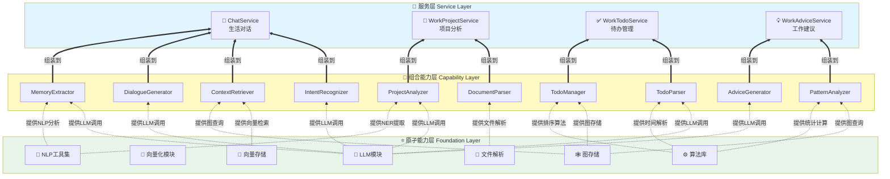
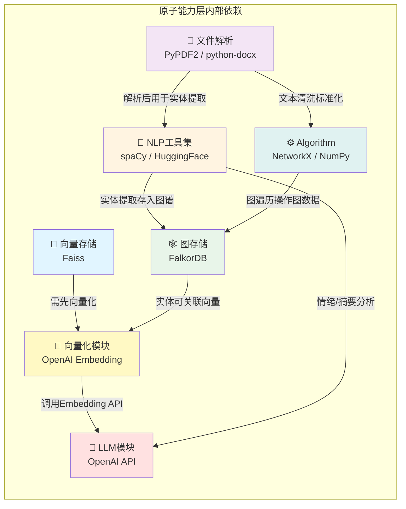
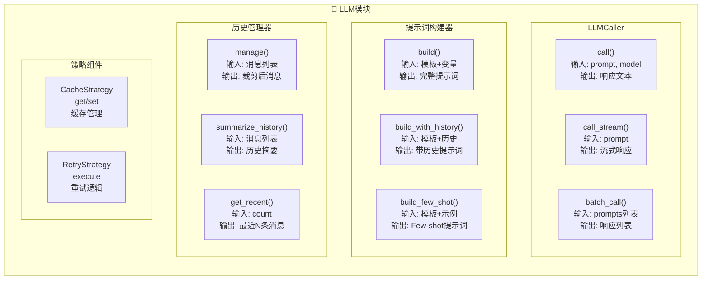
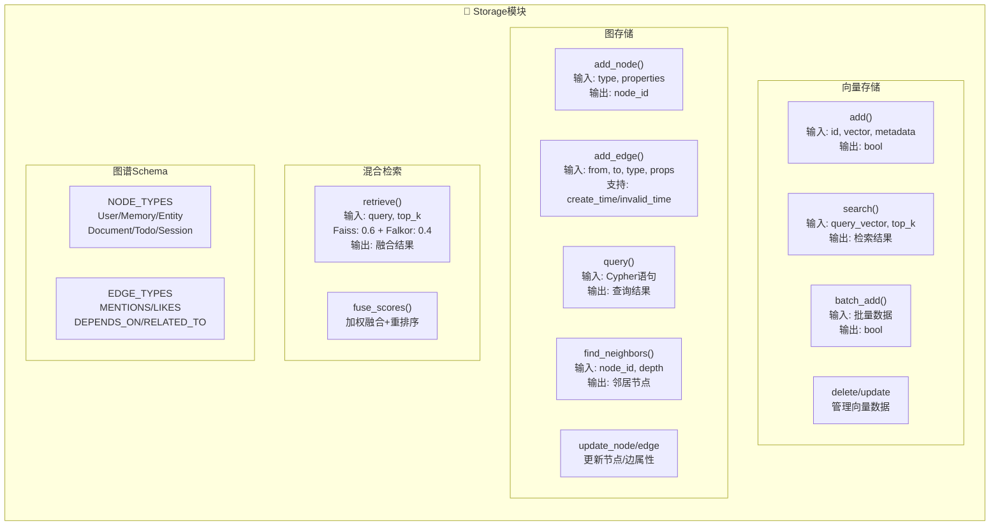
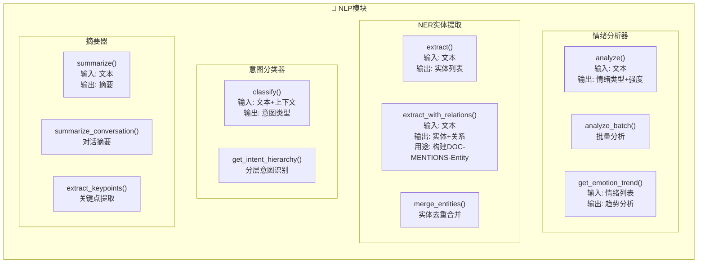
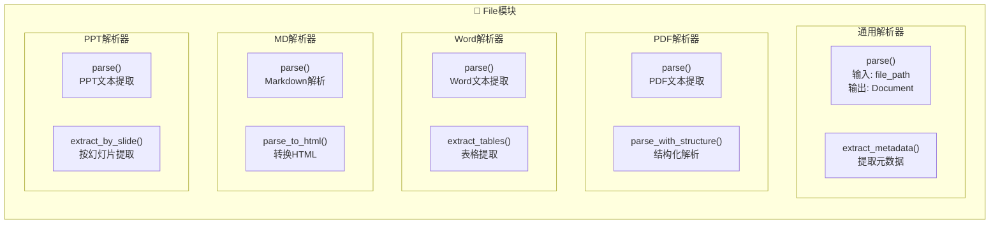
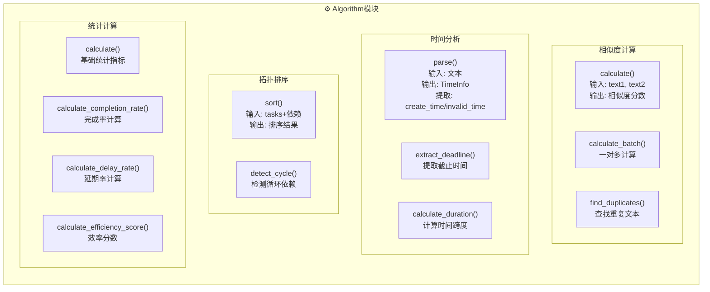

# Another-Me 系统架构设计

> **架构理念**: 自下而上的能力提供 - 从底层原子能力向上组装,层层组合,最终提供智能服务

## 📚 文档目录

1. [架构概述](#架构概述)
   - [1.1 系统定位](#系统定位)
   - [1.2 架构分层](#架构分层)
   - [1.3 能力提供方向](#能力提供方向)
   - [1.4 完整架构视图](#完整架构视图)
2. [原子能力层 Foundation Layer](#原子能力层-foundation-layer)
   - [2.1 技术选型](#技术选型)
   - [2.2 内部依赖关系](#内部依赖关系)
   - [2.3 模块能力详解](#模块能力详解)
3. [组合能力层 Capability Layer](#组合能力层-capability-layer)
   - [3.1 Life场景能力](#life场景能力)
   - [3.2 Work场景能力](#work场景能力)
   - [3.3 能力工厂模式](#能力工厂模式)
4. [服务层 Service Layer](#服务层-service-layer)
   - [4.1 ChatService 生活对话服务](#chatservice-生活对话服务)
   - [4.2 WorkProjectService 项目分析服务](#workprojectservice-项目分析服务)
   - [4.3 WorkTodoService 待办管理服务](#worktodoservice-待办管理服务)
   - [4.4 WorkAdviceService 工作建议服务](#workadviceservice-工作建议服务)
5. [架构设计原则](#架构设计原则)

---

## 架构概述

### 系统定位

Another-Me是一个**基于个人数据的AI数字分身引擎**，采用**三层能力提供架构**：

- 🏗️ **原子能力层 (Foundation)**: 提供最小粒度的基础能力
- 🔧 **组合能力层 (Capability)**: 基于原子能力的组合
- 🚀 **服务层 (Service)**: 业务流程编排,对外提供完整服务

### 架构分层

系统覆盖两大场景,提供四种智能服务:

**🏡 生活场景 (Life)**
- ChatService: 个性化对话,支持风格模仿与记忆管理

**💼 工作场景 (Work)**
- WorkProjectService: 项目文档智能分析
- WorkTodoService: 待办任务智能管理
- WorkAdviceService: 工作效率优化建议

### 能力提供方向

```
┌─────────────────────────────────┐
│   🚀 服务层 Service Layer       │  ← 用户交互层
│   基于组合能力编排业务流程      │
└──────────────┬──────────────────┘
               ↑ 组装能力
┌──────────────┴──────────────────┐
│   🔧 组合能力层 Capability       │  ← 抽象能力层
│   组合多个原子能力完成抽象步骤   │
└──────────────┬──────────────────┘
               ↑ 提供原子能力
┌──────────────┴──────────────────┐
│   ⭐ 原子能力层 Foundation       │  ← 能力基座
│   提供最小粒度的原子操作         │
└─────────────────────────────────┘
```

**核心理念**: 能力从下往上提供,用户从上往下使用

### 完整架构视图



---

## 原子能力层 Foundation Layer

> 💡 **设计理念**: 原子能力层是整个系统的**能力基座**，提供最小粒度的原子操作，所有上层功能都基于这些原子能力组合而成。

### 技术选型

| 模块 | 开源技术方案 | 说明 | 替代方案 |
|------|------------|------|--------|
| **🧠 LLM模块** | OpenAI API | GPT-4/GPT-3.5-turbo | Anthropic Claude, Google Gemini, 本地LLaMA/ChatGLM |
| **💾 向量存储** | Faiss | Facebook开源,高性能向量检索 | Milvus, Qdrant, Weaviate, ChromaDB |
| **🕸️ 图存储** | FalkorDB | Redis兼容的图数据库 | Neo4j, ArangoDB, JanusGraph, TigerGraph |
| **📝 NLP工具** | spaCy + HuggingFace | spaCy做NER,HF做情感分析 | NLTK, Stanford CoreNLP, AllenNLP |
| **🔢 向量化** | OpenAI Embedding | text-embedding-ada-002 | sentence-transformers, BGE, M3E(中文) |
| **📄 文件解析** | PyPDF2 + python-docx + markdown | PDF/Word/MD解析 | pdfplumber, PyMuPDF, mammoth |
| **⚙️ 算法库** | NetworkX + NumPy | 图算法+数值计算 | SciPy, pandas, scikit-learn |

**开源技术选型原则**:
1. **LLM**: 优先使用OpenAI,支持本地模型替换
2. **向量存储**: Faiss轻量高效,适合中小规模
3. **图存储**: FalkorDB与Redis生态集成,便于部署
4. **NLP**: spaCy工业级,HuggingFace生态丰富
5. **向量化**: 与LLM保持一致,使用OpenAI Embedding
6. **文件解析**: Python生态成熟的库,稳定可靠
7. **算法**: NetworkX专业图算法,NumPy高性能计算

### 内部依赖关系



**依赖关系说明**:

1. **VectorStore → Embedding → LLM**
   - 向量存储前,需先通过Embedding模块将文本向量化
   - Embedding底层调用LLM的Embedding API(如text-embedding-ada-002)

2. **GraphStore ← → Embedding**
   - 图谱中的实体节点可以关联向量表示
   - 支持向量+图谱的混合检索

3. **NLP → LLM (可选)**
   - 情绪分析、摘要生成等高级NLP任务可调用LLM
   - 基础NER使用spaCy本地模型

4. **NLP → GraphStore**
   - NER提取的实体存储到图谱中
   - 构建(Document)-[:MENTIONS]->(Entity)关系

5. **FileParser → Algorithm**
   - 文本清洗、标准化使用算法模块
   - 文本分割、去重等预处理

6. **FileParser → NLP**
   - 解析后的文本进行实体提取
   - 支持文档级别的NLP分析

7. **Algorithm → GraphStore**
   - 图遍历、拓扑排序等算法操作图数据
   - 依赖关系分析、路径查找等

### 模块能力详解

下面展示7个基础模块的详细能力图,每个模块都提供了细粒度的原子操作:

#### 1. LLM模块能力图



#### 2. Storage模块能力图



#### 3. NLP模块能力图



#### 4. File模块能力图



#### 5. Algorithm模块能力图



### 原子能力层(Foundation Layer)详细设计

#### 1. LLM模块
```
foundation/llm/
├── atomic/
│   ├── caller.py              # LLM调用抽象基类
│   ├── openai_caller.py       # OpenAI实现
│   └── strategy/
│       ├── cache.py           # 缓存策略
│       ├── retry.py           # 重试策略
│       └── compress.py        # 压缩策略
├── core/
│   ├── models.py              # 数据模型
│   ├── exceptions.py          # 异常定义
│   └── history.py             # 历史管理
└── pipeline/
    ├── session_pipe.py        # 会话管道
    └── document_pipe.py       # 文档管道
```

**核心原子能力详细说明**:

**1.1 LLMCaller (LLM调用器)**
```python
class LLMCaller:
    def call(self, prompt: str, model: str, temperature: float, max_tokens: int) -> str:
        """
        同步调用LLM
        - 输入: 提示词、模型配置参数
        - 输出: 生成的文本响应
        - 功能: 支持重试、缓存、日志记录
        """
    
    def call_stream(self, prompt: str, model: str) -> Iterator[str]:
        """
        流式调用LLM
        - 输入: 提示词、模型配置
        - 输出: 生成文本的流式迭代器
        - 功能: 实时返回生成内容
        """
    
    def batch_call(self, prompts: List[str]) -> List[str]:
        """
        批量调用LLM
        - 输入: 提示词列表
        - 输出: 响应列表
        - 功能: 批量处理提高效率
        """
```

**1.2 PromptBuilder (提示词构建器)**
```python
class PromptBuilder:
    def build(self, template: str, context: Dict, variables: Dict) -> str:
        """
        构建提示词
        - 输入: 模板、上下文、变量
        - 输出: 完整提示词
        - 功能: 模板渲染、变量替换、上下文注入
        """
    
    def build_with_history(self, template: str, history: List[Message]) -> str:
        """
        带历史的提示词构建
        - 输入: 模板、历史消息
        - 输出: 包含历史的提示词
        - 功能: 格式化历史对话、控制长度
        """
    
    def build_few_shot(self, template: str, examples: List[Example]) -> str:
        """
        Few-shot提示词构建
        - 输入: 模板、示例列表
        - 输出: 包含示例的提示词
        - 功能: 构建少样本学习提示
        """
```

**1.3 HistoryManager (历史管理器)**
```python
class HistoryManager:
    def manage(self, messages: List[Message], max_length: int) -> List[Message]:
        """
        管理对话历史
        - 输入: 消息列表、最大长度
        - 输出: 裁剪后的消息列表
        - 功能: 长度控制、重要消息保留、滑动窗口
        """
    
    def summarize_history(self, messages: List[Message]) -> str:
        """
        压缩历史为摘要
        - 输入: 消息列表
        - 输出: 历史摘要
        - 功能: 使用LLM生成历史摘要
        """
    
    def get_recent(self, messages: List[Message], count: int) -> List[Message]:
        """
        获取最近消息
        - 输入: 消息列表、数量
        - 输出: 最近N条消息
        - 功能: 快速获取最近对话
        """
```

**1.4 CacheStrategy (缓存策略)**
```python
class CacheStrategy:
    def get(self, key: str) -> Optional[str]:
        """
        获取缓存
        - 输入: 缓存键(prompt hash)
        - 输出: 缓存的响应或None
        - 功能: 基于prompt的哈希值查找缓存
        """
    
    def set(self, key: str, value: str, ttl: int):
        """
        设置缓存
        - 输入: 键、值、过期时间
        - 输出: 无
        - 功能: 存储LLM响应,支持TTL
        """
```

**1.5 RetryStrategy (重试策略)**
```python
class RetryStrategy:
    def execute(self, func: Callable, max_retries: int, backoff: float) -> Any:
        """
        执行重试逻辑
        - 输入: 函数、最大重试次数、退避系数
        - 输出: 函数执行结果
        - 功能: 指数退避、错误分类处理
        """
```

#### 2. Storage模块
```
foundation/storage/
├── atomic/
│   ├── base.py                # 存储抽象基类
│   ├── vector_store.py        # 向量存储接口
│   ├── faiss_store.py         # Faiss实现
│   ├── graph_store.py         # 图存储接口
│   ├── falkordb_store.py      # FalkorDB实现
│   └── hybrid_retriever.py    # 混合检索
├── core/
│   ├── models.py              # 数据模型
│   ├── schema.py              # Schema定义
│   ├── exceptions.py          # 异常定义
│   └── validators.py          # 验证器
└── pipeline/
    ├── life_graph_pipeline.py # 生活图谱管道
    └── work_graph_pipeline.py # 工作图谱管道
```

**核心原子能力详细说明**:

**2.1 VectorStore (向量存储)**
```python
class VectorStore:
    def add(self, id: str, vector: List[float], metadata: Dict) -> bool:
        """
        添加向量
        - 输入: ID、向量、元数据
        - 输出: 成功/失败
        - 功能: 存储向量和关联元数据(文本、时间等)
        """
    
    def batch_add(self, items: List[Tuple[str, List[float], Dict]]) -> bool:
        """
        批量添加向量
        - 输入: (ID, 向量, 元数据)列表
        - 输出: 成功/失败
        - 功能: 批量存储提高效率
        """
    
    def search(self, query_vector: List[float], top_k: int, filter: Dict) -> List[SearchResult]:
        """
        相似度检索
        - 输入: 查询向量、Top-K、过滤条件
        - 输出: 检索结果列表(包含分数、元数据)
        - 功能: 余弦相似度计算、结果排序、元数据过滤
        """
    
    def delete(self, id: str) -> bool:
        """
        删除向量
        - 输入: 向量ID
        - 输出: 成功/失败
        - 功能: 从索引中移除向量
        """
    
    def update_metadata(self, id: str, metadata: Dict) -> bool:
        """
        更新元数据
        - 输入: ID、新元数据
        - 输出: 成功/失败
        - 功能: 更新向量关联的元数据
        """
```

**2.2 GraphStore (图存储)**
```python
class GraphStore:
    def add_node(self, node_type: str, properties: Dict) -> str:
        """
        添加节点
        - 输入: 节点类型、属性字典
        - 输出: 节点ID
        - 功能: 创建图节点(如User、Memory、Todo、Document等)
        - 示例: add_node('Memory', {'content': '...', 'emotion': 'happy'})
        """
    
    def add_edge(self, from_id: str, to_id: str, edge_type: str, properties: Dict) -> str:
        """
        添加边(支持时间属性)
        - 输入: 源节点ID、目标节点ID、边类型、属性
        - 输出: 边ID
        - 功能: 创建关系,支持create_time/invalid_time属性
        - 示例: add_edge(user_id, entity_id, 'LIKES', 
                        {'create_time': '2024-01-01', 'invalid_time': None})
        """
    
    def query(self, cypher: str, params: Dict) -> List[Dict]:
        """
        Cypher查询
        - 输入: Cypher查询语句、参数
        - 输出: 查询结果列表
        - 功能: 执行Cypher查询,支持模式匹配、关系遍历
        - 示例: query("MATCH (u:User)-[r:LIKES]->(e) WHERE r.invalid_time IS NULL RETURN e")
        """
    
    def find_neighbors(self, node_id: str, edge_type: str, direction: str, depth: int) -> List[Dict]:
        """
        查找邻居节点
        - 输入: 节点ID、边类型、方向(in/out/both)、深度
        - 输出: 邻居节点列表
        - 功能: 多跳查询,支持方向控制
        """
    
    def update_node(self, node_id: str, properties: Dict) -> bool:
        """
        更新节点
        - 输入: 节点ID、属性
        - 输出: 成功/失败
        - 功能: 更新节点属性
        """
    
    def update_edge(self, edge_id: str, properties: Dict) -> bool:
        """
        更新边(用于更新时间属性)
        - 输入: 边ID、属性
        - 输出: 成功/失败
        - 功能: 更新边属性,常用于设置invalid_time标记关系失效
        - 示例: update_edge(edge_id, {'invalid_time': '2024-12-31'})
        """
    
    def delete_node(self, node_id: str, cascade: bool) -> bool:
        """
        删除节点
        - 输入: 节点ID、是否级联删除
        - 输出: 成功/失败
        - 功能: 删除节点,可选级联删除相关边
        """
```

**2.3 HybridRetriever (混合检索)**
```python
class HybridRetriever:
    def __init__(self, vector_store: VectorStore, graph_store: GraphStore, 
                 vector_weight: float = 0.6, graph_weight: float = 0.4):
        """
        初始化混合检索器
        - 默认权重: Faiss 0.6 + Falkor 0.4
        """
    
    def retrieve(self, query: str, query_vector: List[float], top_k: int) -> List[RetrievalResult]:
        """
        混合检索
        - 输入: 查询文本、查询向量、Top-K
        - 输出: 融合后的检索结果
        - 流程:
          1. 并行调用VectorStore.search()(语义相似)
          2. 并行调用GraphStore基于NER构建的实体图谱检索(关系相关)
          3. 加权融合: score = 0.6*vector_score + 0.4*graph_score
          4. 重排序返回
        """
    
    def fuse_scores(self, vector_results: List, graph_results: List) -> List[RetrievalResult]:
        """
        分数融合
        - 输入: 向量检索结果、图检索结果
        - 输出: 融合后的结果
        - 功能: 加权融合算法、去重、重排序
        """
```

**2.4 Schema定义**
```python
class GraphSchema:
    """图谱Schema定义"""
    
    # 节点类型
    NODE_TYPES = {
        'User': ['user_id', 'name', 'created_at'],
        'Memory': ['content', 'emotion', 'timestamp'],
        'Entity': ['name', 'type', 'description'],  # NER提取的实体
        'Document': ['title', 'content', 'type'],
        'Todo': ['title', 'priority', 'status', 'deadline'],
        'Session': ['session_id', 'start_time', 'end_time']
    }
    
    # 边类型(都支持create_time/invalid_time)
    EDGE_TYPES = {
        'MENTIONS': 'Document/Memory -> Entity',  # 实体关系
        'LIKES': 'User -> Entity',                # 喜好关系
        'DEPENDS_ON': 'Todo -> Todo',             # 依赖关系
        'RELATED_TO': 'Memory -> Memory',         # 记忆关联
        'CONTAINS': 'Session -> Message',         # 包含关系
    }
```

#### 3. NLP模块
```
foundation/nlp/
├── atomic/
│   ├── emotion_analyzer.py    # 情绪分析
│   ├── entity_extractor.py    # 实体提取(NER)
│   ├── intent_recognizer.py   # 意图识别
│   └── summarizer.py          # 文本摘要
└── core/
    ├── models.py              # 数据模型
    └── exceptions.py          # 异常定义
```

**核心原子能力**:
- `EmotionAnalyzer.analyze()`: 情绪分析
- `EntityExtractor.extract()`: 实体提取
- `IntentClassifier.classify()`: 意图分类
- `Summarizer.summarize()`: 文本摘要

#### 4. File模块
```
foundation/file/
├── atomic/
│   ├── base.py                # 解析器基类
│   ├── pdf_parser.py          # PDF解析
│   ├── docx_parser.py         # Word解析
│   ├── markdown_parser.py     # Markdown解析
│   ├── text_parser.py         # 文本解析
│   └── ppt_parser.py          # PPT解析
├── core/
│   ├── models.py              # 数据模型
│   └── exceptions.py          # 异常定义
└── pipeline/
    └── document_pipeline.py   # 文档处理管道
```

**核心原子能力**:
- `PDFParser.parse()`: PDF解析
- `DocxParser.parse()`: Word解析
- `MarkdownParser.parse()`: Markdown解析
- `TextParser.parse()`: 文本解析
- `PPTParser.parse()`: PPT解析

#### 5. Algorithm模块
```
foundation/algorithm/
├── text_similarity.py         # 文本相似度
├── time_analyzer.py           # 时间分析
├── todo_sorter.py             # 待办排序
└── statistics.py              # 统计计算
```

**核心原子能力详细说明**:

**5.1 SimilarityCalculator**
```python
class SimilarityCalculator:
    def calculate(self, text1: str, text2: str) -> float:
        """计算文本相似度 - 用于待办/文档去重"""
    def find_duplicates(self, texts: List[str], threshold: float) -> List[Tuple]:
        """查找重复文本"""
```

**5.2 TimeAnalyzer**
```python
class TimeAnalyzer:
    def parse(self, text: str) -> TimeInfo:
        """解析时间表达式 - 提取create_time/invalid_time"""
    def extract_deadline(self, text: str) -> Optional[datetime]:
        """提取截止时间"""
    def calculate_duration(self, start: datetime, end: datetime) -> timedelta:
        """计算时间跨度"""
```

**5.3 TopologicalSorter**
```python
class TopologicalSorter:
    def sort(self, tasks: List[Task], dependencies: List[Tuple]) -> List[Task]:
        """拓扑排序 - 处理待办依赖关系"""
    def detect_cycle(self, dependencies: List[Tuple]) -> bool:
        """检测循环依赖"""
```

**5.4 StatisticsCalculator**
```python
class StatisticsCalculator:
    def calculate(self, data: List[float]) -> StatResult:
        """计算统计指标(均值、中位数、标准差)"""
    def calculate_completion_rate(self, todos: List[Todo]) -> float:
        """计算完成率"""
    def calculate_delay_rate(self, todos: List[Todo]) -> float:
        """计算延期率"""
    def calculate_efficiency_score(self, pattern: WorkPattern) -> float:
        """计算效率分数"""
```

## 组合能力层 Capability Layer

> 🔧 **设计理念**: 组合能力层将多个原子能力组合起来,完成某个抽象的业务步骤。服务层通过编排这些组合能力实现完整业务流程。

### Life场景能力

| 组合能力 | 组合的原子能力 | 主要功能 |
|----------|-----------------|----------|
| **IntentRecognizer**<br/>意图识别器 | LLMCaller + IntentClassifier | 识别用户意图类型 |
| **ContextRetriever**<br/>上下文检索器 | VectorStore + GraphStore + HybridRetriever | 检索相关历史对话和生活记忆<br/>混合融合(Faiss 0.6 + Falkor 0.4) |
| **DialogueGenerator**<br/>对话生成器 | LLMCaller + StyleAnalyzer + PromptBuilder | 生成个性化回复,模仿用户风格 |
| **MemoryExtractor**<br/>记忆提取器 | LLMCaller + EmotionAnalyzer +<br/>EntityExtractor + TimeAnalyzer | 提取对话中的记忆点<br/>识别情绪和事件<br/>构建带时间属性的图谱 |

### Work场景能力

| 组合能力 | 组合的原子能力 | 主要功能 |
|----------|-----------------|----------|
| **DocumentParser**<br/>文档解析器 | 多个FileParser | 解析多格式文档<br/>PDF/Word/MD/PPT |
| **ProjectAnalyzer**<br/>项目分析器 | EntityExtractor + LLMCaller +<br/>StructureAnalyzer | 分析项目结构,识别核心要素<br/>构建(Document)-[:MENTIONS]->(Entity)图谱 |
| **TodoParser**<br/>待办解析器 | LLMCaller + TimeAnalyzer +<br/>PriorityExtractor | 解析用户任务描述<br/>提取时间和优先级 |
| **TodoManager**<br/>待办管理器 | GraphStore + SimilarityCalculator +<br/>TopologicalSorter | 管理待办任务<br/>去重、拓扑排序、持久化 |
| **PatternAnalyzer**<br/>模式分析器 | GraphStore + StatisticsCalculator +<br/>多个指标计算器 | 分析工作模式<br/>计算完成率、延期率、效率分数 |
| **AdviceGenerator**<br/>建议生成器 | LLMCaller + PromptBuilder +<br/>MarkdownFormatter | 生成个性化工作建议 |

### 能力工厂模式

使用工厂模式统一管理组合能力的创建和依赖注入:

```python
class CapabilityFactory:
    """能力工厂 - 统一管理组合能力的创建和依赖注入"""
    
    @staticmethod
    def get_intent_recognizer() -> IntentRecognizer:
        llm = LLMCaller()
        return IntentRecognizer(llm)
    
    @staticmethod
    def get_context_retriever() -> ContextRetriever:
        vector_store = FaissStore()
        graph_store = FalkorDBStore()
        hybrid = HybridRetriever(vector_store, graph_store, weights=(0.6, 0.4))
        return ContextRetriever(hybrid)
    
    # ... 其他能力的工厂方法
```

---

## 服务层 Service Layer

> 🚀 **设计理念**: 服务层编排组合能力,实现完整的业务流程，直接对外提供服务。用户只需调用Service层接口,底层Capability和Foundation由系统自动编排执行。

### ChatService 生活对话服务
```
capability/life/
├── intent_recognizer.py       # 意图识别器
├── context_retriever.py       # 上下文检索器
├── dialogue_generator.py      # 对话生成器
└── memory_extractor.py        # 记忆提取器
```

**组合能力实现示例**:

```python
class IntentRecognizer:
    """IntentRecognizer: 组合 LLMCaller + IntentClassifier"""
    def recognize(self, message: str) -> Intent:
        # 1. 调用LLM分析意图
        # 2. 使用分类器归类
        # 3. 返回意图对象
        pass

class ContextRetriever:
    """ContextRetriever: 组合 VectorStore + GraphStore + HybridRetriever"""
    def retrieve(self, query: str, session_id: str) -> List[Context]:
        # 1. 向量检索相似对话
        # 2. 图谱检索相关记忆
        # 3. 混合融合排序(Faiss 0.6 + Falkor 0.4)
        # 4. 返回上下文列表
        pass

class DialogueGenerator:
    """DialogueGenerator: 组合 LLMCaller + StyleAnalyzer + PromptBuilder"""
    def generate(self, context: Context, message: str) -> str:
        # 1. 分析用户风格
        # 2. 构建个性化提示词
        # 3. 调用LLM生成回复
        # 4. 返回生成内容
        pass

class MemoryExtractor:
    """MemoryExtractor: 组合 LLMCaller + EmotionAnalyzer + EntityExtractor + TimeAnalyzer"""
    def extract(self, conversation: Conversation) -> List[Memory]:
        # 1. 调用LLM提取记忆点
        # 2. 情绪分析
        # 3. 实体提取(基于NER构建实体图谱)
        # 4. 时间解析(构建带create_time/invalid_time的图边)
        # 5. 返回记忆对象列表
        pass
```

#### 2. Work能力模块
```
capability/work/
├── document_parser.py         # 文档解析器
├── project_analyzer.py        # 项目分析器
├── todo_parser.py             # 待办解析器
├── todo_manager.py            # 待办管理器
├── pattern_analyzer.py        # 模式分析器
└── advice_generator.py        # 建议生成器
```

**组合能力实现示例**:

```python
class DocumentParser:
    """DocumentParser: 组合多个FileParser"""
    def parse(self, files: List[File]) -> List[Document]:
        # 1. 识别文件类型
        # 2. 调用对应解析器(PDF/Docx/Markdown/Text/PPT)
        # 3. 标准化输出
        # 4. 返回文档列表
        pass

class ProjectAnalyzer:
    """ProjectAnalyzer: 组合 EntityExtractor + LLMCaller + StructureAnalyzer"""
    def analyze(self, documents: List[Document]) -> ProjectReport:
        # 1. 提取实体(基于NER构建(Document)-[:MENTIONS]->(Entity)图谱)
        # 2. 分析结构
        # 3. 调用LLM生成分析
        # 4. 返回报告对象
        pass

class TodoParser:
    """TodoParser: 组合 LLMCaller + TimeAnalyzer + PriorityExtractor"""
    def parse(self, description: str) -> List[Todo]:
        # 1. 调用LLM解析任务
        # 2. 提取时间信息(create_time/invalid_time)
        # 3. 提取优先级
        # 4. 返回待办列表
        pass

class TodoManager:
    """TodoManager: 组合 GraphStore + SimilarityCalculator + TopologicalSorter"""
    def manage(self, new_todos: List[Todo]) -> List[Todo]:
        # 1. 查询已有待办
        # 2. 去重合并
        # 3. 拓扑排序
        # 4. 返回排序结果
        pass

class PatternAnalyzer:
    """PatternAnalyzer: 组合 GraphStore + StatisticsCalculator + 多个指标计算器"""
    def analyze(self, user_id: str) -> WorkPattern:
        # 1. 查询工作数据
        # 2. 计算完成率
        # 3. 计算延期率
        # 4. 计算效率分数
        # 5. 返回模式对象
        pass

class AdviceGenerator:
    """AdviceGenerator: 组合 LLMCaller + PromptBuilder + MarkdownFormatter"""
    def generate(self, pattern: WorkPattern) -> str:
        # 1. 构建提示词
        # 2. 调用LLM生成建议
        # 3. 格式化为Markdown
        # 4. 返回建议文本
        pass
```

#### 3. 能力工厂
```
capability/factory.py          # 能力工厂(依赖注入)
```

**工厂模式实现**:
```python
class CapabilityFactory:
    """能力工厂 - 统一管理组合能力的创建和依赖注入"""
    
    @staticmethod
    def get_intent_recognizer() -> IntentRecognizer:
        llm = LLMCaller()
        return IntentRecognizer(llm)
    
    @staticmethod
    def get_context_retriever() -> ContextRetriever:
        vector_store = FaissStore()
        graph_store = FalkorDBStore()
        hybrid = HybridRetriever(vector_store, graph_store, weights=(0.6, 0.4))
        return ContextRetriever(hybrid)
    
    @staticmethod
    def get_dialogue_generator() -> DialogueGenerator:
        llm = LLMCaller()
        return DialogueGenerator(llm)
    
    @staticmethod
    def get_memory_extractor() -> MemoryExtractor:
        llm = LLMCaller()
        emotion = EmotionAnalyzer()
        entity = EntityExtractor()
        time = TimeAnalyzer()
        return MemoryExtractor(llm, emotion, entity, time)
    
    # ... Work场景能力工厂方法
```

### 服务层(Service Layer)详细设计

```
service/
├── life/
│   └── life_chat_service.py   # 生活对话服务
└── work/
    ├── project.py             # 项目分析服务
    ├── todo.py                # 待办管理服务
    └── suggest.py             # 工作建议服务
```

**服务层实现示例**:

```python
class ChatService:
    """生活对话服务 - 编排生活场景完整流程"""
    
    def __init__(self):
        # 通过工厂获取所需能力
        self.intent_recognizer = CapabilityFactory.get_intent_recognizer()
        self.context_retriever = CapabilityFactory.get_context_retriever()
        self.dialogue_generator = CapabilityFactory.get_dialogue_generator()
        self.memory_extractor = CapabilityFactory.get_memory_extractor()
    
    def chat(self, message: str, session_id: str) -> str:
        """对话接口"""
        # 步骤1: 意图识别
        intent = self.intent_recognizer.recognize(message)
        
        # 步骤2: 上下文检索
        context = self.context_retriever.retrieve(message, session_id)
        
        # 步骤3: 对话生成
        response = self.dialogue_generator.generate(context, message)
        
        # 步骤4: 保存消息(内置在generator中)
        
        return response
    
    def end_session(self, session_id: str):
        """结束会话"""
        # 步骤5: 记忆提取
        conversation = self._get_conversation(session_id)
        memories = self.memory_extractor.extract(conversation)
        
        # 保存到生活图谱(包含实体关系和时间属性)
        self._save_to_life_graph(memories)


class WorkProjectService:
    """项目分析服务 - 编排项目分析流程"""
    
    def __init__(self):
        self.document_parser = CapabilityFactory.get_document_parser()
        self.project_analyzer = CapabilityFactory.get_project_analyzer()
    
    def analyze_project(self, files: List[File]) -> str:
        """项目分析接口"""
        # 步骤1-2: 文档解析与合并
        documents = self.document_parser.parse(files)
        
        # 步骤3-5: 实体提取、分析、报告生成
        report = self.project_analyzer.analyze(documents)
        
        return report.to_markdown()


class WorkTodoService:
    """待办管理服务 - 编排待办管理流程"""
    
    def __init__(self):
        self.todo_parser = CapabilityFactory.get_todo_parser()
        self.todo_manager = CapabilityFactory.get_todo_manager()
    
    def add_todos(self, description: str, user_id: str) -> List[Todo]:
        """添加待办接口"""
        # 步骤1: 任务解析
        new_todos = self.todo_parser.parse(description)
        
        # 步骤2-5: 查询、合并、排序、持久化
        sorted_todos = self.todo_manager.manage(new_todos)
        
        return sorted_todos


class WorkAdviceService:
    """工作建议服务 - 编排建议生成流程"""
    
    def __init__(self):
        self.pattern_analyzer = CapabilityFactory.get_pattern_analyzer()
        self.advice_generator = CapabilityFactory.get_advice_generator()
    
    def generate_advice(self, user_id: str) -> str:
        """生成建议接口"""
        # 步骤1-2: 数据收集和模式分析
        pattern = self.pattern_analyzer.analyze(user_id)
        
        # 步骤3-4: 建议生成和格式化
        advice = self.advice_generator.generate(pattern)
        
        return advice
```

---

## 架构设计原则

### 1. 分层职责

- **服务层(Service Layer)**: 业务流程编排,用户只需调用服务层接口
- **组合能力层(Capability Layer)**: 封装抽象步骤,组合多个原子能力
- **原子能力层(Foundation Layer)**: 提供最小粒度的原子操作

### 2. 依赖原则

- 服务层仅依赖组合能力层,通过`CapabilityFactory`获取
- 组合能力层仅依赖原子能力层
- 原子能力层互相独立,可组合使用

### 3. 核心规范

- **双能力模型**: 明确区分'模仿我'(生成)与'分析我'(分析)
- **混合检索**: Faiss权重0.6 + Falkor权重0.4
- **实体图谱**: 基于NER构建(Document)-[:MENTIONS]->(Entity)等关系
- **时间属性**: 图边支持create_time/invalid_time属性

### 4. 自动编排

用户只需调用Service层接口,底层Capability和Foundation逻辑由系统自动编排执行,无需外部显式调用。
