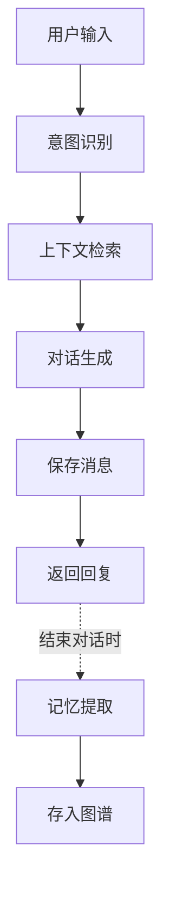
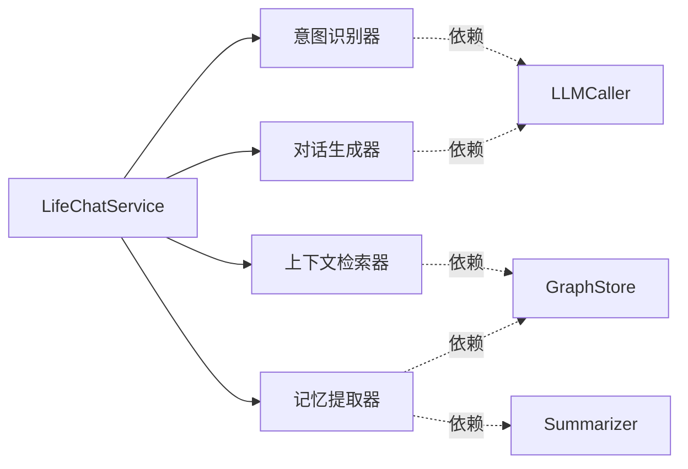
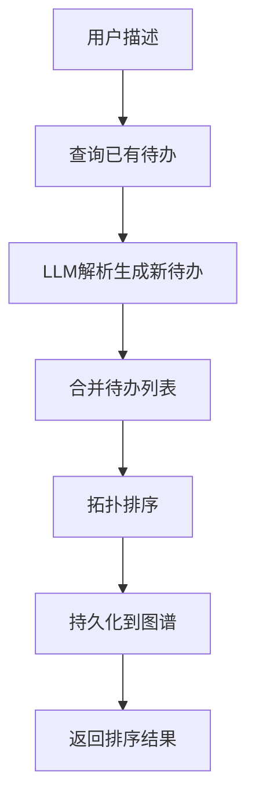
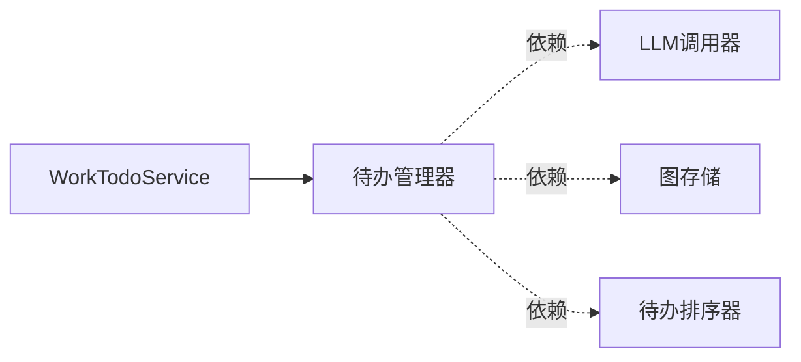
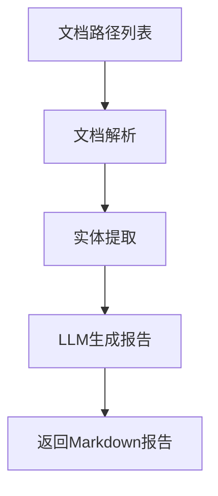
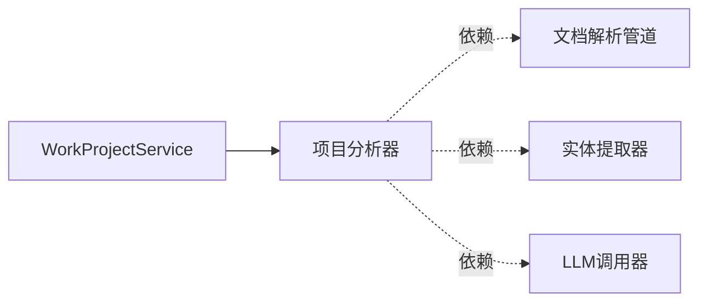
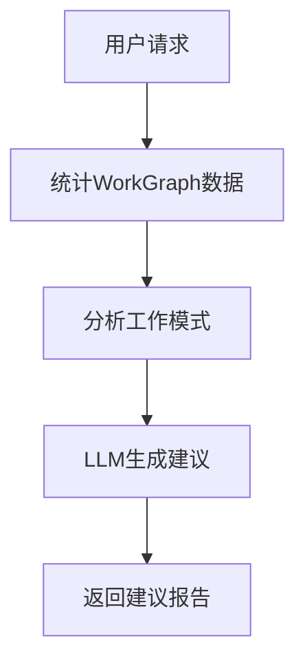
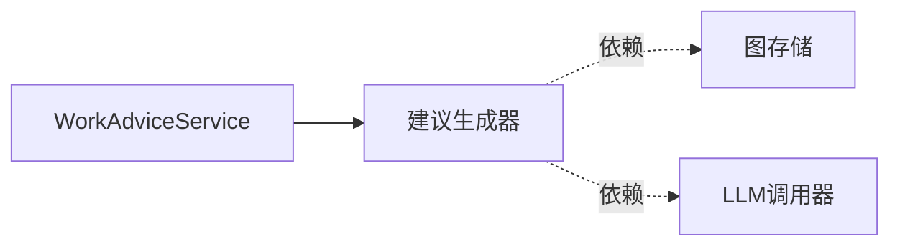
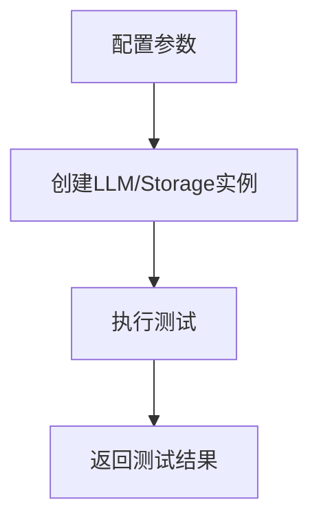
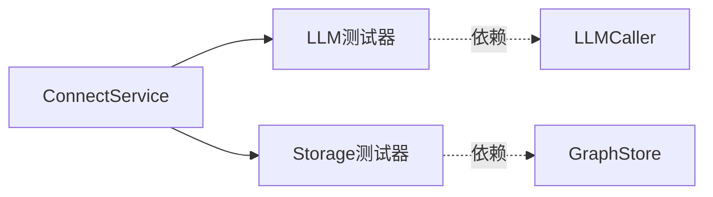

# AME 服务架构分析文档

## 📋 概览

本文档详细分析 AME（Another Me）系统中各个服务的流程、能力依赖和底层 Foundation 组件映射关系。

**架构分层：**
```
Service Layer（服务层）
    ↓ 依赖
Capability Layer（能力层）
    ↓ 依赖  
Foundation Layer（基础层）
```

**核心设计原则：**
- ✅ Service 层只能依赖 CapabilityFactory，不能直接使用 Foundation 层
- ✅ Capability 层封装业务逻辑，组合使用 Foundation 层组件
- ✅ Foundation 层提供原子化、可复用的基础能力

---

## 🔍 服务总览

| 服务名称 | 功能描述 | 主要能力依赖 | 是否有对话 | 是否持久化 |
|---------|---------|-------------|-----------|-----------|
| LifeChatService | 生活对话服务 | 意图识别、上下文检索、对话生成、记忆提取 | ✓ | ✓ |
| WorkTodoService | 待办管理服务 | 待办管理器 | ✗ | ✓ |
| WorkProjectService | 项目认知服务 | 项目分析器 | ✗ | ✗ |
| WorkAdviceService | 工作建议服务 | 建议生成器 | ✗ | ✗ |
| ConnectService | 配置测试服务 | LLM/Storage测试器 | ✗ | ✗ |

---

## 🌟 服务详细分析

### 1. LifeChatService - 生活对话服务

#### 1.1 服务流程



#### 1.2 能力依赖图



#### 1.3 Foundation 映射关系

| Capability | 依赖的 Foundation 组件 | 用途 |
|-----------|---------------------|------|
| **IntentRecognizer** | LLMCaller | 增强意图识别准确度 |
|  | 规则引擎（内置） | 基础关键词匹配 |
| **ContextRetriever** | GraphStore (FalkorDB) | 从生活图谱查询相关上下文 |
| **DialogueGenerator** | LLMCaller (OpenAI) | 生成个性化回复 |
| **MemoryExtractor** | GraphStore (FalkorDB) | 存储记忆节点和关系 |
|  | Summarizer | 生成对话摘要 |
|  | EntityExtractor | 提取实体 |
|  | EmotionAnalyzer | 分析情感 |

#### 1.4 详细流程说明

**步骤 1: 意图识别**
```python
# 1. 用户输入 → IntentRecognizer
intent_result = await intent_recognizer.recognize(user_input, use_llm=True)

# Foundation 调用链：
# IntentRecognizer → LLMCaller → OpenAI API
# - 先用规则引擎快速匹配
# - 复杂情况调用 LLM 增强识别
```

**步骤 2: 上下文检索**
```python
# 2. 根据意图 → ContextRetriever
contexts = await context_retriever.retrieve_by_intent(intent, limit=5)

# Foundation 调用链：
# ContextRetriever → GraphStore → FalkorDB
# - 根据意图类型查询不同的节点（MEMORY/PERSON/EVENT）
# - 使用 Cypher 查询语句检索相关信息
```

**步骤 3: 对话生成**
```python
# 3. 生成回复 → DialogueGenerator
response = await dialogue_generator.generate(
    user_input=user_input,
    intent=intent,
    contexts=contexts,
    conversation_history=history
)

# Foundation 调用链：
# DialogueGenerator → LLMCaller → OpenAI API
# - 构建包含系统提示词、上下文、历史的消息列表
# - 调用 LLM 生成个性化回复
```

**步骤 4: 记忆提取（会话结束时）**
```python
# 4. 提取记忆 → MemoryExtractor
memory_result = await memory_extractor.extract_and_save(
    session_id=session_id,
    messages=messages,
    extract_entities=True,
    analyze_emotions=True
)

# Foundation 调用链：
# MemoryExtractor → Summarizer → LLMCaller (生成摘要)
#                → EntityExtractor → LLMCaller (提取实体)
#                → EmotionAnalyzer → LLMCaller (分析情感)
#                → GraphStore (存储节点和关系)
```

---

### 2. WorkTodoService - 待办管理服务

#### 2.1 服务流程



#### 2.2 能力依赖图



#### 2.3 Foundation 映射关系

| Capability | 依赖的 Foundation 组件 | 用途 |
|-----------|---------------------|------|
| **TodoManager** | LLMCaller (OpenAI) | 解析用户输入，生成待办列表 |
|  | GraphStore (FalkorDB) | 查询/存储待办任务和依赖关系 |
|  | TodoSorter | 根据依赖关系和截止日期排序 |

#### 2.4 详细流程说明

**步骤 1: 查询已有待办**
```python
# 1. 从 WorkGraph 查询已有待办
existing_todos = await _fetch_existing_todos(user_id, project_name)

# Foundation 调用链：
# TodoManager → GraphStore → FalkorDB
# Cypher: MATCH (u:User)-[:HAS_TASK]->(t:Task) WHERE t.status <> 'completed'
```

**步骤 2: LLM 解析生成新待办**
```python
# 2. 使用 LLM 解析用户输入
new_todos = await _parse_todos_from_text(text, existing_todos, project_name)

# Foundation 调用链：
# TodoManager → LLMCaller → OpenAI API
# - 构建提示词，包含已有待办摘要（避免重复）
# - LLM 返回 JSON 格式的待办列表
# - 解析 JSON 转换为 TodoItem 对象
```

**步骤 3: 拓扑排序**
```python
# 3. 合并并排序
all_todos = existing_todos + new_todos
sorted_result = todo_sorter.sort(all_todos, consider_dependencies=True)

# Foundation 调用链：
# TodoManager → TodoSorter (算法层)
# - 基于 dependencies 字段构建依赖图
# - 拓扑排序，检测循环依赖
# - 按优先级分组（high/medium/low）
```

**步骤 4: 持久化**
```python
# 4. 持久化新待办到 WorkGraph
await _persist_todos_to_graph(user_id, new_todos, project_name)

# Foundation 调用链：
# TodoManager → GraphStore → FalkorDB
# - 创建 Task 节点
# - 创建 User->Task 关系
# - 创建 Task->Task 依赖关系
```

---

### 3. WorkProjectService - 项目认知服务

#### 3.1 服务流程



#### 3.2 能力依赖图



#### 3.3 Foundation 映射关系

| Capability | 依赖的 Foundation 组件 | 用途 |
|-----------|---------------------|------|
| **ProjectAnalyzer** | DocumentParsePipeline | 解析多种格式文档（PDF/DOCX/MD/PPT） |
|  | EntityExtractor | 提取技术栈、模块、概念等实体 |
|  | LLMCaller (OpenAI) | 生成结构化的项目分析报告 |

#### 3.4 详细流程说明

**步骤 1: 文档解析**
```python
# 1. 解析所有文档
for doc_path in doc_paths:
    parsed_doc = await doc_parser.parse(doc_path)
    all_content.append(parsed_doc.content)

# Foundation 调用链：
# ProjectAnalyzer → DocumentParsePipeline → 对应的文件解析器
# - PDFParser (pypdf)
# - DocxParser (python-docx)
# - MarkdownParser (markdown)
# - PPTParser (python-pptx)
# - TextParser (纯文本)
```

**步骤 2: 实体提取**
```python
# 2. 提取实体
entities = await entity_extractor.extract(
    combined_content, 
    use_llm=True, 
    use_jieba=True
)

# Foundation 调用链：
# ProjectAnalyzer → EntityExtractor → LLMCaller + jieba
# - jieba 分词（快速提取关键词）
# - LLM 识别实体类型（CONCEPT/ORGANIZATION/PERSON等）
```

**步骤 3: 生成分析报告**
```python
# 3. LLM 生成 Markdown 报告
markdown_content = await _generate_analysis_report(
    project_name, content, entities, custom_prompt
)

# Foundation 调用链：
# ProjectAnalyzer → LLMCaller → OpenAI API
# - 构建包含实体摘要和文档内容的提示词
# - LLM 生成结构化 Markdown 报告
```

---

### 4. WorkAdviceService - 工作建议服务

#### 4.1 服务流程



#### 4.2 能力依赖图



#### 4.3 Foundation 映射关系

| Capability | 依赖的 Foundation 组件 | 用途 |
|-----------|---------------------|------|
| **AdviceGenerator** | GraphStore (FalkorDB) | 查询任务统计数据 |
|  | LLMCaller (OpenAI) | 生成个性化工作建议 |

#### 4.4 详细流程说明

**步骤 1: 统计数据**
```python
# 1. 从 WorkGraph 统计任务数据
stats = await _query_task_statistics(user_id, time_range)

# Foundation 调用链：
# AdviceGenerator → GraphStore → FalkorDB
# Cypher 查询：
# - 总任务数、已完成、待办、逾期
# - 平均完成时间
# - 偏好项目领域
```

**步骤 2: 分析工作模式**
```python
# 2. 计算工作模式指标
pattern = WorkPattern(
    avg_completion_time=stats['avg_completion_time'],
    delay_rate=overdue_tasks / total_tasks,
    efficiency_score=(completion_rate * 100) - (delay_rate * 50),
    ...
)

# 纯算法计算，不依赖 Foundation
```

**步骤 3: 生成个性化建议**
```python
# 3. LLM 生成建议报告
advice = await _generate_advice_with_llm(user_id, pattern, time_range)

# Foundation 调用链：
# AdviceGenerator → LLMCaller → OpenAI API
# - 构建包含统计数据的提示词
# - LLM 生成效率分析、能力评估、改进建议
```

---

### 5. ConnectService - 配置测试服务

#### 5.1 服务流程



#### 5.2 能力依赖图



#### 5.3 Foundation 映射关系

| Capability | 依赖的 Foundation 组件 | 用途 |
|-----------|---------------------|------|
| **LLM测试器** | LLMCaller (OpenAI) | 测试连通性、流式输出、完整输出、Token估算 |
| **Storage测试器** | GraphStore (FalkorDB) | 测试连通性、节点操作、边操作、查询操作 |

#### 5.4 详细流程说明

**LLM 测试流程**
```python
# 1. 创建 LLM 调用器
llm_caller = factory.create_llm_caller(api_key, model, base_url)

# 2. 执行测试套件
test_connectivity()    # 基础连通性
test_stream()          # 流式输出
test_complete()        # 完整输出
test_token_estimation() # Token估算

# Foundation 调用链：
# ConnectService → LLMCaller → OpenAI API
```

**Storage 测试流程**
```python
# 1. 创建图存储
graph_store = factory.create_graph_store(host, port, graph_name)

# 2. 执行测试套件
test_connectivity()       # 连通性
test_node_operations()    # 节点增删改查
test_edge_operations()    # 边增删改查
test_query_operations()   # Cypher查询

# Foundation 调用链：
# ConnectService → GraphStore → FalkorDB
```

---

## 🧩 Foundation 层组件总览

### LLM 层

| 组件 | 功能 | 使用的服务 |
|------|------|-----------|
| **OpenAICaller** | LLM API调用封装 | Life, Todo, Project, Advice |
| **SessionPipe** | 会话管理管道 | Life |
| **DocumentPipe** | 文档处理管道 | Project |

### Storage 层

| 组件 | 功能 | 使用的服务 |
|------|------|-----------|
| **FalkorDBStore** | 图数据库封装 | Life, Todo, Advice |
| **LifeGraphPipeline** | 生活图谱管道 | Life |
| **WorkGraphPipeline** | 工作图谱管道 | Todo, Advice |

### NLP 层

| 组件 | 功能 | 使用的服务 |
|------|------|-----------|
| **IntentRecognizer** | 意图识别 | Life |
| **EntityExtractor** | 实体提取 | Life, Project |
| **EmotionAnalyzer** | 情感分析 | Life |
| **Summarizer** | 摘要生成 | Life |

### Algorithm 层

| 组件 | 功能 | 使用的服务 |
|------|------|-----------|
| **TodoSorter** | 待办拓扑排序 | Todo |
| **TextSimilarity** | 文本相似度 | - |
| **TimeAnalyzer** | 时间分析 | Advice |

### File 层

| 组件 | 功能 | 使用的服务 |
|------|------|-----------|
| **DocumentParsePipeline** | 文档解析 | Project |
| **PDFParser** | PDF解析 | Project |
| **DocxParser** | Word解析 | Project |
| **MarkdownParser** | Markdown解析 | Project |
| **PPTParser** | PPT解析 | Project |

---

## 📊 依赖关系矩阵

| Service / Foundation | LLMCaller | GraphStore | Summarizer | EntityExtractor | IntentRecognizer | TodoSorter | DocumentPipeline |
|---------------------|-----------|------------|------------|----------------|-----------------|-----------|-----------------|
| **LifeChatService** | ✓ | ✓ | ✓ | ✓ | ✓ | ✗ | ✗ |
| **WorkTodoService** | ✓ | ✓ | ✗ | ✗ | ✗ | ✓ | ✗ |
| **WorkProjectService** | ✓ | ✗ | ✗ | ✓ | ✗ | ✗ | ✓ |
| **WorkAdviceService** | ✓ | ✓ | ✗ | ✗ | ✗ | ✗ | ✗ |
| **ConnectService** | ✓ | ✓ | ✗ | ✗ | ✗ | ✗ | ✗ |

---

## 🎯 架构优势

### 1. 清晰的分层架构
- Service 层专注业务逻辑
- Capability 层封装领域能力
- Foundation 层提供原子化功能

### 2. 高复用性
- LLMCaller 被所有服务复用
- GraphStore 被 Life 和 Work 服务共享
- NLP 组件在多个能力中重用

### 3. 易于测试
- ConnectService 提供配置测试能力
- 每一层都可独立测试

### 4. 易于扩展
- 通过 CapabilityFactory 统一管理
- 新增能力只需实现相应接口
- 缓存机制提升性能

---

## 🔧 技术栈汇总

### 核心技术
- **LLM**: OpenAI API (gpt-3.5-turbo/gpt-4)
- **图数据库**: FalkorDB (Redis-based)
- **NLP**: jieba 分词
- **文档解析**: pypdf, python-docx, python-pptx

### 开发框架
- **异步框架**: Python asyncio
- **日志**: loguru
- **数据类**: dataclasses

---

## 📝 总结

AME 系统通过三层架构（Service - Capability - Foundation）实现了：

1. **业务隔离**: Service 层不直接依赖底层实现
2. **能力封装**: Capability 层提供高内聚的业务能力
3. **基础复用**: Foundation 层组件可被多个能力共享
4. **统一管理**: CapabilityFactory 统一创建和缓存能力实例

这种架构使得系统易于理解、测试和扩展，为后续功能开发提供了良好的基础。

---

**文档生成时间**: 2025-11-20  
**版本**: v1.0  
**维护者**: AME Team
